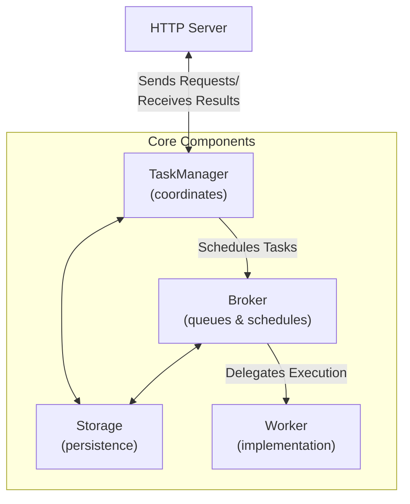

# Agent2Agent (A2A) Protocol

The [Agent2Agent (A2A) Protocol](https://google.github.io/A2A/) is an open standard introduced by Google that enables
communication and interoperability between AI agents, regardless of the framework or vendor they are built on.

At Pydantic, we built the [FastA2A](#fasta2a) library to make it easier to implement the A2A protocol in Python.

We also built a convenience method that expose Pydantic AI agents as A2A servers - let's have a quick look at how to use it:

```py {title="agent_to_a2a.py" hl_lines="4"}
from pydantic_ai import Agent

agent = Agent('openai:gpt-4.1', instructions='Be fun!')
app = agent.to_a2a()
```

_You can run the example with `uvicorn agent_to_a2a:app --host 0.0.0.0 --port 8000`_

This will expose the agent as an A2A server, and you can start sending requests to it.

See more about [exposing Pydantic AI agents as A2A servers](#pydantic-ai-agent-to-a2a-server).

## FastA2A

**FastA2A** is an agentic framework agnostic implementation of the A2A protocol in Python.
The library is designed to be used with any agentic framework, and is **not exclusive to Pydantic AI**.

### Design

**FastA2A** is built on top of [Starlette](https://www.starlette.io), which means it's fully compatible with any ASGI server.

Given the nature of the A2A protocol, it's important to understand the design before using it, as a developer
you'll need to provide some components:

- [`Storage`][fasta2a.Storage]: to save and load tasks, as well as store context for conversations
- [`Broker`][fasta2a.Broker]: to schedule tasks
- [`Worker`][fasta2a.Worker]: to execute tasks

Let's have a look at how those components fit together:



FastA2A allows you to bring your own [`Storage`][fasta2a.Storage], [`Broker`][fasta2a.Broker] and [`Worker`][fasta2a.Worker].

#### Understanding Tasks and Context

In the A2A protocol:

- **Task**: Represents one complete execution of an agent. When a client sends a message to the agent, a new task is created. The agent runs until completion (or failure), and this entire execution is considered one task. The final output is stored as a task artifact.

- **Context**: Represents a conversation thread that can span multiple tasks. The A2A protocol uses a `context_id` to maintain conversation continuity:
  - When a new message is sent without a `context_id`, the server generates a new one
  - Subsequent messages can include the same `context_id` to continue the conversation
  - All tasks sharing the same `context_id` have access to the complete message history

#### Storage Architecture

The [`Storage`][fasta2a.Storage] component serves two purposes:

1. **Task Storage**: Stores tasks in A2A protocol format, including their status, artifacts, and message history
2. **Context Storage**: Stores conversation context in a format optimized for the specific agent implementation

This design allows for agents to store rich internal state (e.g., tool calls, reasoning traces) as well as store task-specific A2A-formatted messages and artifacts.

For example, a Pydantic AI agent might store its complete internal message format (including tool calls and responses) in the context storage, while storing only the A2A-compliant messages in the task history.

### Installation

FastA2A is available on PyPI as [`fasta2a`](https://pypi.org/project/fasta2a/) so installation is as simple as:

```bash
pip/uv-add fasta2a
```

The only dependencies are:

- [starlette](https://www.starlette.io): to expose the A2A server as an [ASGI application](https://asgi.readthedocs.io/en/latest/)
- [pydantic](https://pydantic.dev): to validate the request/response messages
- [opentelemetry-api](https://opentelemetry-python.readthedocs.io/en/latest): to provide tracing capabilities

You can install Pydantic AI with the `a2a` extra to include **FastA2A**:

```bash
pip/uv-add 'pydantic-ai-slim[a2a]'
```

### Pydantic AI Agent to A2A Server

To expose a Pydantic AI agent as an A2A server, you can use the `to_a2a` method:

```python {title="agent_to_a2a.py"}
from pydantic_ai import Agent

agent = Agent('openai:gpt-4.1', instructions='Be fun!')
app = agent.to_a2a()
```

Since `app` is an ASGI application, it can be used with any ASGI server.

```bash
uvicorn agent_to_a2a:app --host 0.0.0.0 --port 8000
```

Since the goal of `to_a2a` is to be a convenience method, it accepts the same arguments as the [`FastA2A`][fasta2a.FastA2A] constructor.

When using `to_a2a()`, Pydantic AI automatically:

- Stores the complete conversation history (including tool calls and responses) in the context storage
- Ensures that subsequent messages with the same `context_id` have access to the full conversation history
- Persists agent results as A2A artifacts:
  - String results become `TextPart` artifacts and also appear in the message history
  - Structured data (Pydantic models, dataclasses, tuples, etc.) become `DataPart` artifacts with the data wrapped as `{"result": <your_data>}`
  - Artifacts include metadata with type information and JSON schema when available
