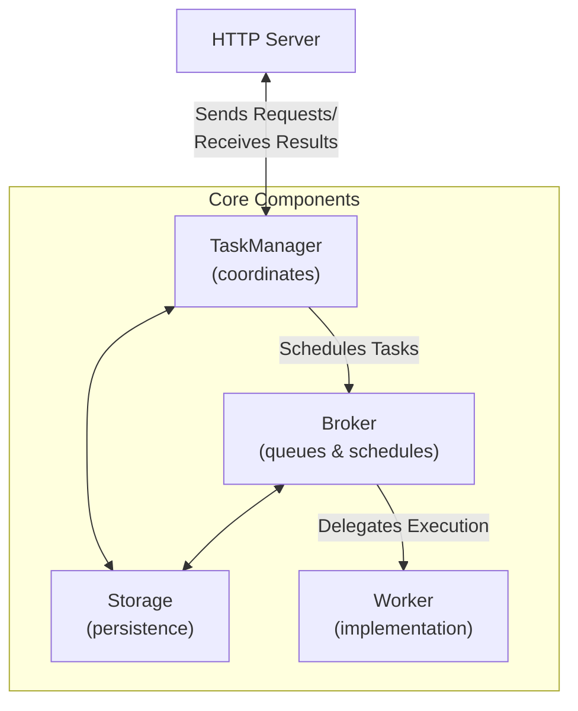

# Agent2Agent (A2A) Protocol

The [Agent2Agent (A2A) Protocol](https://google.github.io/A2A/) is an open standard introduced by Google that enables
communication and interoperability between AI agents, regardless of the framework or vendor they are built on.

At Pydantic, we built the [FastA2A](#fasta2a) library to make it easier to implement the A2A protocol in Python.

We also built a convenience method that expose PydanticAI agents as A2A servers - let's have a quick look at how to use it:

```py {title="agent_to_a2a.py" hl_lines="4"}
from pydantic_ai import Agent

agent = Agent('openai:gpt-4.1', instructions='Be fun!')
app = agent.to_a2a()
```

_You can run the example with `uvicorn agent_to_a2a:app --host 0.0.0.0 --port 8000`_

This will expose the agent as an A2A server, and you can start sending requests to it.

See more about [exposing PydanticAI agents as A2A servers](#pydanticai-agent-to-a2a-server).

## FastA2A

**FastA2A** is an agentic framework agnostic implementation of the A2A protocol in Python.
The library is designed to be used with any agentic framework, and is **not exclusive to PydanticAI**.

### Design

**FastA2A** is built on top of [Starlette](https://starlette.io), which means it's fully compatible with any ASGI server.

Given the nature of the A2A protocol, it's important to understand the design before using it, as a developer
you'll need to provide some components:

- [`Storage`][fasta2a.Storage]: to save and load tasks
- [`Broker`][fasta2a.Broker]: to schedule tasks
- [`Worker`][fasta2a.Worker]: to execute tasks

Let's have a look at how those components fit together:



FastA2A allows you to bring your own [`Storage`][fasta2a.Storage], [`Broker`][fasta2a.Broker] and [`Worker`][fasta2a.Worker].


### Installation

FastA2A is available on PyPI as [`fasta2a`](https://pypi.org/project/fasta2a/) so installation is as simple as:

```bash
pip/uv-add fasta2a
```

The only dependencies are:

- [starlette](https://starlette.io): to expose the A2A server as an [ASGI application](https://asgi.readthedocs.io/en/latest/)
- [pydantic](https://pydantic.dev): to validate the request/response messages
- [opentelemetry-api](https://opentelemetry-python.readthedocs.io/en/latest): to provide tracing capabilities

You can install PydanticAI with the `a2a` extra to include **FastA2A**:

```bash
pip/uv-add 'pydantic-ai-slim[a2a]'
```

### PydanticAI Agent to A2A Server

To expose a PydanticAI agent as an A2A server, you can use the `to_a2a` method:

```python {title="agent_to_a2a.py"}
from pydantic_ai import Agent

agent = Agent('openai:gpt-4.1', instructions='Be fun!')
app = agent.to_a2a()
```

Since `app` is an ASGI application, it can be used with any ASGI server.

```bash
uvicorn agent_to_a2a:app --host 0.0.0.0 --port 8000
```

Since the goal of `to_a2a` is to be a convenience method, it accepts the same arguments as the [`FastA2A`][fasta2a.FastA2A] constructor.
