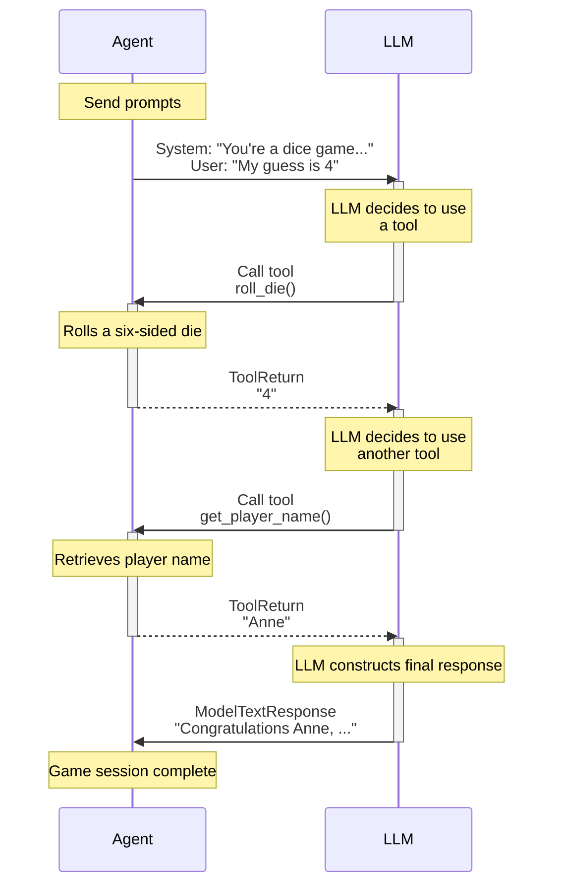

## Introduction

Agents are PydanticAI's primary interface for interacting with LLMs.

In some use cases a single Agent will control an entire application or component,
but multiple agents can also interact to embody more complex workflows.

The [`Agent`][pydantic_ai.Agent] class has full API documentation, but conceptually you can think of an agent as a container for:

* A [system prompt](#system-prompts) — a set of instructions for the LLM written by the developer
* One or more [retrieval tool](#function-tools) — functions that the LLM may call to get information while generating a response
* An optional structured [result type](results.md) — the structured datatype the LLM must return at the end of a run
* A [dependency](dependencies.md) type constraint — system prompt functions, tools and result validators may all use dependencies when they're run
* Agents may optionally also have a default [LLM model](api/models/base.md) associated with them; the model to use can also be specified when running the agent

In typing terms, agents are generic in their dependency and result types, e.g., an agent which required dependencies of type `#!python Foobar` and returned results of type `#!python list[str]` would have type `cAgent[Foobar, list[str]]`. In practice, you shouldn't need to care about this, it should just mean your IDE can tell you when you have the right type, and if you choose to use [static type checking](#static-type-checking) it should work well with PydanticAI.

Here's a toy example of an agent that simulates a roulette wheel:

```py title="roulette_wheel.py"
from pydantic_ai import Agent, RunContext

roulette_agent = Agent(  # (1)!
    'openai:gpt-4o',
    deps_type=int,
    result_type=bool,
    system_prompt=(
        'Use the `roulette_wheel` function to see if the '
        'customer has won based on the number they provide.'
    ),
)


@roulette_agent.tool
async def roulette_wheel(ctx: RunContext[int], square: int) -> str:  # (2)!
    """check if the square is a winner"""
    return 'winner' if square == ctx.deps else 'loser'


# Run the agent
success_number = 18  # (3)!
result = roulette_agent.run_sync('Put my money on square eighteen', deps=success_number)
print(result.data)  # (4)!
#> True

result = roulette_agent.run_sync('I bet five is the winner', deps=success_number)
print(result.data)
#> False
```

1. Create an agent, which expects an integer dependency and returns a boolean result. This agent will have type `#!python Agent[int, bool]`.
2. Define a tool that checks if the square is a winner. Here [`RunContext`][pydantic_ai.tools.RunContext] is parameterized with the dependency type `int`; if you got the dependency type wrong you'd get a typing error.
3. In reality, you might want to use a random number here e.g. `random.randint(0, 36)`.
4. `result.data` will be a boolean indicating if the square is a winner. Pydantic performs the result validation, it'll be typed as a `bool` since its type is derived from the `result_type` generic parameter of the agent.


!!! tip "Agents are designed for reuse, like FastAPI Apps"
    Agents are intended to be instantiated once (frequently as module globals) and reused throughout your application, similar to a small [FastAPI][fastapi.FastAPI] app or an [APIRouter][fastapi.APIRouter].

## Running Agents

There are three ways to run an agent:

1. [`agent.run()`][pydantic_ai.Agent.run] — a coroutine which returns a [`RunResult`][pydantic_ai.result.RunResult] containing a completed response
2. [`agent.run_sync()`][pydantic_ai.Agent.run_sync] — a plain, synchronous function which returns a [`RunResult`][pydantic_ai.result.RunResult] containing a completed response (internally, this just calls `asyncio.run(self.run())`)
3. [`agent.run_stream()`][pydantic_ai.Agent.run_stream] — a coroutine which returns a [`StreamedRunResult`][pydantic_ai.result.StreamedRunResult], which contains methods to stream a response as an async iterable

Here's a simple example demonstrating all three:

```py title="run_agent.py"
from pydantic_ai import Agent

agent = Agent('openai:gpt-4o')

result_sync = agent.run_sync('What is the capital of Italy?')
print(result_sync.data)
#> Rome


async def main():
    result = await agent.run('What is the capital of France?')
    print(result.data)
    #> Paris

    async with agent.run_stream('What is the capital of the UK?') as response:
        print(await response.get_data())
        #> London
```
_(This example is complete, it can be run "as is")_

You can also pass messages from previous runs to continue a conversation or provide context, as described in [Messages and Chat History](message-history.md).

## Runs vs. Conversations

An agent **run** might represent an entire conversation — there's no limit to how many messages can be exchanged in a single run. However, a **conversation** might also be composed of multiple runs, especially if you need to maintain state between separate interactions or API calls.

Here's an example of a conversation comprised of multiple runs:

```py title="conversation_example.py" hl_lines="13"
from pydantic_ai import Agent

agent = Agent('openai:gpt-4o')

# First run
result1 = agent.run_sync('Who was Albert Einstein?')
print(result1.data)
#> Albert Einstein was a German-born theoretical physicist.

# Second run, passing previous messages
result2 = agent.run_sync(
    'What was his most famous equation?',
    message_history=result1.new_messages(),  # (1)!
)
print(result2.data)
#> Albert Einstein's most famous equation is (E = mc^2).
```

1. Continue the conversation; without `message_history` the model would not know who "his" was referring to.

_(This example is complete, it can be run "as is")_

## Type safe by design {#static-type-checking}

PydanticAI is designed to work well with static type checkers, like mypy and pyright.

!!! tip "Typing is (somewhat) optional"
    PydanticAI is designed to make type checking as useful as possible for you if you choose to use it, but you don't have to use types everywhere all the time.

    That said, because PydanticAI uses Pydantic, and Pydantic uses type hints as the definition for schema and validation, some types (specifically type hints on parameters to tools, and the `result_type` arguments to [`Agent`][pydantic_ai.Agent]) are used at runtime.

    We (the library developers) have messed up if type hints are confusing you more than they're help you, if you find this, please create an [issue](https://github.com/pydantic/pydantic-ai/issues) explaining what's annoying you!

In particular, agents are generic in both the type of their dependencies and the type of results they return, so you can use the type hints to ensure you're using the right types.

Consider the following script with type mistakes:

```py title="type_mistakes.py" hl_lines="18 28"
from dataclasses import dataclass

from pydantic_ai import Agent, RunContext


@dataclass
class User:
    name: str


agent = Agent(
    'test',
    deps_type=User,  # (1)!
    result_type=bool,
)


@agent.system_prompt
def add_user_name(ctx: RunContext[str]) -> str:  # (2)!
    return f"The user's name is {ctx.deps}."


def foobar(x: bytes) -> None:
    pass


result = agent.run_sync('Does their name start with "A"?', deps=User('Anne'))
foobar(result.data)  # (3)!
```

1. The agent is defined as expecting an instance of `User` as `deps`.
2. But here `add_user_name` is defined as taking a `str` as the dependency, not a `User`.
3. Since the agent is defined as returning a `bool`, this will raise a type error since `foobar` expects `bytes`.

Running `mypy` on this will give the following output:

```bash
➤ uv run mypy type_mistakes.py
type_mistakes.py:18: error: Argument 1 to "system_prompt" of "Agent" has incompatible type "Callable[[RunContext[str]], str]"; expected "Callable[[RunContext[User]], str]"  [arg-type]
type_mistakes.py:28: error: Argument 1 to "foobar" has incompatible type "bool"; expected "bytes"  [arg-type]
Found 2 errors in 1 file (checked 1 source file)
```

Running `pyright` would identify the same issues.

## System Prompts

System prompts might seem simple at first glance since they're just strings (or sequences of strings that are concatenated), but crafting the right system prompt is key to getting the model to behave as you want.

Generally, system prompts fall into two categories:

1. **Static system prompts**: These are known when writing the code and can be defined via the `system_prompt` parameter of the [`Agent` constructor][pydantic_ai.Agent.__init__].
2. **Dynamic system prompts**: These depend in some way on context that isn't known until runtime, and should be defined via functions decorated with [`@agent.system_prompt`][pydantic_ai.Agent.system_prompt].

You can add both to a single agent; they're appended in the order they're defined at runtime.

Here's an example using both types of system prompts:

```py title="system_prompts.py"
from datetime import date

from pydantic_ai import Agent, RunContext

agent = Agent(
    'openai:gpt-4o',
    deps_type=str,  # (1)!
    system_prompt="Use the customer's name while replying to them.",  # (2)!
)


@agent.system_prompt  # (3)!
def add_the_users_name(ctx: RunContext[str]) -> str:
    return f"The user's named is {ctx.deps}."


@agent.system_prompt
def add_the_date() -> str:  # (4)!
    return f'The date is {date.today()}.'


result = agent.run_sync('What is the date?', deps='Frank')
print(result.data)
#> Hello Frank, the date today is 2032-01-02.
```

1. The agent expects a string dependency.
2. Static system prompt defined at agent creation time.
3. Dynamic system prompt defined via a decorator with [`RunContext`][pydantic_ai.tools.RunContext], this is called just after `run_sync`, not when the agent is created, so can benefit from runtime information like the dependencies used on that run.
4. Another dynamic system prompt, system prompts don't have to have the `RunContext` parameter.

_(This example is complete, it can be run "as is")_

## Function Tools

Function tools provide a mechanism for models to retrieve extra information to help them generate a response.

They're useful when it is impractical or impossible to put all the context an agent might need into the system prompt, or when you want to make agents' behavior more deterministic or reliable by deferring some of the logic required to generate a response to another (not necessarily AI-powered) tool.

!!! info "Function tools vs. RAG"
    Function tools are basically the "R" of RAG (Retrieval-Augmented Generation) — they augment what the model can do by letting it request extra information.

    The main semantic difference between PydanticAI Tools and RAG is RAG is synonymous with vector search, while PydanticAI tools are more general-purpose. (Note: we may add support for vector search functionality in the future, particularly an API for generating embeddings. See [#58](https://github.com/pydantic/pydantic-ai/issues/58))

There are a number of ways to register tools with an agent:

* via the [`@agent.tool`][pydantic_ai.Agent.tool] decorator — for tools that need access to the agent [context][pydantic_ai.tools.RunContext]
* via the [`@agent.tool_plain`][pydantic_ai.Agent.tool_plain] decorator — for tools that do not need access to the agent [context][pydantic_ai.tools.RunContext]
* via the [`tools`][pydantic_ai.Agent.__init__] keyword argument to `Agent` which can take either plain functions, or instances of [`Tool`][pydantic_ai.tools.Tool]

`@agent.tool` is considered the default decorator since in the majority of cases tools will need access to the agent context.

Here's an example using both:

```py title="dice_game.py"
import random

from pydantic_ai import Agent, RunContext

agent = Agent(
    'gemini-1.5-flash',  # (1)!
    deps_type=str,  # (2)!
    system_prompt=(
        "You're a dice game, you should roll the die and see if the number "
        "you get back matches the user's guess. If so, tell them they're a winner. "
        "Use the player's name in the response."
    ),
)


@agent.tool_plain  # (3)!
def roll_die() -> str:
    """Roll a six-sided die and return the result."""
    return str(random.randint(1, 6))


@agent.tool  # (4)!
def get_player_name(ctx: RunContext[str]) -> str:
    """Get the player's name."""
    return ctx.deps


dice_result = agent.run_sync('My guess is 4', deps='Anne')  # (5)!
print(dice_result.data)
#> Congratulations Anne, you guessed correctly! You're a winner!
```

1. This is a pretty simple task, so we can use the fast and cheap Gemini flash model.
2. We pass the user's name as the dependency, to keep things simple we use just the name as a string as the dependency.
3. This tool doesn't need any context, it just returns a random number. You could probably use a dynamic system prompt in this case.
4. This tool needs the player's name, so it uses `RunContext` to access dependencies which are just the player's name in this case.
5. Run the agent, passing the player's name as the dependency.

_(This example is complete, it can be run "as is")_

Let's print the messages from that game to see what happened:

```py title="dice_game_messages.py"
from dice_game import dice_result

print(dice_result.all_messages())
"""
[
    SystemPrompt(
        content="You're a dice game, you should roll the die and see if the number you get back matches the user's guess. If so, tell them they're a winner. Use the player's name in the response.",
        role='system',
    ),
    UserPrompt(
        content='My guess is 4',
        timestamp=datetime.datetime(...),
        role='user',
    ),
    ModelStructuredResponse(
        calls=[
            ToolCall(tool_name='roll_die', args=ArgsDict(args_dict={}), tool_id=None)
        ],
        timestamp=datetime.datetime(...),
        role='model-structured-response',
    ),
    ToolReturn(
        tool_name='roll_die',
        content='4',
        tool_id=None,
        timestamp=datetime.datetime(...),
        role='tool-return',
    ),
    ModelStructuredResponse(
        calls=[
            ToolCall(
                tool_name='get_player_name', args=ArgsDict(args_dict={}), tool_id=None
            )
        ],
        timestamp=datetime.datetime(...),
        role='model-structured-response',
    ),
    ToolReturn(
        tool_name='get_player_name',
        content='Anne',
        tool_id=None,
        timestamp=datetime.datetime(...),
        role='tool-return',
    ),
    ModelTextResponse(
        content="Congratulations Anne, you guessed correctly! You're a winner!",
        timestamp=datetime.datetime(...),
        role='model-text-response',
    ),
]
"""
```

We can represent this with a diagram:



### Registering Function Tools via kwarg

As well as using the decorators, we can register tools via the `tools` argument to the [`Agent` constructor][pydantic_ai.Agent.__init__]. This is useful when you want to re-use tools, and can also give more fine-grained control over the tools.

```py title="dice_game_tool_kwarg.py"
import random

from pydantic_ai import Agent, RunContext, Tool


def roll_die() -> str:
    """Roll a six-sided die and return the result."""
    return str(random.randint(1, 6))


def get_player_name(ctx: RunContext[str]) -> str:
    """Get the player's name."""
    return ctx.deps


agent_a = Agent(
    'gemini-1.5-flash',
    deps_type=str,
    tools=[roll_die, get_player_name],  # (1)!
)
agent_b = Agent(
    'gemini-1.5-flash',
    deps_type=str,
    tools=[  # (2)!
        Tool(roll_die, takes_ctx=False),
        Tool(get_player_name, takes_ctx=True),
    ],
)
dice_result = agent_b.run_sync('My guess is 4', deps='Anne')
print(dice_result.data)
#> Congratulations Anne, you guessed correctly! You're a winner!
```

1. The simplest way to register tools via the `Agent` constructor is to pass a list of functions, the function signature is inspected to determine if the tool takes [`RunContext`][pydantic_ai.tools.RunContext].
2. `agent_a` and `agent_b` are identical — but we can use [`Tool`][pydantic_ai.tools.Tool] to reuse tool definitions and give more fine-grained control over how tools are defined, e.g. setting their name or description, or using a custom [`prepare`](#tool-prepare) method.

_(This example is complete, it can be run "as is")_

### Function Tools vs. Structured Results

As the name suggests, function tools use the model's "tools" or "functions" API to let the model know what is available to call. Tools or functions are also used to define the schema(s) for structured responses, thus a model might have access to many tools, some of which call function tools while others end the run and return a result.

### Function tools and schema

Function parameters are extracted from the function signature, and all parameters except `RunContext` are used to build the schema for that tool call.

Even better, PydanticAI extracts the docstring from functions and (thanks to [griffe](https://mkdocstrings.github.io/griffe/)) extracts parameter descriptions from the docstring and adds them to the schema.

[Griffe supports](https://mkdocstrings.github.io/griffe/reference/docstrings/#docstrings) extracting parameter descriptions from `google`, `numpy` and `sphinx` style docstrings, and PydanticAI will infer the format to use based on the docstring. We plan to add support in the future to explicitly set the style to use, and warn/error if not all parameters are documented; see [#59](https://github.com/pydantic/pydantic-ai/issues/59).

To demonstrate a tool's schema, here we use [`FunctionModel`][pydantic_ai.models.function.FunctionModel] to print the schema a model would receive:

```py title="tool_schema.py"
from pydantic_ai import Agent
from pydantic_ai.messages import Message, ModelAnyResponse, ModelTextResponse
from pydantic_ai.models.function import AgentInfo, FunctionModel

agent = Agent()


@agent.tool_plain
def foobar(a: int, b: str, c: dict[str, list[float]]) -> str:
    """Get me foobar.

    Args:
        a: apple pie
        b: banana cake
        c: carrot smoothie
    """
    return f'{a} {b} {c}'


def print_schema(messages: list[Message], info: AgentInfo) -> ModelAnyResponse:
    tool = info.function_tools[0]
    print(tool.description)
    #> Get me foobar.
    print(tool.parameters_json_schema)
    """
    {
        'description': 'Get me foobar.',
        'properties': {
            'a': {'description': 'apple pie', 'title': 'A', 'type': 'integer'},
            'b': {'description': 'banana cake', 'title': 'B', 'type': 'string'},
            'c': {
                'additionalProperties': {'items': {'type': 'number'}, 'type': 'array'},
                'description': 'carrot smoothie',
                'title': 'C',
                'type': 'object',
            },
        },
        'required': ['a', 'b', 'c'],
        'type': 'object',
        'additionalProperties': False,
    }
    """
    return ModelTextResponse(content='foobar')


agent.run_sync('hello', model=FunctionModel(print_schema))
```

_(This example is complete, it can be run "as is")_

The return type of tool can be anything which Pydantic can serialize to JSON as some models (e.g. Gemini) support semi-structured return values, some expect text (OpenAI) but seem to be just as good at extracting meaning from the data. If a Python object is returned and the model expects a string, the value will be serialized to JSON.

If a tool has a single parameter that can be represented as an object in JSON schema (e.g. dataclass, TypedDict, pydantic model), the schema for the tool is simplified to be just that object.

Here's an example, we use [`TestModel.agent_model_function_tools`][pydantic_ai.models.test.TestModel.agent_model_function_tools] to inspect the tool schema that would be passed to the model.

```py title="single_parameter_tool.py"
from pydantic import BaseModel

from pydantic_ai import Agent
from pydantic_ai.models.test import TestModel

agent = Agent()


class Foobar(BaseModel):
    """This is a Foobar"""

    x: int
    y: str
    z: float = 3.14


@agent.tool_plain
def foobar(f: Foobar) -> str:
    return str(f)


test_model = TestModel()
result = agent.run_sync('hello', model=test_model)
print(result.data)
#> {"foobar":"x=0 y='a' z=3.14"}
print(test_model.agent_model_function_tools)
"""
[
    ToolDefinition(
        name='foobar',
        description='',
        parameters_json_schema={
            'description': 'This is a Foobar',
            'properties': {
                'x': {'title': 'X', 'type': 'integer'},
                'y': {'title': 'Y', 'type': 'string'},
                'z': {'default': 3.14, 'title': 'Z', 'type': 'number'},
            },
            'required': ['x', 'y'],
            'title': 'Foobar',
            'type': 'object',
        },
        outer_typed_dict_key=None,
    )
]
"""
```

_(This example is complete, it can be run "as is")_

### Dynamic Function tools {#tool-prepare}

Tools can optionally be defined with another function: `prepare`, which is called at each step of a run to
customize the definition of the tool passed to the model, or omit the tool completely from that step.

A `prepare` method can be registered via the `prepare` kwarg to any of the tool registration mechanisms:

* [`@agent.tool`][pydantic_ai.Agent.tool] decorator
* [`@agent.tool_plain`][pydantic_ai.Agent.tool_plain] decorator
* [`Tool`][pydantic_ai.tools.Tool] dataclass

The `prepare` method, should be of type [`ToolPrepareFunc`][pydantic_ai.tools.ToolPrepareFunc], a function which takes [`RunContext`][pydantic_ai.tools.RunContext] and a pre-built [`ToolDefinition`][pydantic_ai.tools.ToolDefinition], and should either return that `ToolDefinition` with or without modifying it, return a new `ToolDefinition`, or return `None` to indicate this tools should not be registered for that step.

Here's a simple `prepare` method that only includes the tool if the value of the dependency is `42`.

As with the previous example, we use [`TestModel`][pydantic_ai.models.test.TestModel] to demonstrate the behavior without calling a real model.

```py title="tool_only_if_42.py"
from typing import Union

from pydantic_ai import Agent, RunContext
from pydantic_ai.tools import ToolDefinition

agent = Agent('test')


async def only_if_42(
    ctx: RunContext[int], tool_def: ToolDefinition
) -> Union[ToolDefinition, None]:
    if ctx.deps == 42:
        return tool_def


@agent.tool(prepare=only_if_42)
def hitchhiker(ctx: RunContext[int], answer: str) -> str:
    return f'{ctx.deps} {answer}'


result = agent.run_sync('testing...', deps=41)
print(result.data)
#> success (no tool calls)
result = agent.run_sync('testing...', deps=42)
print(result.data)
#> {"hitchhiker":"42 a"}
```

_(This example is complete, it can be run "as is")_

Here's a more complex example where we change the description of the `name` parameter to based on the value of `deps`

For the sake of variation, we create this tool using the [`Tool`][pydantic_ai.tools.Tool] dataclass.

```py title="customize_name.py"
from __future__ import annotations

from typing import Literal

from pydantic_ai import Agent, RunContext
from pydantic_ai.models.test import TestModel
from pydantic_ai.tools import Tool, ToolDefinition


def greet(name: str) -> str:
    return f'hello {name}'


async def prepare_greet(
    ctx: RunContext[Literal['human', 'machine']], tool_def: ToolDefinition
) -> ToolDefinition | None:
    d = f'Name of the {ctx.deps} to greet.'
    tool_def.parameters_json_schema['properties']['name']['description'] = d
    return tool_def


greet_tool = Tool(greet, prepare=prepare_greet)
test_model = TestModel()
agent = Agent(test_model, tools=[greet_tool], deps_type=Literal['human', 'machine'])

result = agent.run_sync('testing...', deps='human')
print(result.data)
#> {"greet":"hello a"}
print(test_model.agent_model_function_tools)
"""
[
    ToolDefinition(
        name='greet',
        description='',
        parameters_json_schema={
            'properties': {
                'name': {
                    'title': 'Name',
                    'type': 'string',
                    'description': 'Name of the human to greet.',
                }
            },
            'required': ['name'],
            'type': 'object',
            'additionalProperties': False,
        },
        outer_typed_dict_key=None,
    )
]
"""
```

_(This example is complete, it can be run "as is")_

## Reflection and self-correction

Validation errors from both function tool parameter validation and [structured result validation](results.md#structured-result-validation) can be passed back to the model with a request to retry.

You can also raise [`ModelRetry`][pydantic_ai.exceptions.ModelRetry] from within a [tool](#function-tools) or [result validator function](results.md#result-validators-functions) to tell the model it should retry generating a response.

- The default retry count is **1** but can be altered for the [entire agent][pydantic_ai.Agent.__init__], a [specific tool][pydantic_ai.Agent.tool], or a [result validator][pydantic_ai.Agent.__init__].
- You can access the current retry count from within a tool or result validator via [`ctx.retry`][pydantic_ai.tools.RunContext].

Here's an example:

```py title="tool_retry.py"
from fake_database import DatabaseConn
from pydantic import BaseModel

from pydantic_ai import Agent, RunContext, ModelRetry


class ChatResult(BaseModel):
    user_id: int
    message: str


agent = Agent(
    'openai:gpt-4o',
    deps_type=DatabaseConn,
    result_type=ChatResult,
)


@agent.tool(retries=2)
def get_user_by_name(ctx: RunContext[DatabaseConn], name: str) -> int:
    """Get a user's ID from their full name."""
    print(name)
    #> John
    #> John Doe
    user_id = ctx.deps.users.get(name=name)
    if user_id is None:
        raise ModelRetry(
            f'No user found with name {name!r}, remember to provide their full name'
        )
    return user_id


result = agent.run_sync(
    'Send a message to John Doe asking for coffee next week', deps=DatabaseConn()
)
print(result.data)
"""
user_id=123 message='Hello John, would you be free for coffee sometime next week? Let me know what works for you!'
"""
```

## Model errors

If models behave unexpectedly (e.g., the retry limit is exceeded, or their API returns `503`), agent runs will raise [`UnexpectedModelBehavior`][pydantic_ai.exceptions.UnexpectedModelBehavior].

In these cases, [`agent.last_run_messages`][pydantic_ai.Agent.last_run_messages] can be used to access the messages exchanged during the run to help diagnose the issue.

```py
from pydantic_ai import Agent, ModelRetry, UnexpectedModelBehavior

agent = Agent('openai:gpt-4o')


@agent.tool_plain
def calc_volume(size: int) -> int:  # (1)!
    if size == 42:
        return size**3
    else:
        raise ModelRetry('Please try again.')


try:
    result = agent.run_sync('Please get me the volume of a box with size 6.')
except UnexpectedModelBehavior as e:
    print('An error occurred:', e)
    #> An error occurred: Tool exceeded max retries count of 1
    print('cause:', repr(e.__cause__))
    #> cause: ModelRetry('Please try again.')
    print('messages:', agent.last_run_messages)
    """
    messages:
    [
        UserPrompt(
            content='Please get me the volume of a box with size 6.',
            timestamp=datetime.datetime(...),
            role='user',
        ),
        ModelStructuredResponse(
            calls=[
                ToolCall(
                    tool_name='calc_volume',
                    args=ArgsDict(args_dict={'size': 6}),
                    tool_id=None,
                )
            ],
            timestamp=datetime.datetime(...),
            role='model-structured-response',
        ),
        RetryPrompt(
            content='Please try again.',
            tool_name='calc_volume',
            tool_id=None,
            timestamp=datetime.datetime(...),
            role='retry-prompt',
        ),
        ModelStructuredResponse(
            calls=[
                ToolCall(
                    tool_name='calc_volume',
                    args=ArgsDict(args_dict={'size': 6}),
                    tool_id=None,
                )
            ],
            timestamp=datetime.datetime(...),
            role='model-structured-response',
        ),
    ]
    """
else:
    print(result.data)
```
1. Define a tool that will raise `ModelRetry` repeatedly in this case.

_(This example is complete, it can be run "as is")_
