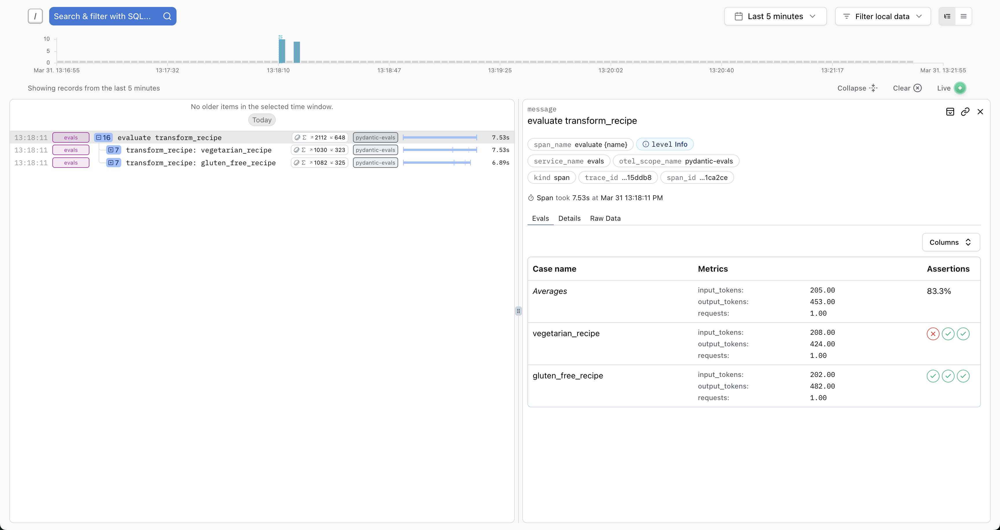
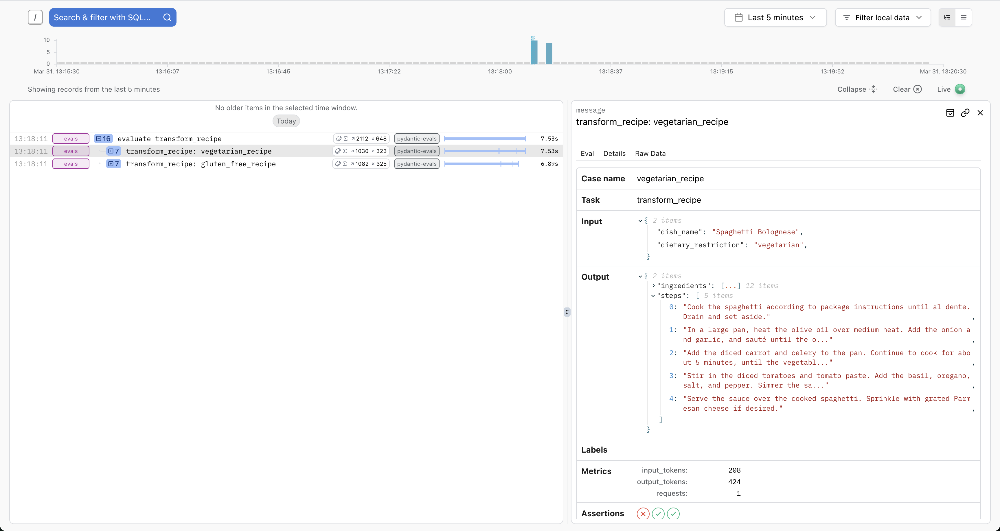
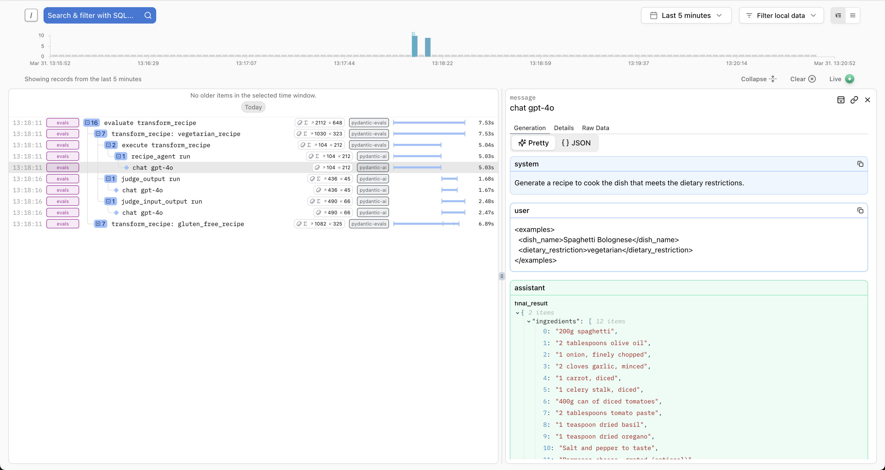

# Evals

"Evals" refers to evaluating a model's performance for a specific application.

!!! danger "Warning"
    Unlike unit tests, evals are an emerging art/science; anyone who claims to know for sure exactly how your evals should be defined can safely be ignored.

Pydantic Evals is a powerful evaluation framework designed to help you systematically test and evaluate the performance and accuracy of the systems you build, especially when working with LLMs.

We've designed Pydantic Evals to be useful while not being too opinionated since we (along with everyone else) are still figuring out best practices. We'd love your [feedback](help.md) on the package and how we can improve it.

!!! note "In Beta"
    Pydantic Evals support was [introduced](https://github.com/pydantic/pydantic-ai/pull/935) in v0.0.47 and is currently in beta. The API is subject to change and the documentation is incomplete.

## Installation

To install the Pydantic Evals package, run:

```bash
pip/uv-add pydantic-evals
```

`pydantic-evals` does not depend on `pydantic-ai`, but has an optional dependency on `logfire` if you'd like to
use OpenTelemetry traces in your evals, or send evaluation results to [logfire](https://pydantic.dev/logfire).

```bash
pip/uv-add 'pydantic-evals[logfire]'
```

## Datasets and Cases

In Pydantic Evals, everything begins with `Dataset`s and `Case`s:

- [`Case`][pydantic_evals.Case]: A single test scenario corresponding to "task" inputs. Can also optionally have a name, expected outputs, metadata, and evaluators.
- [`Dataset`][pydantic_evals.Dataset]: A collection of test cases designed for the evaluation of a specific task or function.

```python {title="simple_eval_dataset.py"}
from pydantic_evals import Case, Dataset

case1 = Case(
    name='simple_case',
    inputs='What is the capital of France?',
    expected_output='Paris',
    metadata={'difficulty': 'easy'},
)

dataset = Dataset(cases=[case1])
```

_(This example is complete, it can be run "as is")_

## Evaluators

Evaluators are the components that analyze and score the results of your task when tested against a case.

Pydantic Evals includes several built-in evaluators and allows you to create custom evaluators:

```python {title="simple_eval_evaluator.py" requires="simple_eval_dataset.py"}
from dataclasses import dataclass

from simple_eval_dataset import dataset

from pydantic_evals.evaluators import Evaluator, EvaluatorContext
from pydantic_evals.evaluators.common import IsInstance

dataset.add_evaluator(IsInstance(type_name='str'))  # (1)!


@dataclass
class MyEvaluator(Evaluator):
    async def evaluate(self, ctx: EvaluatorContext[str, str]) -> float:  # (2)!
        if ctx.output == ctx.expected_output:
            return 1.0
        elif (
            isinstance(ctx.output, str)
            and ctx.expected_output.lower() in ctx.output.lower()
        ):
            return 0.8
        else:
            return 0.0


dataset.add_evaluator(MyEvaluator())
```

1. You can add built-in evaluators to a dataset using the [`add_evaluator`][pydantic_evals.Dataset.add_evaluator] method.
2. This custom evaluator returns a simple score based on whether the output matches the expected output.

_(This example is complete, it can be run "as is")_

## Evaluation Process

The evaluation process involves running a task against all cases in a dataset:

Putting the above two examples together and using the more declarative `evaluators` kwarg to [`Dataset`][pydantic_evals.Dataset]:

```python {title="simple_eval_complete.py"}
from pydantic_evals import Case, Dataset
from pydantic_evals.evaluators import Evaluator, EvaluatorContext, IsInstance

case1 = Case(  # (1)!
    name='simple_case',
    inputs='What is the capital of France?',
    expected_output='Paris',
    metadata={'difficulty': 'easy'},
)


class MyEvaluator(Evaluator[str, str]):
    def evaluate(self, ctx: EvaluatorContext[str, str]) -> float:
        if ctx.output == ctx.expected_output:
            return 1.0
        elif (
            isinstance(ctx.output, str)
            and ctx.expected_output.lower() in ctx.output.lower()
        ):
            return 0.8
        else:
            return 0.0


dataset = Dataset(
    cases=[case1],
    evaluators=[IsInstance(type_name='str'), MyEvaluator()],  # (3)!
)


async def guess_city(question: str) -> str:  # (4)!
    return 'Paris'


report = dataset.evaluate_sync(guess_city)  # (5)!
report.print(include_input=True, include_output=True, include_durations=False)  # (6)!
"""
                              Evaluation Summary: guess_city
┏━━━━━━━━━━━━━┳━━━━━━━━━━━━━━━━━━━━━━━━━━━━━━━━┳━━━━━━━━━┳━━━━━━━━━━━━━━━━━━━┳━━━━━━━━━━━━┓
┃ Case ID     ┃ Inputs                         ┃ Outputs ┃ Scores            ┃ Assertions ┃
┡━━━━━━━━━━━━━╇━━━━━━━━━━━━━━━━━━━━━━━━━━━━━━━━╇━━━━━━━━━╇━━━━━━━━━━━━━━━━━━━╇━━━━━━━━━━━━┩
│ simple_case │ What is the capital of France? │ Paris   │ MyEvaluator: 1.00 │ ✔          │
├─────────────┼────────────────────────────────┼─────────┼───────────────────┼────────────┤
│ Averages    │                                │         │ MyEvaluator: 1.00 │ 100.0% ✔   │
└─────────────┴────────────────────────────────┴─────────┴───────────────────┴────────────┘
"""
```

1. Create a [test case][pydantic_evals.Case] as above
2. Also create a custom evaluator function as above
3. Create a [`Dataset`][pydantic_evals.Dataset] with test cases, also set the [`evaluators`][pydantic_evals.Dataset.evaluators] when creating the dataset
4. Our function to evaluate.
5. Run the evaluation with [`evaluate_sync`][pydantic_evals.Dataset.evaluate_sync], which runs the function against all test cases in the dataset, and returns an [`EvaluationReport`][pydantic_evals.reporting.EvaluationReport] object.
6. Print the report with [`print`][pydantic_evals.reporting.EvaluationReport.print], which shows the results of the evaluation, including input and output. We have omitted duration here just to keep the printed output from changing from run to run.

_(This example is complete, it can be run "as is")_

## Evaluation with `LLMJudge`

In this example we evaluate a method for generating recipes based on customer orders.

```python {title="judge_recipes.py" test="skip"}
from __future__ import annotations

from typing import Any

from pydantic import BaseModel

from pydantic_ai import Agent, format_as_xml
from pydantic_evals import Case, Dataset
from pydantic_evals.evaluators import IsInstance, LLMJudge


class CustomerOrder(BaseModel):  # (1)!
    dish_name: str
    dietary_restriction: str | None = None


class Recipe(BaseModel):
    ingredients: list[str]
    steps: list[str]


recipe_agent = Agent(
    'groq:llama-3.3-70b-versatile',
    output_type=Recipe,
    system_prompt=(
        'Generate a recipe to cook the dish that meets the dietary restrictions.'
    ),
)


async def transform_recipe(customer_order: CustomerOrder) -> Recipe:  # (2)!
    r = await recipe_agent.run(format_as_xml(customer_order))
    return r.output


recipe_dataset = Dataset[CustomerOrder, Recipe, Any](  # (3)!
    cases=[
        Case(
            name='vegetarian_recipe',
            inputs=CustomerOrder(
                dish_name='Spaghetti Bolognese', dietary_restriction='vegetarian'
            ),
            expected_output=None,  # (4)
            metadata={'focus': 'vegetarian'},
            evaluators=(
                LLMJudge(  # (5)!
                    rubric='Recipe should not contain meat or animal products',
                ),
            ),
        ),
        Case(
            name='gluten_free_recipe',
            inputs=CustomerOrder(
                dish_name='Chocolate Cake', dietary_restriction='gluten-free'
            ),
            expected_output=None,
            metadata={'focus': 'gluten-free'},
            # Case-specific evaluator with a focused rubric
            evaluators=(
                LLMJudge(
                    rubric='Recipe should not contain gluten or wheat products',
                ),
            ),
        ),
    ],
    evaluators=[  # (6)!
        IsInstance(type_name='Recipe'),
        LLMJudge(
            rubric='Recipe should have clear steps and relevant ingredients',
            include_input=True,
            model='anthropic:claude-3-7-sonnet-latest',  # (7)!
        ),
    ],
)


report = recipe_dataset.evaluate_sync(transform_recipe)
print(report)
"""
     Evaluation Summary: transform_recipe
┏━━━━━━━━━━━━━━━━━━━━┳━━━━━━━━━━━━┳━━━━━━━━━━┓
┃ Case ID            ┃ Assertions ┃ Duration ┃
┡━━━━━━━━━━━━━━━━━━━━╇━━━━━━━━━━━━╇━━━━━━━━━━┩
│ vegetarian_recipe  │ ✔✔✔        │     10ms │
├────────────────────┼────────────┼──────────┤
│ gluten_free_recipe │ ✔✔✔        │     10ms │
├────────────────────┼────────────┼──────────┤
│ Averages           │ 100.0% ✔   │     10ms │
└────────────────────┴────────────┴──────────┘
"""
```

1. Define models for our task — Input for recipe generation task and output of the task.
2. Define our recipe generation function - this is the task we want to evaluate.
3. Create a dataset with different test cases and different rubrics.
4. No expected output, we'll let the LLM judge the quality.
5. Case-specific evaluator with a focused rubric using [`LLMJudge`][pydantic_evals.evaluators.LLMJudge].
6. Dataset-level evaluators that apply to all cases, including a general quality rubric for all recipes
7. By default `LLMJudge` uses `openai:gpt-4o`, here we use a specific Anthropic model.

_(This example is complete, it can be run "as is")_

## Saving and Loading Datasets

Datasets can be saved to and loaded from YAML or JSON files.

```python {title="save_load_dataset_example.py" test="skip"}
from pathlib import Path

from judge_recipes import CustomerOrder, Recipe, recipe_dataset

from pydantic_evals import Dataset

recipe_transforms_file = Path('recipe_transform_tests.yaml')
recipe_dataset.to_file(recipe_transforms_file)  # (1)!
print(recipe_transforms_file.read_text())
"""
# yaml-language-server: $schema=recipe_transform_tests_schema.json
cases:
- name: vegetarian_recipe
  inputs:
    dish_name: Spaghetti Bolognese
    dietary_restriction: vegetarian
  metadata:
    focus: vegetarian
  evaluators:
  - LLMJudge: Recipe should not contain meat or animal products
- name: gluten_free_recipe
  inputs:
    dish_name: Chocolate Cake
    dietary_restriction: gluten-free
  metadata:
    focus: gluten-free
  evaluators:
  - LLMJudge: Recipe should not contain gluten or wheat products
evaluators:
- IsInstance: Recipe
- LLMJudge:
    rubric: Recipe should have clear steps and relevant ingredients
    model: anthropic:claude-3-7-sonnet-latest
    include_input: true
"""

# Load dataset from file
loaded_dataset = Dataset[CustomerOrder, Recipe, dict].from_file(recipe_transforms_file)

print(f'Loaded dataset with {len(loaded_dataset.cases)} cases')
#> Loaded dataset with 2 cases
```

_(This example is complete, it can be run "as is")_

## Parallel Evaluation

You can control concurrency during evaluation (this might be useful to prevent exceeding a rate limit):

```python {title="parallel_evaluation_example.py" line_length="100"}
import asyncio
import time

from pydantic_evals import Case, Dataset

# Create a dataset with multiple test cases
dataset = Dataset(
    cases=[
        Case(
            name=f'case_{i}',
            inputs=i,
            expected_output=i * 2,
        )
        for i in range(5)
    ]
)


async def double_number(input_value: int) -> int:
    """Function that simulates work by sleeping for a tenth of a second before returning double the input."""
    await asyncio.sleep(0.1)  # Simulate work
    return input_value * 2


# Run evaluation with unlimited concurrency
t0 = time.time()
report_default = dataset.evaluate_sync(double_number)
print(f'Evaluation took less than 0.5s: {time.time() - t0 < 0.5}')
#> Evaluation took less than 0.5s: True

report_default.print(include_input=True, include_output=True, include_durations=False)  # (1)!
"""
      Evaluation Summary:
         double_number
┏━━━━━━━━━━┳━━━━━━━━┳━━━━━━━━━┓
┃ Case ID  ┃ Inputs ┃ Outputs ┃
┡━━━━━━━━━━╇━━━━━━━━╇━━━━━━━━━┩
│ case_0   │ 0      │ 0       │
├──────────┼────────┼─────────┤
│ case_1   │ 1      │ 2       │
├──────────┼────────┼─────────┤
│ case_2   │ 2      │ 4       │
├──────────┼────────┼─────────┤
│ case_3   │ 3      │ 6       │
├──────────┼────────┼─────────┤
│ case_4   │ 4      │ 8       │
├──────────┼────────┼─────────┤
│ Averages │        │         │
└──────────┴────────┴─────────┘
"""

# Run evaluation with limited concurrency
t0 = time.time()
report_limited = dataset.evaluate_sync(double_number, max_concurrency=1)
print(f'Evaluation took more than 0.5s: {time.time() - t0 > 0.5}')
#> Evaluation took more than 0.5s: True

report_limited.print(include_input=True, include_output=True, include_durations=False)  # (2)!
"""
      Evaluation Summary:
         double_number
┏━━━━━━━━━━┳━━━━━━━━┳━━━━━━━━━┓
┃ Case ID  ┃ Inputs ┃ Outputs ┃
┡━━━━━━━━━━╇━━━━━━━━╇━━━━━━━━━┩
│ case_0   │ 0      │ 0       │
├──────────┼────────┼─────────┤
│ case_1   │ 1      │ 2       │
├──────────┼────────┼─────────┤
│ case_2   │ 2      │ 4       │
├──────────┼────────┼─────────┤
│ case_3   │ 3      │ 6       │
├──────────┼────────┼─────────┤
│ case_4   │ 4      │ 8       │
├──────────┼────────┼─────────┤
│ Averages │        │         │
└──────────┴────────┴─────────┘
"""
```

1. We have omitted duration here just to keep the printed output from changing from run to run.
2. We have omitted duration here just to keep the printed output from changing from run to run.

_(This example is complete, it can be run "as is")_

## OpenTelemetry Integration

Pydantic Evals integrates with OpenTelemetry for tracing.

The [`EvaluatorContext`][pydantic_evals.evaluators.context.EvaluatorContext] includes a property called `span_tree`
which returns a [`SpanTree`][pydantic_evals.otel.span_tree.SpanTree]. The `SpanTree` provides a way to query and analyze
the spans generated during function execution. This provides a way to access the results of instrumentation during
evaluation.

!!! note
    If you just want to write unit tests that ensure that specific spans are produced during calls to your evaluation
    task, it's usually better to just use the `logfire.testing.capfire` fixture directly.

There are two main ways this is useful.

<!-- TODO: Finish this -->

```python {title="opentelemetry_example.py"}
import asyncio
from typing import Any

import logfire

from pydantic_evals import Case, Dataset
from pydantic_evals.evaluators import Evaluator
from pydantic_evals.evaluators.context import EvaluatorContext
from pydantic_evals.otel.span_tree import SpanQuery

logfire.configure(  # ensure that an OpenTelemetry tracer is configured
    send_to_logfire='if-token-present'
)


class SpanTracingEvaluator(Evaluator[str, str]):
    """Evaluator that analyzes the span tree generated during function execution."""

    def evaluate(self, ctx: EvaluatorContext[str, str]) -> dict[str, Any]:
        # Get the span tree from the context
        span_tree = ctx.span_tree
        if span_tree is None:
            return {'has_spans': False, 'performance_score': 0.0}

        # Find all spans with "processing" in the name
        processing_spans = span_tree.find(lambda node: 'processing' in node.name)

        # Calculate total processing time
        total_processing_time = sum(
            (span.duration.total_seconds() for span in processing_spans), 0.0
        )

        # Check for error spans
        error_query: SpanQuery = {'name_contains': 'error'}
        has_errors = span_tree.any(error_query)

        # Calculate a performance score (lower is better)
        performance_score = 1.0 if total_processing_time < 1.0 else 0.5

        return {
            'has_spans': True,
            'has_errors': has_errors,
            'performance_score': 0 if has_errors else performance_score,
        }


async def process_text(text: str) -> str:
    """Function that processes text with OpenTelemetry instrumentation."""
    with logfire.span('process_text'):
        # Simulate initial processing
        with logfire.span('text_processing'):
            await asyncio.sleep(0.1)
            processed = text.strip().lower()

        # Simulate additional processing
        with logfire.span('additional_processing'):
            if 'error' in processed:
                with logfire.span('error_handling'):
                    logfire.error(f'Error detected in text: {text}')
                    return f'Error processing: {text}'
            await asyncio.sleep(0.2)
            processed = processed.replace(' ', '_')

        return f'Processed: {processed}'


# Create test cases
dataset = Dataset(
    cases=[
        Case(
            name='normal_text',
            inputs='Hello World',
            expected_output='Processed: hello_world',
        ),
        Case(
            name='text_with_error',
            inputs='Contains error marker',
            expected_output='Error processing: Contains error marker',
        ),
    ],
    evaluators=[SpanTracingEvaluator()],
)

# Run evaluation - spans are automatically captured since logfire is configured
report = dataset.evaluate_sync(process_text)

# Print the report
report.print(include_input=True, include_output=True, include_durations=False)  # (1)!
"""
                                              Evaluation Summary: process_text
┏━━━━━━━━━━━━━━━━━┳━━━━━━━━━━━━━━━━━━━━━━━┳━━━━━━━━━━━━━━━━━━━━━━━━━━━━━━━━━━━━━━━━━┳━━━━━━━━━━━━━━━━━━━━━━━━━━┳━━━━━━━━━━━━┓
┃ Case ID         ┃ Inputs                ┃ Outputs                                 ┃ Scores                   ┃ Assertions ┃
┡━━━━━━━━━━━━━━━━━╇━━━━━━━━━━━━━━━━━━━━━━━╇━━━━━━━━━━━━━━━━━━━━━━━━━━━━━━━━━━━━━━━━━╇━━━━━━━━━━━━━━━━━━━━━━━━━━╇━━━━━━━━━━━━┩
│ normal_text     │ Hello World           │ Processed: hello_world                  │ performance_score: 1.00  │ ✔✗         │
├─────────────────┼───────────────────────┼─────────────────────────────────────────┼──────────────────────────┼────────────┤
│ text_with_error │ Contains error marker │ Error processing: Contains error marker │ performance_score: 0     │ ✔✔         │
├─────────────────┼───────────────────────┼─────────────────────────────────────────┼──────────────────────────┼────────────┤
│ Averages        │                       │                                         │ performance_score: 0.500 │ 75.0% ✔    │
└─────────────────┴───────────────────────┴─────────────────────────────────────────┴──────────────────────────┴────────────┘
"""
```

1. We have omitted duration here just to keep the printed output from changing from run to run.

_(This example is complete, it can be run "as is")_

## Generating Test Datasets

Pydantic Evals allows you to generate test datasets using LLMs with [`generate_dataset`][pydantic_evals.generation.generate_dataset].

Datasets can be generated in either JSON or YAML format, in both cases a JSON schema file is generated alongside the dataset and referenced in the dataset, so you should get type checking and auto-completion in your editor.

```python {title="generate_dataset_example.py"}
from __future__ import annotations

from pathlib import Path

from pydantic import BaseModel, Field

from pydantic_evals import Dataset
from pydantic_evals.generation import generate_dataset


class QuestionInputs(BaseModel, use_attribute_docstrings=True):  # (1)!
    """Model for question inputs."""

    question: str
    """A question to answer"""
    context: str | None = None
    """Optional context for the question"""


class AnswerOutput(BaseModel, use_attribute_docstrings=True):  # (2)!
    """Model for expected answer outputs."""

    answer: str
    """The answer to the question"""
    confidence: float = Field(ge=0, le=1)
    """Confidence level (0-1)"""


class MetadataType(BaseModel, use_attribute_docstrings=True):  # (3)!
    """Metadata model for test cases."""

    difficulty: str
    """Difficulty level (easy, medium, hard)"""
    category: str
    """Question category"""


async def main():
    dataset = await generate_dataset(  # (4)!
        dataset_type=Dataset[QuestionInputs, AnswerOutput, MetadataType],
        n_examples=2,
        extra_instructions="""
        Generate question-answer pairs about world capitals and landmarks.
        Make sure to include both easy and challenging questions.
        """,
    )
    output_file = Path('questions_cases.yaml')
    dataset.to_file(output_file)  # (5)!
    print(output_file.read_text())
    """
    # yaml-language-server: $schema=questions_cases_schema.json
    cases:
    - name: Easy Capital Question
      inputs:
        question: What is the capital of France?
      metadata:
        difficulty: easy
        category: Geography
      expected_output:
        answer: Paris
        confidence: 0.95
      evaluators:
      - EqualsExpected
    - name: Challenging Landmark Question
      inputs:
        question: Which world-famous landmark is located on the banks of the Seine River?
      metadata:
        difficulty: hard
        category: Landmarks
      expected_output:
        answer: Eiffel Tower
        confidence: 0.9
      evaluators:
      - EqualsExpected
    """
```

1. Define the schema for the inputs to the task.
2. Define the schema for the expected outputs of the task.
3. Define the schema for the metadata of the test cases.
4. Call [`generate_dataset`][pydantic_evals.generation.generate_dataset] to create a [`Dataset`][pydantic_evals.Dataset] with 2 cases confirming to the schema.
5. Save the dataset to a YAML file, this will also write `questions_cases_schema.json` with the schema JSON schema for `questions_cases.yaml` to make editing easier. The magic `yaml-language-server` comment is supported by at least vscode, jetbrains/pycharm (more details [here](https://github.com/redhat-developer/yaml-language-server#using-inlined-schema)).

_(This example is complete, it can be run "as is" — you'll need to add `asyncio.run(main(answer))` to run `main`)_

You can also write datasets as JSON files:

```python {title="generate_dataset_example_json.py" requires="generate_dataset_example.py"}
from pathlib import Path

from generate_dataset_example import AnswerOutput, MetadataType, QuestionInputs

from pydantic_evals import Dataset
from pydantic_evals.generation import generate_dataset


async def main():
    dataset = await generate_dataset(  # (1)!
        dataset_type=Dataset[QuestionInputs, AnswerOutput, MetadataType],
        n_examples=2,
        extra_instructions="""
        Generate question-answer pairs about world capitals and landmarks.
        Make sure to include both easy and challenging questions.
        """,
    )
    output_file = Path('questions_cases.json')
    dataset.to_file(output_file)  # (2)!
    print(output_file.read_text())
    """
    {
      "$schema": "questions_cases_schema.json",
      "cases": [
        {
          "name": "Easy Capital Question",
          "inputs": {
            "question": "What is the capital of France?"
          },
          "metadata": {
            "difficulty": "easy",
            "category": "Geography"
          },
          "expected_output": {
            "answer": "Paris",
            "confidence": 0.95
          },
          "evaluators": [
            "EqualsExpected"
          ]
        },
        {
          "name": "Challenging Landmark Question",
          "inputs": {
            "question": "Which world-famous landmark is located on the banks of the Seine River?"
          },
          "metadata": {
            "difficulty": "hard",
            "category": "Landmarks"
          },
          "expected_output": {
            "answer": "Eiffel Tower",
            "confidence": 0.9
          },
          "evaluators": [
            "EqualsExpected"
          ]
        }
      ]
    }
    """
```

1. Generate the [`Dataset`][pydantic_evals.Dataset] exactly as above.
2. Save the dataset to a JSON file, this will also write `questions_cases_schema.json` with th JSON schema for `questions_cases.json`. This time the `$schema` key is included in the JSON file to define the schema for IDEs to use while you edit the file, there's no formal spec for this, but it works in vscode and pycharm and is discussed at length in [json-schema-org/json-schema-spec#828](https://github.com/json-schema-org/json-schema-spec/issues/828).

_(This example is complete, it can be run "as is" — you'll need to add `asyncio.run(main(answer))` to run `main`)_

## Integration with Logfire

Pydantic Evals is implemented using OpenTelemetry to record traces of the evaluation process. These traces contain all
the information included in the terminal output as attributes, but also include full tracing from the executions of the
evaluation task function.

You can send these traces to any OpenTelemetry-compatible backend, including [Pydantic Logfire](https://logfire.pydantic.dev/docs).

All you need to do is configure Logfire via `logfire.configure`:

```python {title="logfire_integration.py" test="skip"}
import logfire
from judge_recipes import recipe_dataset, transform_recipe

logfire.configure(
    send_to_logfire='if-token-present',  # (1)!
    environment='development',  # (2)!
    service_name='evals',  # (3)!
)

recipe_dataset.evaluate_sync(transform_recipe)
```

1. The `send_to_logfire` argument controls when traces are sent to Logfire. You can set it to `'if-token-present'` to send data to Logfire only if the `LOGFIRE_TOKEN` environment variable is set. See the [Logfire configuration docs](https://logfire.pydantic.dev/docs/reference/configuration/) for more details.
2. The `environment` argument sets the environment for the traces. It's a good idea to set this to `'development'` when running tests or evaluations and sending data to a project with production data, to make it easier to filter these traces out while reviewing data from your production environment(s).
3. The `service_name` argument sets the service name for the traces. This is displayed in the Logfire UI to help you identify the source of the associated spans.

Logfire has some special integration with Pydantic Evals traces, including a table view of the evaluation results
on the evaluation root span (which is generated in each call to [`Dataset.evaluate`][pydantic_evals.Dataset.evaluate]):



and a detailed view of the inputs and outputs for the execution of each case:



In addition, any OpenTelemetry spans generated during the evaluation process will be sent to Logfire, allowing you to
visualize the full execution of the code called during the evaluation process:



This can be especially helpful when attempting to write evaluators that make use of the `span_tree` property of the
[`EvaluatorContext`][pydantic_evals.evaluators.context.EvaluatorContext], as described in the
[OpenTelemetry Integration](#opentelemetry-integration) section above.

This allows you to write evaluations that depend on information about which code paths were executed during the call to
the task function without needing to manually instrument the code being evaluated, as long as the code being evaluated
is already adequately instrumented with OpenTelemetry. In the case of Pydantic AI agents, for example, this can be used
to ensure specific tools are (or are not) called during the execution of specific cases.

Using OpenTelemetry in this way also means that all data used to evaluate the task executions will be accessible in
the traces produced by production runs of the code, making it straightforward to perform the same evaluations on
production data.
