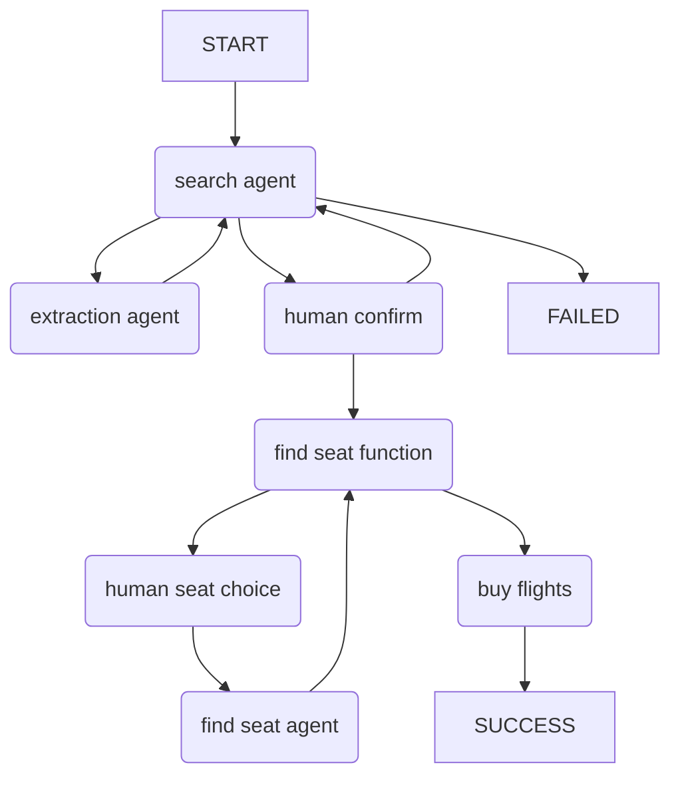

Example of a multi-agent flow where one agent delegates work to another, then hands off control to a third agent.

Demonstrates:

* [agent delegation](../multi-agent-applications.md#agent-delegation)
* [programmatic agent hand-off](../multi-agent-applications.md#programmatic-agent-hand-off)
* [usage limits](../agents.md#usage-limits)

In this scenario, a group of agents work together to find the best flight for a user.

The control flow for this example can be summarised as follows:



## Running the Example

With [dependencies installed and environment variables set](./setup.md#usage), run:

```bash
python/uv-run -m pydantic_ai_examples.flight_booking
```

## Example Code

```snippet {path="/examples/pydantic_ai_examples/flight_booking.py"}```
