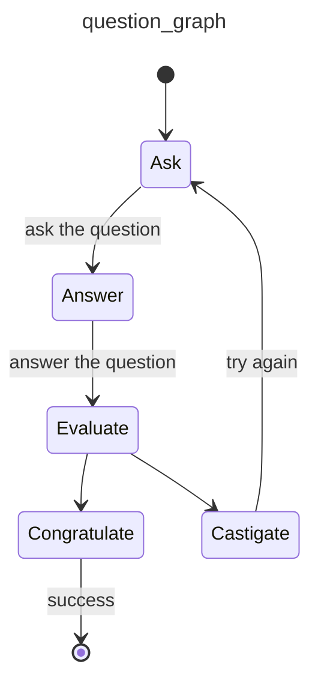

# Question Graph

Example of a graph for asking and evaluating questions.

Demonstrates:

* [`pydantic_graph`](../graph.md)

## Running the Example

With [dependencies installed and environment variables set](./index.md#usage), run:

```bash
python/uv-run -m pydantic_ai_examples.question_graph
```

## Example Code

```python {title="question_graph.py"}
#! examples/pydantic_ai_examples/question_graph.py
```

The mermaid diagram generated in this example looks like this:


