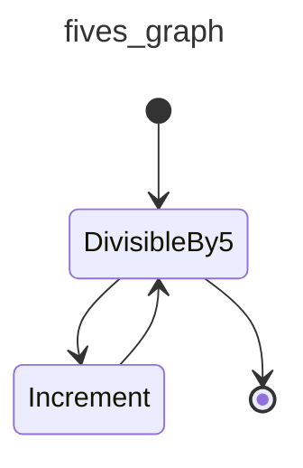
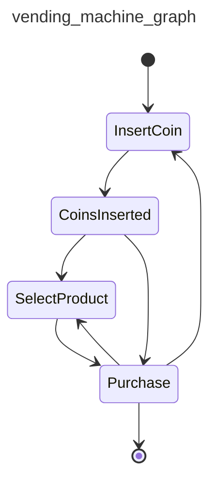
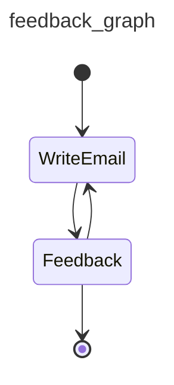
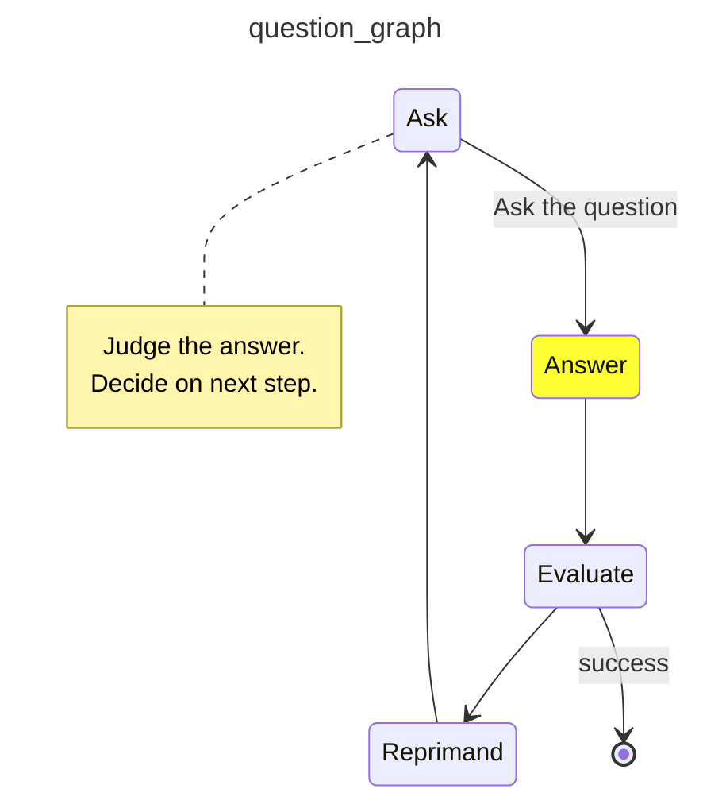
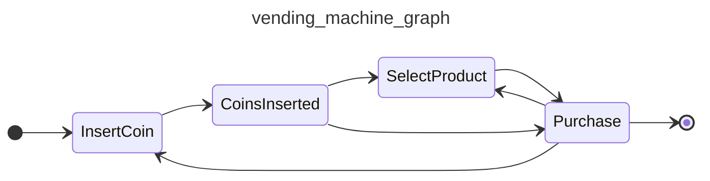

# Graphs

!!! danger "Don't use a nail gun unless you need a nail gun"
    If Pydantic AI [agents](agents.md) are a hammer, and [multi-agent workflows](multi-agent-applications.md) are a sledgehammer, then graphs are a nail gun:

    * sure, nail guns look cooler than hammers
    * but nail guns take a lot more setup than hammers
    * and nail guns don't make you a better builder, they make you a builder with a nail gun
    * Lastly, (and at the risk of torturing this metaphor), if you're a fan of medieval tools like mallets and untyped Python, you probably won't like nail guns or our approach to graphs. (But then again, if you're not a fan of type hints in Python, you've probably already bounced off Pydantic AI to use one of the toy agent frameworks — good luck, and feel free to borrow my sledgehammer when you realize you need it)

    In short, graphs are a powerful tool, but they're not the right tool for every job. Please consider other [multi-agent approaches](multi-agent-applications.md) before proceeding.

    If you're not confident a graph-based approach is a good idea, it might be unnecessary.

Graphs and finite state machines (FSMs) are a powerful abstraction to model, execute, control and visualize complex workflows.

Alongside Pydantic AI, we've developed `pydantic-graph` — an async graph and state machine library for Python where nodes and edges are defined using type hints.

While this library is developed as part of Pydantic AI; it has no dependency on `pydantic-ai` and can be considered as a pure graph-based state machine library. You may find it useful whether or not you're using Pydantic AI or even building with GenAI.

`pydantic-graph` is designed for advanced users and makes heavy use of Python generics and type hints. It is not designed to be as beginner-friendly as Pydantic AI.

## Installation

`pydantic-graph` is a required dependency of `pydantic-ai`, and an optional dependency of `pydantic-ai-slim`, see [installation instructions](install.md#slim-install) for more information. You can also install it directly:

```bash
pip/uv-add pydantic-graph
```

## Graph Types

`pydantic-graph` is made up of a few key components:

### GraphRunContext

[`GraphRunContext`][pydantic_graph.nodes.GraphRunContext] — The context for the graph run, similar to Pydantic AI's [`RunContext`][pydantic_ai.tools.RunContext]. This holds the state of the graph and dependencies and is passed to nodes when they're run.

`GraphRunContext` is generic in the state type of the graph it's used in, [`StateT`][pydantic_graph.nodes.StateT].

### End

[`End`][pydantic_graph.nodes.End] — return value to indicate the graph run should end.

`End` is generic in the graph return type of the graph it's used in, [`RunEndT`][pydantic_graph.nodes.RunEndT].

### Nodes

Subclasses of [`BaseNode`][pydantic_graph.nodes.BaseNode] define nodes for execution in the graph.

Nodes, which are generally [`dataclass`es][dataclasses.dataclass], generally consist of:

- fields containing any parameters required/optional when calling the node
- the business logic to execute the node, in the [`run`][pydantic_graph.nodes.BaseNode.run] method
- return annotations of the [`run`][pydantic_graph.nodes.BaseNode.run] method, which are read by `pydantic-graph` to determine the outgoing edges of the node

Nodes are generic in:

- **state**, which must have the same type as the state of graphs they're included in, [`StateT`][pydantic_graph.nodes.StateT] has a default of `None`, so if you're not using state you can omit this generic parameter, see [stateful graphs](#stateful-graphs) for more information
- **deps**, which must have the same type as the deps of the graph they're included in, [`DepsT`][pydantic_graph.nodes.DepsT] has a default of `None`, so if you're not using deps you can omit this generic parameter, see [dependency injection](#dependency-injection) for more information
- **graph return type** — this only applies if the node returns [`End`][pydantic_graph.nodes.End]. [`RunEndT`][pydantic_graph.nodes.RunEndT] has a default of [Never][typing.Never] so this generic parameter can be omitted if the node doesn't return `End`, but must be included if it does.

Here's an example of a start or intermediate node in a graph — it can't end the run as it doesn't return [`End`][pydantic_graph.nodes.End]:

```py {title="intermediate_node.py" noqa="F821" test="skip"}
from dataclasses import dataclass

from pydantic_graph import BaseNode, GraphRunContext


@dataclass
class MyNode(BaseNode[MyState]):  # (1)!
    foo: int  # (2)!

    async def run(
        self,
        ctx: GraphRunContext[MyState],  # (3)!
    ) -> AnotherNode:  # (4)!
        ...
        return AnotherNode()
```

1. State in this example is `MyState` (not shown), hence `BaseNode` is parameterized with `MyState`. This node can't end the run, so the `RunEndT` generic parameter is omitted and defaults to `Never`.
2. `MyNode` is a dataclass and has a single field `foo`, an `int`.
3. The `run` method takes a `GraphRunContext` parameter, again parameterized with state `MyState`.
4. The return type of the `run` method is `AnotherNode` (not shown), this is used to determine the outgoing edges of the node.

We could extend `MyNode` to optionally end the run if `foo` is divisible by 5:

```py {title="intermediate_or_end_node.py" hl_lines="7 13 15" noqa="F821" test="skip"}
from dataclasses import dataclass

from pydantic_graph import BaseNode, End, GraphRunContext


@dataclass
class MyNode(BaseNode[MyState, None, int]):  # (1)!
    foo: int

    async def run(
        self,
        ctx: GraphRunContext[MyState],
    ) -> AnotherNode | End[int]:  # (2)!
        if self.foo % 5 == 0:
            return End(self.foo)
        else:
            return AnotherNode()
```

1. We parameterize the node with the return type (`int` in this case) as well as state. Because generic parameters are positional-only, we have to include `None` as the second parameter representing deps.
2. The return type of the `run` method is now a union of `AnotherNode` and `End[int]`, this allows the node to end the run if `foo` is divisible by 5.

### Graph

[`Graph`][pydantic_graph.graph.Graph] — this is the execution graph itself, made up of a set of [node classes](#nodes) (i.e., `BaseNode` subclasses).

`Graph` is generic in:

- **state** the state type of the graph, [`StateT`][pydantic_graph.nodes.StateT]
- **deps** the deps type of the graph, [`DepsT`][pydantic_graph.nodes.DepsT]
- **graph return type** the return type of the graph run, [`RunEndT`][pydantic_graph.nodes.RunEndT]

Here's an example of a simple graph:

```py {title="graph_example.py" py="3.10"}
from __future__ import annotations

from dataclasses import dataclass

from pydantic_graph import BaseNode, End, Graph, GraphRunContext


@dataclass
class DivisibleBy5(BaseNode[None, None, int]):  # (1)!
    foo: int

    async def run(
        self,
        ctx: GraphRunContext,
    ) -> Increment | End[int]:
        if self.foo % 5 == 0:
            return End(self.foo)
        else:
            return Increment(self.foo)


@dataclass
class Increment(BaseNode):  # (2)!
    foo: int

    async def run(self, ctx: GraphRunContext) -> DivisibleBy5:
        return DivisibleBy5(self.foo + 1)


fives_graph = Graph(nodes=[DivisibleBy5, Increment])  # (3)!
result = fives_graph.run_sync(DivisibleBy5(4))  # (4)!
print(result.output)
#> 5
```

1. The `DivisibleBy5` node is parameterized with `None` for the state param and `None` for the deps param as this graph doesn't use state or deps, and `int` as it can end the run.
2. The `Increment` node doesn't return `End`, so the `RunEndT` generic parameter is omitted, state can also be omitted as the graph doesn't use state.
3. The graph is created with a sequence of nodes.
4. The graph is run synchronously with [`run_sync`][pydantic_graph.graph.Graph.run_sync]. The initial node is `DivisibleBy5(4)`. Because the graph doesn't use external state or deps, we don't pass `state` or `deps`.

_(This example is complete, it can be run "as is" with Python 3.10+)_

A [mermaid diagram](#mermaid-diagrams) for this graph can be generated with the following code:

```py {title="graph_example_diagram.py" py="3.10" requires="graph_example.py"}
from graph_example import DivisibleBy5, fives_graph

fives_graph.mermaid_code(start_node=DivisibleBy5)
```



In order to visualize a graph within a `jupyter-notebook`, `IPython.display` needs to be used:

```python {title="jupyter_display_mermaid.py"  test="skip"}
from graph_example import DivisibleBy5, fives_graph
from IPython.display import Image, display

display(Image(fives_graph.mermaid_image(start_node=DivisibleBy5)))
```

## Stateful Graphs

The "state" concept in `pydantic-graph` provides an optional way to access and mutate an object (often a `dataclass` or Pydantic model) as nodes run in a graph. If you think of Graphs as a production line, then your state is the engine being passed along the line and built up by each node as the graph is run.

`pydantic-graph` provides state persistence, with the state recorded after each node is run. (See [State Persistence](#state-persistence).)

Here's an example of a graph which represents a vending machine where the user may insert coins and select a product to purchase.

```python {title="vending_machine.py" py="3.10"}
from __future__ import annotations

from dataclasses import dataclass

from rich.prompt import Prompt

from pydantic_graph import BaseNode, End, Graph, GraphRunContext


@dataclass
class MachineState:  # (1)!
    user_balance: float = 0.0
    product: str | None = None


@dataclass
class InsertCoin(BaseNode[MachineState]):  # (3)!
    async def run(self, ctx: GraphRunContext[MachineState]) -> CoinsInserted:  # (16)!
        return CoinsInserted(float(Prompt.ask('Insert coins')))  # (4)!


@dataclass
class CoinsInserted(BaseNode[MachineState]):
    amount: float  # (5)!

    async def run(
        self, ctx: GraphRunContext[MachineState]
    ) -> SelectProduct | Purchase:  # (17)!
        ctx.state.user_balance += self.amount  # (6)!
        if ctx.state.product is not None:  # (7)!
            return Purchase(ctx.state.product)
        else:
            return SelectProduct()


@dataclass
class SelectProduct(BaseNode[MachineState]):
    async def run(self, ctx: GraphRunContext[MachineState]) -> Purchase:
        return Purchase(Prompt.ask('Select product'))


PRODUCT_PRICES = {  # (2)!
    'water': 1.25,
    'soda': 1.50,
    'crisps': 1.75,
    'chocolate': 2.00,
}


@dataclass
class Purchase(BaseNode[MachineState, None, None]):  # (18)!
    product: str

    async def run(
        self, ctx: GraphRunContext[MachineState]
    ) -> End | InsertCoin | SelectProduct:
        if price := PRODUCT_PRICES.get(self.product):  # (8)!
            ctx.state.product = self.product  # (9)!
            if ctx.state.user_balance >= price:  # (10)!
                ctx.state.user_balance -= price
                return End(None)
            else:
                diff = price - ctx.state.user_balance
                print(f'Not enough money for {self.product}, need {diff:0.2f} more')
                #> Not enough money for crisps, need 0.75 more
                return InsertCoin()  # (11)!
        else:
            print(f'No such product: {self.product}, try again')
            return SelectProduct()  # (12)!


vending_machine_graph = Graph(  # (13)!
    nodes=[InsertCoin, CoinsInserted, SelectProduct, Purchase]
)


async def main():
    state = MachineState()  # (14)!
    await vending_machine_graph.run(InsertCoin(), state=state)  # (15)!
    print(f'purchase successful item={state.product} change={state.user_balance:0.2f}')
    #> purchase successful item=crisps change=0.25
```

1. The state of the vending machine is defined as a dataclass with the user's balance and the product they've selected, if any.
2. A dictionary of products mapped to prices.
3. The `InsertCoin` node, [`BaseNode`][pydantic_graph.nodes.BaseNode] is parameterized with `MachineState` as that's the state used in this graph.
4. The `InsertCoin` node prompts the user to insert coins. We keep things simple by just entering a monetary amount as a float. Before you start thinking this is a toy too since it's using [rich's `Prompt.ask`][rich.prompt.PromptBase.ask] within nodes, see [below](#example-human-in-the-loop) for how control flow can be managed when nodes require external input.
5. The `CoinsInserted` node; again this is a [`dataclass`][dataclasses.dataclass] with one field `amount`.
6. Update the user's balance with the amount inserted.
7. If the user has already selected a product, go to `Purchase`, otherwise go to `SelectProduct`.
8. In the `Purchase` node, look up the price of the product if the user entered a valid product.
9. If the user did enter a valid product, set the product in the state so we don't revisit `SelectProduct`.
10. If the balance is enough to purchase the product, adjust the balance to reflect the purchase and return [`End`][pydantic_graph.nodes.End] to end the graph. We're not using the run return type, so we call `End` with `None`.
11. If the balance is insufficient, go to `InsertCoin` to prompt the user to insert more coins.
12. If the product is invalid, go to `SelectProduct` to prompt the user to select a product again.
13. The graph is created by passing a list of nodes to [`Graph`][pydantic_graph.graph.Graph]. Order of nodes is not important, but it can affect how [diagrams](#mermaid-diagrams) are displayed.
14. Initialize the state. This will be passed to the graph run and mutated as the graph runs.
15. Run the graph with the initial state. Since the graph can be run from any node, we must pass the start node — in this case, `InsertCoin`. [`Graph.run`][pydantic_graph.graph.Graph.run] returns a [`GraphRunResult`][pydantic_graph.graph.GraphRunResult] that provides the final data and a history of the run.
16. The return type of the node's [`run`][pydantic_graph.nodes.BaseNode.run] method is important as it is used to determine the outgoing edges of the node. This information in turn is used to render [mermaid diagrams](#mermaid-diagrams) and is enforced at runtime to detect misbehavior as soon as possible.
17. The return type of `CoinsInserted`'s [`run`][pydantic_graph.nodes.BaseNode.run] method is a union, meaning multiple outgoing edges are possible.
18. Unlike other nodes, `Purchase` can end the run, so the [`RunEndT`][pydantic_graph.nodes.RunEndT] generic parameter must be set. In this case it's `None` since the graph run return type is `None`.

_(This example is complete, it can be run "as is" with Python 3.10+ — you'll need to add `asyncio.run(main())` to run `main`)_

A [mermaid diagram](#mermaid-diagrams) for this graph can be generated with the following code:

```py {title="vending_machine_diagram.py" py="3.10" requires="vending_machine.py"}
from vending_machine import InsertCoin, vending_machine_graph

vending_machine_graph.mermaid_code(start_node=InsertCoin)
```

The diagram generated by the above code is:



See [below](#mermaid-diagrams) for more information on generating diagrams.

## GenAI Example

So far we haven't shown an example of a Graph that actually uses Pydantic AI or GenAI at all.

In this example, one agent generates a welcome email to a user and the other agent provides feedback on the email.

This graph has a very simple structure:



```python {title="genai_email_feedback.py" py="3.10" test="ci_only"}
from __future__ import annotations as _annotations

from dataclasses import dataclass, field

from pydantic import BaseModel, EmailStr

from pydantic_ai import Agent, format_as_xml
from pydantic_ai.messages import ModelMessage
from pydantic_graph import BaseNode, End, Graph, GraphRunContext


@dataclass
class User:
    name: str
    email: EmailStr
    interests: list[str]


@dataclass
class Email:
    subject: str
    body: str


@dataclass
class State:
    user: User
    write_agent_messages: list[ModelMessage] = field(default_factory=list)


email_writer_agent = Agent(
    'google-vertex:gemini-1.5-pro',
    output_type=Email,
    system_prompt='Write a welcome email to our tech blog.',
)


@dataclass
class WriteEmail(BaseNode[State]):
    email_feedback: str | None = None

    async def run(self, ctx: GraphRunContext[State]) -> Feedback:
        if self.email_feedback:
            prompt = (
                f'Rewrite the email for the user:\n'
                f'{format_as_xml(ctx.state.user)}\n'
                f'Feedback: {self.email_feedback}'
            )
        else:
            prompt = (
                f'Write a welcome email for the user:\n'
                f'{format_as_xml(ctx.state.user)}'
            )

        result = await email_writer_agent.run(
            prompt,
            message_history=ctx.state.write_agent_messages,
        )
        ctx.state.write_agent_messages += result.new_messages()
        return Feedback(result.output)


class EmailRequiresWrite(BaseModel):
    feedback: str


class EmailOk(BaseModel):
    pass


feedback_agent = Agent[None, EmailRequiresWrite | EmailOk](
    'openai:gpt-4o',
    output_type=EmailRequiresWrite | EmailOk,  # type: ignore
    system_prompt=(
        'Review the email and provide feedback, email must reference the users specific interests.'
    ),
)


@dataclass
class Feedback(BaseNode[State, None, Email]):
    email: Email

    async def run(
        self,
        ctx: GraphRunContext[State],
    ) -> WriteEmail | End[Email]:
        prompt = format_as_xml({'user': ctx.state.user, 'email': self.email})
        result = await feedback_agent.run(prompt)
        if isinstance(result.output, EmailRequiresWrite):
            return WriteEmail(email_feedback=result.output.feedback)
        else:
            return End(self.email)


async def main():
    user = User(
        name='John Doe',
        email='john.joe@example.com',
        interests=['Haskel', 'Lisp', 'Fortran'],
    )
    state = State(user)
    feedback_graph = Graph(nodes=(WriteEmail, Feedback))
    result = await feedback_graph.run(WriteEmail(), state=state)
    print(result.output)
    """
    Email(
        subject='Welcome to our tech blog!',
        body='Hello John, Welcome to our tech blog! ...',
    )
    """
```

_(This example is complete, it can be run "as is" with Python 3.10+ — you'll need to add `asyncio.run(main())` to run `main`)_

## Iterating Over a Graph

### Using `Graph.iter` for `async for` iteration

Sometimes you want direct control or insight into each node as the graph executes. The easiest way to do that is with the [`Graph.iter`][pydantic_graph.graph.Graph.iter] method, which returns a **context manager** that yields a [`GraphRun`][pydantic_graph.graph.GraphRun] object. The `GraphRun` is an async-iterable over the nodes of your graph, allowing you to record or modify them as they execute.

Here's an example:

```python {title="count_down.py" noqa="I001" py="3.10"}
from __future__ import annotations as _annotations

from dataclasses import dataclass
from pydantic_graph import Graph, BaseNode, End, GraphRunContext


@dataclass
class CountDownState:
    counter: int


@dataclass
class CountDown(BaseNode[CountDownState, None, int]):
    async def run(self, ctx: GraphRunContext[CountDownState]) -> CountDown | End[int]:
        if ctx.state.counter <= 0:
            return End(ctx.state.counter)
        ctx.state.counter -= 1
        return CountDown()


count_down_graph = Graph(nodes=[CountDown])


async def main():
    state = CountDownState(counter=3)
    async with count_down_graph.iter(CountDown(), state=state) as run:  # (1)!
        async for node in run:  # (2)!
            print('Node:', node)
            #> Node: CountDown()
            #> Node: CountDown()
            #> Node: CountDown()
            #> Node: CountDown()
            #> Node: End(data=0)
    print('Final output:', run.result.output)  # (3)!
    #> Final output: 0
```

1. `Graph.iter(...)` returns a [`GraphRun`][pydantic_graph.graph.GraphRun].
2. Here, we step through each node as it is executed.
3. Once the graph returns an [`End`][pydantic_graph.nodes.End], the loop ends, and `run.result` becomes a [`GraphRunResult`][pydantic_graph.graph.GraphRunResult] containing the final outcome (`0` here).

### Using `GraphRun.next(node)` manually

Alternatively, you can drive iteration manually with the [`GraphRun.next`][pydantic_graph.graph.GraphRun.next] method, which allows you to pass in whichever node you want to run next. You can modify or selectively skip nodes this way.

Below is a contrived example that stops whenever the counter is at 2, ignoring any node runs beyond that:

```python {title="count_down_next.py" noqa="I001" py="3.10" requires="count_down.py"}
from pydantic_graph import End, FullStatePersistence
from count_down import CountDown, CountDownState, count_down_graph


async def main():
    state = CountDownState(counter=5)
    persistence = FullStatePersistence()  # (7)!
    async with count_down_graph.iter(
        CountDown(), state=state, persistence=persistence
    ) as run:
        node = run.next_node  # (1)!
        while not isinstance(node, End):  # (2)!
            print('Node:', node)
            #> Node: CountDown()
            #> Node: CountDown()
            #> Node: CountDown()
            #> Node: CountDown()
            if state.counter == 2:
                break  # (3)!
            node = await run.next(node)  # (4)!

        print(run.result)  # (5)!
        #> None

        for step in persistence.history:  # (6)!
            print('History Step:', step.state, step.state)
            #> History Step: CountDownState(counter=5) CountDownState(counter=5)
            #> History Step: CountDownState(counter=4) CountDownState(counter=4)
            #> History Step: CountDownState(counter=3) CountDownState(counter=3)
            #> History Step: CountDownState(counter=2) CountDownState(counter=2)
```

1. We start by grabbing the first node that will be run in the agent's graph.
2. The agent run is finished once an `End` node has been produced; instances of `End` cannot be passed to `next`.
3. If the user decides to stop early, we break out of the loop. The graph run won't have a real final result in that case (`run.result` remains `None`).
4. At each step, we call `await run.next(node)` to run it and get the next node (or an `End`).
5. Because we did not continue the run until it finished, the `result` is not set.
6. The run's history is still populated with the steps we executed so far.
7. Use [`FullStatePersistence`][pydantic_graph.FullStatePersistence] so we can show the history of the run, see [State Persistence](#state-persistence) below for more information.

## State Persistence

One of the biggest benefits of finite state machine (FSM) graphs is how they simplify the handling of interrupted execution. This might happen for a variety of reasons:

- the state machine logic might fundamentally need to be paused — e.g. the returns workflow for an e-commerce order needs to wait for the item to be posted to the returns center or because execution of the next node needs input from a user so needs to wait for a new http request,
- the execution takes so long that the entire graph can't reliably be executed in a single continuous run — e.g. a deep research agent that might take hours to run,
- you want to run multiple graph nodes in parallel in different processes / hardware instances (note: parallel node execution is not yet supported in `pydantic-graph`, see [#704](https://github.com/pydantic/pydantic-ai/issues/704)).

Trying to make a conventional control flow (i.e., boolean logic and nested function calls) implementation compatible with these usage scenarios generally results in brittle and over-complicated spaghetti code, with the logic required to interrupt and resume execution dominating the implementation.

To allow graph runs to be interrupted and resumed, `pydantic-graph` provides state persistence — a system for snapshotting the state of a graph run before and after each node is run, allowing a graph run to be resumed from any point in the graph.

`pydantic-graph` includes three state persistence implementations:

- [`SimpleStatePersistence`][pydantic_graph.SimpleStatePersistence] — Simple in memory state persistence that just hold the latest snapshot. If no state persistence implementation is provided when running a graph, this is used by default.
- [`FullStatePersistence`][pydantic_graph.FullStatePersistence] — In memory state persistence that hold a list of snapshots.
- [`FileStatePersistence`][pydantic_graph.persistence.file.FileStatePersistence] — File-based state persistence that saves snapshots to a JSON file.

In production applications, developers should implement their own state persistence by subclassing [`BaseStatePersistence`][pydantic_graph.persistence.BaseStatePersistence] abstract base class, which might persist runs in a relational database like PostgresQL.

At a high level the role of `StatePersistence` implementations is to store and retrieve [`NodeSnapshot`][pydantic_graph.persistence.NodeSnapshot] and [`EndSnapshot`][pydantic_graph.persistence.EndSnapshot] objects.

[`graph.iter_from_persistence()`][pydantic_graph.graph.Graph.iter_from_persistence] may be used to run the graph based on the state stored in persistence.

We can run the `count_down_graph` from [above](#iterating-over-a-graph), using [`graph.iter_from_persistence()`][pydantic_graph.graph.Graph.iter_from_persistence] and [`FileStatePersistence`][pydantic_graph.persistence.file.FileStatePersistence].

As you can see in this code, `run_node` requires no external application state (apart from state persistence) to be run, meaning graphs can easily be executed by distributed execution and queueing systems.

```python {title="count_down_from_persistence.py" noqa="I001" py="3.10" requires="count_down.py"}
from pathlib import Path

from pydantic_graph import End
from pydantic_graph.persistence.file import FileStatePersistence

from count_down import CountDown, CountDownState, count_down_graph


async def main():
    run_id = 'run_abc123'
    persistence = FileStatePersistence(Path(f'count_down_{run_id}.json'))  # (1)!
    state = CountDownState(counter=5)
    await count_down_graph.initialize(  # (2)!
        CountDown(), state=state, persistence=persistence
    )

    done = False
    while not done:
        done = await run_node(run_id)


async def run_node(run_id: str) -> bool:  # (3)!
    persistence = FileStatePersistence(Path(f'count_down_{run_id}.json'))
    async with count_down_graph.iter_from_persistence(persistence) as run:  # (4)!
        node_or_end = await run.next()  # (5)!

    print('Node:', node_or_end)
    #> Node: CountDown()
    #> Node: CountDown()
    #> Node: CountDown()
    #> Node: CountDown()
    #> Node: CountDown()
    #> Node: End(data=0)
    return isinstance(node_or_end, End)  # (6)!
```

1. Create a [`FileStatePersistence`][pydantic_graph.persistence.file.FileStatePersistence] to use to start the graph.
2. Call [`graph.initialize()`][pydantic_graph.graph.Graph.initialize] to set the initial graph state in the persistence object.
3. `run_node` is a pure function that doesn't need access to any other process state to run the next node of the graph, except the ID of the run.
4. Call [`graph.iter_from_persistence()`][pydantic_graph.graph.Graph.iter_from_persistence] create a [`GraphRun`][pydantic_graph.graph.GraphRun] object that will run the next node of the graph from the state stored in persistence. This will return either a node or an `End` object.
5. [`graph.run()`][pydantic_graph.graph.Graph.run] will return either a [node][pydantic_graph.nodes.BaseNode] or an [`End`][pydantic_graph.nodes.End] object.
6. Check if the node is an [`End`][pydantic_graph.nodes.End] object, if it is, the graph run is complete.

_(This example is complete, it can be run "as is" with Python 3.10+ — you'll need to add `asyncio.run(main())` to run `main`)_

### Example: Human in the loop.

As noted above, state persistence allows graphs to be interrupted and resumed. One use case of this is to allow user input to continue.

In this example, an AI asks the user a question, the user provides an answer, the AI evaluates the answer and ends if the user got it right or asks another question if they got it wrong.

Instead of running the entire graph in a single process invocation, we run the graph by running the process repeatedly, optionally providing an answer to the question as a command line argument.

??? example "`ai_q_and_a_graph.py` — `question_graph` definition"
```python {title="ai_q_and_a_graph.py" noqa="I001" py="3.10"}
from __future__ import annotations as _annotations

from typing import Annotated
from pydantic_graph import Edge
from dataclasses import dataclass, field
from pydantic import BaseModel
from pydantic_graph import (
    BaseNode,
    End,
    Graph,
    GraphRunContext,
)
from pydantic_ai import Agent, format_as_xml
from pydantic_ai.messages import ModelMessage

ask_agent = Agent('openai:gpt-4o', output_type=str, instrument=True)


@dataclass
class QuestionState:
    question: str | None = None
    ask_agent_messages: list[ModelMessage] = field(default_factory=list)
    evaluate_agent_messages: list[ModelMessage] = field(default_factory=list)


@dataclass
class Ask(BaseNode[QuestionState]):
    """Generate question using GPT-4o."""
    docstring_notes = True
    async def run(
        self, ctx: GraphRunContext[QuestionState]
    ) -> Annotated[Answer, Edge(label='Ask the question')]:
        result = await ask_agent.run(
            'Ask a simple question with a single correct answer.',
            message_history=ctx.state.ask_agent_messages,
        )
        ctx.state.ask_agent_messages += result.new_messages()
        ctx.state.question = result.output
        return Answer(result.output)


@dataclass
class Answer(BaseNode[QuestionState]):
    question: str

    async def run(self, ctx: GraphRunContext[QuestionState]) -> Evaluate:
        answer = input(f'{self.question}: ')
        return Evaluate(answer)


class EvaluationResult(BaseModel, use_attribute_docstrings=True):
    correct: bool
    """Whether the answer is correct."""
    comment: str
    """Comment on the answer, reprimand the user if the answer is wrong."""


evaluate_agent = Agent(
    'openai:gpt-4o',
    output_type=EvaluationResult,
    system_prompt='Given a question and answer, evaluate if the answer is correct.',
)


@dataclass
class Evaluate(BaseNode[QuestionState, None, str]):
    answer: str

    async def run(
        self,
        ctx: GraphRunContext[QuestionState],
    ) -> Annotated[End[str], Edge(label='success')] | Reprimand:
        assert ctx.state.question is not None
        result = await evaluate_agent.run(
            format_as_xml({'question': ctx.state.question, 'answer': self.answer}),
            message_history=ctx.state.evaluate_agent_messages,
        )
        ctx.state.evaluate_agent_messages += result.new_messages()
        if result.output.correct:
            return End(result.output.comment)
        else:
            return Reprimand(result.output.comment)


@dataclass
class Reprimand(BaseNode[QuestionState]):
    comment: str

    async def run(self, ctx: GraphRunContext[QuestionState]) -> Ask:
        print(f'Comment: {self.comment}')
        ctx.state.question = None
        return Ask()


question_graph = Graph(
    nodes=(Ask, Answer, Evaluate, Reprimand), state_type=QuestionState
)
```

_(This example is complete, it can be run "as is" with Python 3.10+)_

```python {title="ai_q_and_a_run.py" noqa="I001" py="3.10" requires="ai_q_and_a_graph.py"}
import sys
from pathlib import Path

from pydantic_graph import End
from pydantic_graph.persistence.file import FileStatePersistence
from pydantic_ai.messages import ModelMessage  # noqa: F401

from ai_q_and_a_graph import Ask, question_graph, Evaluate, QuestionState, Answer


async def main():
    answer: str | None = sys.argv[1] if len(sys.argv) > 1 else None  # (1)!
    persistence = FileStatePersistence(Path('question_graph.json'))  # (2)!
    persistence.set_graph_types(question_graph)  # (3)!

    if snapshot := await persistence.load_next():  # (4)!
        state = snapshot.state
        assert answer is not None
        node = Evaluate(answer)
    else:
        state = QuestionState()
        node = Ask()  # (5)!

    async with question_graph.iter(node, state=state, persistence=persistence) as run:
        while True:
            node = await run.next()  # (6)!
            if isinstance(node, End):  # (7)!
                print('END:', node.data)
                history = await persistence.load_all()  # (8)!
                print([e.node for e in history])
                break
            elif isinstance(node, Answer):  # (9)!
                print(node.question)
                #> What is the capital of France?
                break
            # otherwise just continue
```

1. Get the user's answer from the command line, if provided. See [question graph example](examples/question-graph.md) for a complete example.
2. Create a state persistence instance the `'question_graph.json'` file may or may not already exist.
3. Since we're using the [persistence interface][pydantic_graph.persistence.BaseStatePersistence] outside a graph, we need to call [`set_graph_types`][pydantic_graph.persistence.BaseStatePersistence.set_graph_types] to set the graph generic types `StateT` and `RunEndT` for the persistence instance. This is necessary to allow the persistence instance to know how to serialize and deserialize graph nodes.
4. If we're run the graph before, [`load_next`][pydantic_graph.persistence.BaseStatePersistence.load_next] will return a snapshot of the next node to run, here we use `state` from that snapshot, and create a new `Evaluate` node with the answer provided on the command line.
5. If the graph hasn't been run before, we create a new `QuestionState` and start with the `Ask` node.
6. Call [`GraphRun.next()`][pydantic_graph.graph.GraphRun.next] to run the node. This will return either a node or an `End` object.
7. If the node is an `End` object, the graph run is complete. The `data` field of the `End` object contains the comment returned by the `evaluate_agent` about the correct answer.
8. To demonstrate the state persistence, we call [`load_all`][pydantic_graph.persistence.BaseStatePersistence.load_all] to get all the snapshots from the persistence instance. This will return a list of [`Snapshot`][pydantic_graph.persistence.Snapshot] objects.
9. If the node is an `Answer` object, we print the question and break out of the loop to end the process and wait for user input.

_(This example is complete, it can be run "as is" with Python 3.10+ — you'll need to add `asyncio.run(main())` to run `main`)_

For a complete example of this graph, see the [question graph example](examples/question-graph.md).

## Dependency Injection

As with Pydantic AI, `pydantic-graph` supports dependency injection via a generic parameter on [`Graph`][pydantic_graph.graph.Graph] and [`BaseNode`][pydantic_graph.nodes.BaseNode], and the [`GraphRunContext.deps`][pydantic_graph.nodes.GraphRunContext.deps] field.

As an example of dependency injection, let's modify the `DivisibleBy5` example [above](#graph) to use a [`ProcessPoolExecutor`][concurrent.futures.ProcessPoolExecutor] to run the compute load in a separate process (this is a contrived example, `ProcessPoolExecutor` wouldn't actually improve performance in this example):

```py {title="deps_example.py" py="3.10" test="skip" hl_lines="4 10-12 35-37 48-49"}
from __future__ import annotations

import asyncio
from concurrent.futures import ProcessPoolExecutor
from dataclasses import dataclass

from pydantic_graph import BaseNode, End, FullStatePersistence, Graph, GraphRunContext


@dataclass
class GraphDeps:
    executor: ProcessPoolExecutor


@dataclass
class DivisibleBy5(BaseNode[None, GraphDeps, int]):
    foo: int

    async def run(
        self,
        ctx: GraphRunContext[None, GraphDeps],
    ) -> Increment | End[int]:
        if self.foo % 5 == 0:
            return End(self.foo)
        else:
            return Increment(self.foo)


@dataclass
class Increment(BaseNode[None, GraphDeps]):
    foo: int

    async def run(self, ctx: GraphRunContext[None, GraphDeps]) -> DivisibleBy5:
        loop = asyncio.get_running_loop()
        compute_result = await loop.run_in_executor(
            ctx.deps.executor,
            self.compute,
        )
        return DivisibleBy5(compute_result)

    def compute(self) -> int:
        return self.foo + 1


fives_graph = Graph(nodes=[DivisibleBy5, Increment])


async def main():
    with ProcessPoolExecutor() as executor:
        deps = GraphDeps(executor)
        result = await fives_graph.run(DivisibleBy5(3), deps=deps, persistence=FullStatePersistence())
    print(result.output)
    #> 5
    # the full history is quite verbose (see below), so we'll just print the summary
    print([item.node for item in result.persistence.history])
    """
    [
        DivisibleBy5(foo=3),
        Increment(foo=3),
        DivisibleBy5(foo=4),
        Increment(foo=4),
        DivisibleBy5(foo=5),
        End(data=5),
    ]
    """
```

_(This example is complete, it can be run "as is" with Python 3.10+ — you'll need to add `asyncio.run(main())` to run `main`)_

## Mermaid Diagrams

Pydantic Graph can generate [mermaid](https://mermaid.js.org/) [`stateDiagram-v2`](https://mermaid.js.org/syntax/stateDiagram.html) diagrams for graphs, as shown above.

These diagrams can be generated with:

- [`Graph.mermaid_code`][pydantic_graph.graph.Graph.mermaid_code] to generate the mermaid code for a graph
- [`Graph.mermaid_image`][pydantic_graph.graph.Graph.mermaid_image] to generate an image of the graph using [mermaid.ink](https://mermaid.ink/)
- [`Graph.mermaid_save`][pydantic_graph.graph.Graph.mermaid_save] to generate an image of the graph using [mermaid.ink](https://mermaid.ink/) and save it to a file

Beyond the diagrams shown above, you can also customize mermaid diagrams with the following options:

- [`Edge`][pydantic_graph.nodes.Edge] allows you to apply a label to an edge
- [`BaseNode.docstring_notes`][pydantic_graph.nodes.BaseNode.docstring_notes] and [`BaseNode.get_note`][pydantic_graph.nodes.BaseNode.get_note] allows you to add notes to nodes
- The [`highlighted_nodes`][pydantic_graph.graph.Graph.mermaid_code] parameter allows you to highlight specific node(s) in the diagram

Putting that together, we can edit the last [`ai_q_and_a_graph.py`](#example-human-in-the-loop) example to:

- add labels to some edges
- add a note to the `Ask` node
- highlight the `Answer` node
- save the diagram as a `PNG` image to file

```python {title="ai_q_and_a_graph_extra.py" test="skip" lint="skip" hl_lines="2 4 10-11 14 26 31"}
from typing import Annotated

from pydantic_graph import BaseNode, End, Graph, GraphRunContext, Edge

ask_agent = Agent('openai:gpt-4o', output_type=str, instrument=True)


@dataclass
class QuestionState:
    question: str | None = None
    ask_agent_messages: list[ModelMessage] = field(default_factory=list)
    evaluate_agent_messages: list[ModelMessage] = field(default_factory=list)


@dataclass
class Ask(BaseNode[QuestionState]):
    """Generate question using GPT-4o."""
    docstring_notes = True
    async def run(
        self, ctx: GraphRunContext[QuestionState]
    ) -> Annotated[Answer, Edge(label='Ask the question')]:
        result = await ask_agent.run(
            'Ask a simple question with a single correct answer.',
            message_history=ctx.state.ask_agent_messages,
        )
        ctx.state.ask_agent_messages += result.new_messages()
        ctx.state.question = result.output
        return Answer(result.output)


@dataclass
class Answer(BaseNode[QuestionState]):
    question: str

    async def run(self, ctx: GraphRunContext[QuestionState]) -> Evaluate:
        answer = input(f'{self.question}: ')
        return Evaluate(answer)


class EvaluationResult(BaseModel, use_attribute_docstrings=True):
    correct: bool
    """Whether the answer is correct."""
    comment: str
    """Comment on the answer, reprimand the user if the answer is wrong."""


evaluate_agent = Agent(
    'openai:gpt-4o',
    output_type=EvaluationResult,
    system_prompt='Given a question and answer, evaluate if the answer is correct.',
)


@dataclass
class Evaluate(BaseNode[QuestionState, None, str]):
    answer: str

    async def run(
        self,
        ctx: GraphRunContext[QuestionState],
    ) -> Annotated[End[str], Edge(label='success')] | Reprimand:
        assert ctx.state.question is not None
        result = await evaluate_agent.run(
            format_as_xml({'question': ctx.state.question, 'answer': self.answer}),
            message_history=ctx.state.evaluate_agent_messages,
        )
        ctx.state.evaluate_agent_messages += result.new_messages()
        if result.output.correct:
            return End(result.output.comment)
        else:
            return Reprimand(result.output.comment)


@dataclass
class Reprimand(BaseNode[QuestionState]):
    comment: str

    async def run(self, ctx: GraphRunContext[QuestionState]) -> Ask:
        print(f'Comment: {self.comment}')
        ctx.state.question = None
        return Ask()


question_graph = Graph(
    nodes=(Ask, Answer, Evaluate, Reprimand), state_type=QuestionState
)
```

_(This example is not complete and cannot be run directly)_

This would generate an image that looks like this:



### Setting Direction of the State Diagram

You can specify the direction of the state diagram using one of the following values:

- `'TB'`: Top to bottom, the diagram flows vertically from top to bottom.
- `'LR'`: Left to right, the diagram flows horizontally from left to right.
- `'RL'`: Right to left, the diagram flows horizontally from right to left.
- `'BT'`: Bottom to top, the diagram flows vertically from bottom to top.

Here is an example of how to do this using 'Left to Right' (LR) instead of the default 'Top to Bottom' (TB):

```py {title="vending_machine_diagram.py" py="3.10" requires="vending_machine.py"}
from vending_machine import InsertCoin, vending_machine_graph

vending_machine_graph.mermaid_code(start_node=InsertCoin, direction='LR')
```


