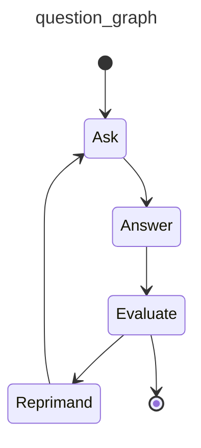

# Graphs

!!! danger "Don't use a nail gun unless you need a nail gun"
    If PydanticAI [agents](agents.md) are a hammer, and [multi-agent workflows](multi-agent-applications.md) are a sledgehammer, then graphs are a nail gun:

    * sure, nail guns look cooler than hammers
    * but nail guns take a lot more setup than hammers
    * and nail guns don't make you a better builder, they make you a builder with a nail gun
    * Lastly, (and at the risk of torturing this metaphor), if you're a fan of medieval tools like mallets and untyped Python, you probably won't like nail guns or our approach to graphs. (But then again, if you're not a fan of type hints in Python, you've probably already bounced off PydanticAI to use one of the toy agent frameworks — good luck, and feel free to borrow my sledgehammer when you realize you need it)

    In short, graphs are a powerful tool, but they're not the right tool for every job. Please consider other [multi-agent approaches](multi-agent-applications.md) before proceeding.

    If you're not confident a graph-based approach is a good idea, it might be unnecessary.

Graphs and finite state machines (FSMs) are a powerful abstraction to model, execute, control and visualize complex workflows.

Alongside PydanticAI, we've developed `pydantic-graph` — an async graph and state machine library for Python where nodes and edges are defined using type hints.

While this library is developed as part of PydanticAI; it has no dependency on `pydantic-ai` and can be considered as a pure graph-based state machine library. You may find it useful whether or not you're using PydanticAI or even building with GenAI.

`pydantic-graph` is designed for advanced users and makes heavy use of Python generics and type hints. It is not designed to be as beginner-friendly as PydanticAI.

!!! note "Very Early beta"
    Graph support was [introduced](https://github.com/pydantic/pydantic-ai/pull/528) in v0.0.19 and is in a very early beta. The API is subject to change. The documentation is incomplete. The implementation is incomplete.

## Installation

`pydantic-graph` is a required dependency of `pydantic-ai`, and an optional dependency of `pydantic-ai-slim`, see [installation instructions](install.md#slim-install) for more information. You can also install it directly:

```bash
pip/uv-add pydantic-graph
```

## Graph Types

`pydantic-graph` is made up of a few key components:

### GraphRunContext

[`GraphRunContext`][pydantic_graph.nodes.GraphRunContext] — The context for the graph run, similar to PydanticAI's [`RunContext`][pydantic_ai.tools.RunContext]. This holds the state of the graph and dependencies and is passed to nodes when they're run.

`GraphRunContext` is generic in the state type of the graph it's used in, [`StateT`][pydantic_graph.state.StateT].

### End

[`End`][pydantic_graph.nodes.End] — return value to indicate the graph run should end.

`End` is generic in the graph return type of the graph it's used in, [`RunEndT`][pydantic_graph.nodes.RunEndT].

### Nodes

Subclasses of [`BaseNode`][pydantic_graph.nodes.BaseNode] define nodes for execution in the graph.

Nodes, which are generally [`dataclass`es][dataclasses.dataclass], generally consist of:

* fields containing any parameters required/optional when calling the node
* the business logic to execute the node, in the [`run`][pydantic_graph.nodes.BaseNode.run] method
* return annotations of the [`run`][pydantic_graph.nodes.BaseNode.run] method, which are read by `pydantic-graph` to determine the outgoing edges of the node

Nodes are generic in:

* **state**, which must have the same type as the state of graphs they're included in, [`StateT`][pydantic_graph.state.StateT] has a default of `None`, so if you're not using state you can omit this generic parameter, see [stateful graphs](#stateful-graphs) for more information
* **deps**, which must have the same type as the deps of the graph they're included in, [`DepsT`][pydantic_graph.nodes.DepsT] has a default of `None`, so if you're not using deps you can omit this generic parameter, see [dependency injection](#dependency-injection) for more information
* **graph return type** — this only applies if the node returns [`End`][pydantic_graph.nodes.End]. [`RunEndT`][pydantic_graph.nodes.RunEndT] has a default of [Never][typing.Never] so this generic parameter can be omitted if the node doesn't return `End`, but must be included if it does.

Here's an example of a start or intermediate node in a graph — it can't end the run as it doesn't return [`End`][pydantic_graph.nodes.End]:

```py {title="intermediate_node.py" noqa="F821" test="skip"}
from dataclasses import dataclass

from pydantic_graph import BaseNode, GraphRunContext


@dataclass
class MyNode(BaseNode[MyState]):  # (1)!
    foo: int  # (2)!

    async def run(
        self,
        ctx: GraphRunContext[MyState],  # (3)!
    ) -> AnotherNode:  # (4)!
        ...
        return AnotherNode()
```

1. State in this example is `MyState` (not shown), hence `BaseNode` is parameterized with `MyState`. This node can't end the run, so the `RunEndT` generic parameter is omitted and defaults to `Never`.
2. `MyNode` is a dataclass and has a single field `foo`, an `int`.
3. The `run` method takes a `GraphRunContext` parameter, again parameterized with state `MyState`.
4. The return type of the `run` method is `AnotherNode` (not shown), this is used to determine the outgoing edges of the node.

We could extend `MyNode` to optionally end the run if `foo` is divisible by 5:

```py {title="intermediate_or_end_node.py" hl_lines="7 13 15" noqa="F821" test="skip"}
from dataclasses import dataclass

from pydantic_graph import BaseNode, End, GraphRunContext


@dataclass
class MyNode(BaseNode[MyState, None, int]):  # (1)!
    foo: int

    async def run(
        self,
        ctx: GraphRunContext[MyState],
    ) -> AnotherNode | End[int]:  # (2)!
        if self.foo % 5 == 0:
            return End(self.foo)
        else:
            return AnotherNode()
```

1. We parameterize the node with the return type (`int` in this case) as well as state. Because generic parameters are positional-only, we have to include `None` as the second parameter representing deps.
2. The return type of the `run` method is now a union of `AnotherNode` and `End[int]`, this allows the node to end the run if `foo` is divisible by 5.

### Graph

[`Graph`][pydantic_graph.graph.Graph] — this is the execution graph itself, made up of a set of [node classes](#nodes) (i.e., `BaseNode` subclasses).

`Graph` is generic in:

* **state** the state type of the graph, [`StateT`][pydantic_graph.state.StateT]
* **deps** the deps type of the graph, [`DepsT`][pydantic_graph.nodes.DepsT]
* **graph return type** the return type of the graph run, [`RunEndT`][pydantic_graph.nodes.RunEndT]

Here's an example of a simple graph:

```py {title="graph_example.py" py="3.10"}
from __future__ import annotations

from dataclasses import dataclass

from pydantic_graph import BaseNode, End, Graph, GraphRunContext


@dataclass
class DivisibleBy5(BaseNode[None, None, int]):  # (1)!
    foo: int

    async def run(
        self,
        ctx: GraphRunContext,
    ) -> Increment | End[int]:
        if self.foo % 5 == 0:
            return End(self.foo)
        else:
            return Increment(self.foo)


@dataclass
class Increment(BaseNode):  # (2)!
    foo: int

    async def run(self, ctx: GraphRunContext) -> DivisibleBy5:
        return DivisibleBy5(self.foo + 1)


fives_graph = Graph(nodes=[DivisibleBy5, Increment])  # (3)!
result = fives_graph.run_sync(DivisibleBy5(4))  # (4)!
print(result.output)
#> 5
# the full history is quite verbose (see below), so we'll just print the summary
print([item.data_snapshot() for item in result.history])
#> [DivisibleBy5(foo=4), Increment(foo=4), DivisibleBy5(foo=5), End(data=5)]
```

1. The `DivisibleBy5` node is parameterized with `None` for the state param and `None` for the deps param as this graph doesn't use state or deps, and `int` as it can end the run.
2. The `Increment` node doesn't return `End`, so the `RunEndT` generic parameter is omitted, state can also be omitted as the graph doesn't use state.
3. The graph is created with a sequence of nodes.
4. The graph is run synchronously with [`run_sync`][pydantic_graph.graph.Graph.run_sync]. The initial node is `DivisibleBy5(4)`. Because the graph doesn't use external state or deps, we don't pass `state` or `deps`.

_(This example is complete, it can be run "as is" with Python 3.10+)_

A [mermaid diagram](#mermaid-diagrams) for this graph can be generated with the following code:

```py {title="graph_example_diagram.py" py="3.10"}
from graph_example import DivisibleBy5, fives_graph

fives_graph.mermaid_code(start_node=DivisibleBy5)
```


In order to visualize a graph within a `jupyter-notebook`, `IPython.display` needs to be used:

```python {title="jupyter_display_mermaid.py"  test="skip"}
from graph_example import DivisibleBy5, fives_graph
from IPython.display import Image, display

display(Image(fives_graph.mermaid_image(start_node=DivisibleBy5)))
```

## Stateful Graphs

The "state" concept in `pydantic-graph` provides an optional way to access and mutate an object (often a `dataclass` or Pydantic model) as nodes run in a graph. If you think of Graphs as a production line, then your state is the engine being passed along the line and built up by each node as the graph is run.

In the future, we intend to extend `pydantic-graph` to provide state persistence with the state recorded after each node is run, see [#695](https://github.com/pydantic/pydantic-ai/issues/695).

Here's an example of a graph which represents a vending machine where the user may insert coins and select a product to purchase.

```python {title="vending_machine.py" py="3.10"}
from __future__ import annotations

from dataclasses import dataclass

from rich.prompt import Prompt

from pydantic_graph import BaseNode, End, Graph, GraphRunContext


@dataclass
class MachineState:  # (1)!
    user_balance: float = 0.0
    product: str | None = None


@dataclass
class InsertCoin(BaseNode[MachineState]):  # (3)!
    async def run(self, ctx: GraphRunContext[MachineState]) -> CoinsInserted:  # (16)!
        return CoinsInserted(float(Prompt.ask('Insert coins')))  # (4)!


@dataclass
class CoinsInserted(BaseNode[MachineState]):
    amount: float  # (5)!

    async def run(
        self, ctx: GraphRunContext[MachineState]
    ) -> SelectProduct | Purchase:  # (17)!
        ctx.state.user_balance += self.amount  # (6)!
        if ctx.state.product is not None:  # (7)!
            return Purchase(ctx.state.product)
        else:
            return SelectProduct()


@dataclass
class SelectProduct(BaseNode[MachineState]):
    async def run(self, ctx: GraphRunContext[MachineState]) -> Purchase:
        return Purchase(Prompt.ask('Select product'))


PRODUCT_PRICES = {  # (2)!
    'water': 1.25,
    'soda': 1.50,
    'crisps': 1.75,
    'chocolate': 2.00,
}


@dataclass
class Purchase(BaseNode[MachineState, None, None]):  # (18)!
    product: str

    async def run(
        self, ctx: GraphRunContext[MachineState]
    ) -> End | InsertCoin | SelectProduct:
        if price := PRODUCT_PRICES.get(self.product):  # (8)!
            ctx.state.product = self.product  # (9)!
            if ctx.state.user_balance >= price:  # (10)!
                ctx.state.user_balance -= price
                return End(None)
            else:
                diff = price - ctx.state.user_balance
                print(f'Not enough money for {self.product}, need {diff:0.2f} more')
                #> Not enough money for crisps, need 0.75 more
                return InsertCoin()  # (11)!
        else:
            print(f'No such product: {self.product}, try again')
            return SelectProduct()  # (12)!


vending_machine_graph = Graph(  # (13)!
    nodes=[InsertCoin, CoinsInserted, SelectProduct, Purchase]
)


async def main():
    state = MachineState()  # (14)!
    await vending_machine_graph.run(InsertCoin(), state=state)  # (15)!
    print(f'purchase successful item={state.product} change={state.user_balance:0.2f}')
    #> purchase successful item=crisps change=0.25
```

1. The state of the vending machine is defined as a dataclass with the user's balance and the product they've selected, if any.
2. A dictionary of products mapped to prices.
3. The `InsertCoin` node, [`BaseNode`][pydantic_graph.nodes.BaseNode] is parameterized with `MachineState` as that's the state used in this graph.
4. The `InsertCoin` node prompts the user to insert coins. We keep things simple by just entering a monetary amount as a float. Before you start thinking this is a toy too since it's using [rich's `Prompt.ask`][rich.prompt.PromptBase.ask] within nodes, see [below](#custom-control-flow) for how control flow can be managed when nodes require external input.
5. The `CoinsInserted` node; again this is a [`dataclass`][dataclasses.dataclass] with one field `amount`.
6. Update the user's balance with the amount inserted.
7. If the user has already selected a product, go to `Purchase`, otherwise go to `SelectProduct`.
8. In the `Purchase` node, look up the price of the product if the user entered a valid product.
9. If the user did enter a valid product, set the product in the state so we don't revisit `SelectProduct`.
10. If the balance is enough to purchase the product, adjust the balance to reflect the purchase and return [`End`][pydantic_graph.nodes.End] to end the graph. We're not using the run return type, so we call `End` with `None`.
11. If the balance is insufficient, go to `InsertCoin` to prompt the user to insert more coins.
12. If the product is invalid, go to `SelectProduct` to prompt the user to select a product again.
13. The graph is created by passing a list of nodes to [`Graph`][pydantic_graph.graph.Graph]. Order of nodes is not important, but it can affect how [diagrams](#mermaid-diagrams) are displayed.
14. Initialize the state. This will be passed to the graph run and mutated as the graph runs.
15. Run the graph with the initial state. Since the graph can be run from any node, we must pass the start node — in this case, `InsertCoin`. [`Graph.run`][pydantic_graph.graph.Graph.run] returns a [`GraphRunResult`][pydantic_graph.graph.GraphRunResult] that provides the final data and a history of the run.
16. The return type of the node's [`run`][pydantic_graph.nodes.BaseNode.run] method is important as it is used to determine the outgoing edges of the node. This information in turn is used to render [mermaid diagrams](#mermaid-diagrams) and is enforced at runtime to detect misbehavior as soon as possible.
17. The return type of `CoinsInserted`'s [`run`][pydantic_graph.nodes.BaseNode.run] method is a union, meaning multiple outgoing edges are possible.
18. Unlike other nodes, `Purchase` can end the run, so the [`RunEndT`][pydantic_graph.nodes.RunEndT] generic parameter must be set. In this case it's `None` since the graph run return type is `None`.

_(This example is complete, it can be run "as is" with Python 3.10+ — you'll need to add `asyncio.run(main())` to run `main`)_

A [mermaid diagram](#mermaid-diagrams) for this graph can be generated with the following code:

```py {title="vending_machine_diagram.py" py="3.10"}
from vending_machine import InsertCoin, vending_machine_graph

vending_machine_graph.mermaid_code(start_node=InsertCoin)
```

The diagram generated by the above code is:


See [below](#mermaid-diagrams) for more information on generating diagrams.

## GenAI Example

So far we haven't shown an example of a Graph that actually uses PydanticAI or GenAI at all.

In this example, one agent generates a welcome email to a user and the other agent provides feedback on the email.

This graph has a very simple structure:


```python {title="genai_email_feedback.py" py="3.10"}
from __future__ import annotations as _annotations

from dataclasses import dataclass, field

from pydantic import BaseModel, EmailStr

from pydantic_ai import Agent
from pydantic_ai.format_as_xml import format_as_xml
from pydantic_ai.messages import ModelMessage
from pydantic_graph import BaseNode, End, Graph, GraphRunContext


@dataclass
class User:
    name: str
    email: EmailStr
    interests: list[str]


@dataclass
class Email:
    subject: str
    body: str


@dataclass
class State:
    user: User
    write_agent_messages: list[ModelMessage] = field(default_factory=list)


email_writer_agent = Agent(
    'google-vertex:gemini-1.5-pro',
    result_type=Email,
    system_prompt='Write a welcome email to our tech blog.',
)


@dataclass
class WriteEmail(BaseNode[State]):
    email_feedback: str | None = None

    async def run(self, ctx: GraphRunContext[State]) -> Feedback:
        if self.email_feedback:
            prompt = (
                f'Rewrite the email for the user:\n'
                f'{format_as_xml(ctx.state.user)}\n'
                f'Feedback: {self.email_feedback}'
            )
        else:
            prompt = (
                f'Write a welcome email for the user:\n'
                f'{format_as_xml(ctx.state.user)}'
            )

        result = await email_writer_agent.run(
            prompt,
            message_history=ctx.state.write_agent_messages,
        )
        ctx.state.write_agent_messages += result.all_messages()
        return Feedback(result.data)


class EmailRequiresWrite(BaseModel):
    feedback: str


class EmailOk(BaseModel):
    pass


feedback_agent = Agent[None, EmailRequiresWrite | EmailOk](
    'openai:gpt-4o',
    result_type=EmailRequiresWrite | EmailOk,  # type: ignore
    system_prompt=(
        'Review the email and provide feedback, email must reference the users specific interests.'
    ),
)


@dataclass
class Feedback(BaseNode[State, None, Email]):
    email: Email

    async def run(
        self,
        ctx: GraphRunContext[State],
    ) -> WriteEmail | End[Email]:
        prompt = format_as_xml({'user': ctx.state.user, 'email': self.email})
        result = await feedback_agent.run(prompt)
        if isinstance(result.data, EmailRequiresWrite):
            return WriteEmail(email_feedback=result.data.feedback)
        else:
            return End(self.email)


async def main():
    user = User(
        name='John Doe',
        email='john.joe@example.com',
        interests=['Haskel', 'Lisp', 'Fortran'],
    )
    state = State(user)
    feedback_graph = Graph(nodes=(WriteEmail, Feedback))
    result = await feedback_graph.run(WriteEmail(), state=state)
    print(result.output)
    """
    Email(
        subject='Welcome to our tech blog!',
        body='Hello John, Welcome to our tech blog! ...',
    )
    """
```

_(This example is complete, it can be run "as is" with Python 3.10+ — you'll need to add `asyncio.run(main())` to run `main`)_

## Custom Control Flow

In many real-world applications, Graphs cannot run uninterrupted from start to finish — they might require external input, or run over an extended period of time such that a single process cannot execute the entire graph run from start to finish without interruption.

In these scenarios the [`next`][pydantic_graph.graph.Graph.next] method can be used to run the graph one node at a time.

In this example, an AI asks the user a question, the user provides an answer, the AI evaluates the answer and ends if the user got it right or asks another question if they got it wrong.

??? example "`ai_q_and_a_graph.py` — `question_graph` definition"
    ```python {title="ai_q_and_a_graph.py" noqa="I001" py="3.10"}
    from __future__ import annotations as _annotations

    from dataclasses import dataclass, field

    from pydantic_graph import BaseNode, End, Graph, GraphRunContext

    from pydantic_ai import Agent
    from pydantic_ai.format_as_xml import format_as_xml
    from pydantic_ai.messages import ModelMessage

    ask_agent = Agent('openai:gpt-4o', result_type=str)


    @dataclass
    class QuestionState:
        question: str | None = None
        ask_agent_messages: list[ModelMessage] = field(default_factory=list)
        evaluate_agent_messages: list[ModelMessage] = field(default_factory=list)


    @dataclass
    class Ask(BaseNode[QuestionState]):
        async def run(self, ctx: GraphRunContext[QuestionState]) -> Answer:
            result = await ask_agent.run(
                'Ask a simple question with a single correct answer.',
                message_history=ctx.state.ask_agent_messages,
            )
            ctx.state.ask_agent_messages += result.all_messages()
            ctx.state.question = result.data
            return Answer(result.data)


    @dataclass
    class Answer(BaseNode[QuestionState]):
        question: str
        answer: str | None = None

        async def run(self, ctx: GraphRunContext[QuestionState]) -> Evaluate:
            assert self.answer is not None
            return Evaluate(self.answer)


    @dataclass
    class EvaluationResult:
        correct: bool
        comment: str


    evaluate_agent = Agent(
        'openai:gpt-4o',
        result_type=EvaluationResult,
        system_prompt='Given a question and answer, evaluate if the answer is correct.',
    )


    @dataclass
    class Evaluate(BaseNode[QuestionState]):
        answer: str

        async def run(
            self,
            ctx: GraphRunContext[QuestionState],
        ) -> End[str] | Reprimand:
            assert ctx.state.question is not None
            result = await evaluate_agent.run(
                format_as_xml({'question': ctx.state.question, 'answer': self.answer}),
                message_history=ctx.state.evaluate_agent_messages,
            )
            ctx.state.evaluate_agent_messages += result.all_messages()
            if result.data.correct:
                return End(result.data.comment)
            else:
                return Reprimand(result.data.comment)


    @dataclass
    class Reprimand(BaseNode[QuestionState]):
        comment: str

        async def run(self, ctx: GraphRunContext[QuestionState]) -> Ask:
            print(f'Comment: {self.comment}')
            ctx.state.question = None
            return Ask()


    question_graph = Graph(nodes=(Ask, Answer, Evaluate, Reprimand))
    ```

    _(This example is complete, it can be run "as is" with Python 3.10+)_


```python {title="ai_q_and_a_run.py" noqa="I001" py="3.10"}
from rich.prompt import Prompt

from pydantic_graph import End, HistoryStep

from ai_q_and_a_graph import Ask, question_graph, QuestionState, Answer


async def main():
    state = QuestionState()  # (1)!
    node = Ask()  # (2)!
    history: list[HistoryStep[QuestionState]] = []  # (3)!
    while True:
        node = await question_graph.next(node, history, state=state)  # (4)!
        if isinstance(node, Answer):
            node.answer = Prompt.ask(node.question)  # (5)!
        elif isinstance(node, End):  # (6)!
            print(f'Correct answer! {node.data}')
            #> Correct answer! Well done, 1 + 1 = 2
            print([e.data_snapshot() for e in history])
            """
            [
                Ask(),
                Answer(question='What is the capital of France?', answer='Vichy'),
                Evaluate(answer='Vichy'),
                Reprimand(comment='Vichy is no longer the capital of France.'),
                Ask(),
                Answer(question='what is 1 + 1?', answer='2'),
                Evaluate(answer='2'),
                End(data='Well done, 1 + 1 = 2'),
            ]
            """
            return
        # otherwise just continue
```

1. Create the state object which will be mutated by [`next`][pydantic_graph.graph.Graph.next].
2. The start node is `Ask` but will be updated by [`next`][pydantic_graph.graph.Graph.next] as the graph runs.
3. The history of the graph run is stored in a list of [`HistoryStep`][pydantic_graph.state.HistoryStep] objects. Again [`next`][pydantic_graph.graph.Graph.next] will update this list in place.
4. [Run][pydantic_graph.graph.Graph.next] the graph one node at a time, updating the state, current node and history as the graph runs.
5. If the current node is an `Answer` node, prompt the user for an answer.
6. Since we're using [`next`][pydantic_graph.graph.Graph.next] we have to manually check for an [`End`][pydantic_graph.nodes.End] and exit the loop if we get one.

_(This example is complete, it can be run "as is" with Python 3.10+ — you'll need to add `asyncio.run(main())` to run `main`)_

A [mermaid diagram](#mermaid-diagrams) for this graph can be generated with the following code:

```py {title="ai_q_and_a_diagram.py" py="3.10"}
from ai_q_and_a_graph import Ask, question_graph

question_graph.mermaid_code(start_node=Ask)
```



You maybe have noticed that although this example transfers control flow out of the graph run, we're still using [rich's `Prompt.ask`][rich.prompt.PromptBase.ask] to get user input, with the process hanging while we wait for the user to enter a response. For an example of genuine out-of-process control flow, see the [question graph example](examples/question-graph.md).

## Iterating Over a Graph

### Using `Graph.iter` for `async for` iteration

Sometimes you want direct control or insight into each node as the graph executes. The easiest way to do that is with the [`Graph.iter`][pydantic_graph.graph.Graph.iter] method, which returns a **context manager** that yields a [`GraphRun`][pydantic_graph.graph.GraphRun] object. The `GraphRun` is an async-iterable over the nodes of your graph, allowing you to record or modify them as they execute.

Here's an example:

```python {title="count_down.py" noqa="I001" py="3.10"}
from __future__ import annotations as _annotations

from dataclasses import dataclass
from pydantic_graph import Graph, BaseNode, End, GraphRunContext


@dataclass
class CountDownState:
    counter: int


@dataclass
class CountDown(BaseNode[CountDownState]):
    async def run(self, ctx: GraphRunContext[CountDownState]) -> CountDown | End[int]:
        if ctx.state.counter <= 0:
            return End(ctx.state.counter)
        ctx.state.counter -= 1
        return CountDown()


count_down_graph = Graph(nodes=[CountDown])


async def main():
    state = CountDownState(counter=3)
    async with count_down_graph.iter(CountDown(), state=state) as run:  # (1)!
        async for node in run:  # (2)!
            print('Node:', node)
            #> Node: CountDown()
            #> Node: CountDown()
            #> Node: CountDown()
            #> Node: End(data=0)
    print('Final result:', run.result.output)  # (3)!
    #> Final result: 0
    print('History snapshots:', [step.data_snapshot() for step in run.history])
    """
    History snapshots:
    [CountDown(), CountDown(), CountDown(), CountDown(), End(data=0)]
    """
```

1. `Graph.iter(...)` returns a [`GraphRun`][pydantic_graph.graph.GraphRun].
2. Here, we step through each node as it is executed.
3. Once the graph returns an [`End`][pydantic_graph.nodes.End], the loop ends, and `run.final_result` becomes a [`GraphRunResult`][pydantic_graph.graph.GraphRunResult] containing the final outcome (`0` here).

### Using `GraphRun.next(node)` manually

Alternatively, you can drive iteration manually with the [`GraphRun.next`][pydantic_graph.graph.GraphRun.next] method, which allows you to pass in whichever node you want to run next. You can modify or selectively skip nodes this way.

Below is a contrived example that stops whenever the counter is at 2, ignoring any node runs beyond that:

```python {title="count_down_next.py" noqa="I001" py="3.10"}
from pydantic_graph import End
from count_down import CountDown, CountDownState, count_down_graph


async def main():
    state = CountDownState(counter=5)
    async with count_down_graph.iter(CountDown(), state=state) as run:
        node = run.next_node  # (1)!
        while not isinstance(node, End):  # (2)!
            print('Node:', node)
            #> Node: CountDown()
            #> Node: CountDown()
            #> Node: CountDown()
            #> Node: CountDown()
            if state.counter == 2:
                break  # (3)!
            node = await run.next(node)  # (4)!

        print(run.result)  # (5)!
        #> None

        for step in run.history:  # (6)!
            print('History Step:', step.data_snapshot(), step.state)
            #> History Step: CountDown() CountDownState(counter=4)
            #> History Step: CountDown() CountDownState(counter=3)
            #> History Step: CountDown() CountDownState(counter=2)
```

1. We start by grabbing the first node that will be run in the agent's graph.
2. The agent run is finished once an `End` node has been produced; instances of `End` cannot be passed to `next`.
3. If the user decides to stop early, we break out of the loop. The graph run won't have a real final result in that case (`run.final_result` remains `None`).
4. At each step, we call `await run.next(node)` to run it and get the next node (or an `End`).
5. Because we did not continue the run until it finished, the `result` is not set.
6. The run's history is still populated with the steps we executed so far.

## **Interrupting Graph Execution**

### Example: Pausing and Resuming with Human Review

This example shows a simple graph that processes an order.
If the order amount is large, we require human review at a dedicated node and *pause* the workflow until that review occurs.

We'll simulate persistence in a global dictionary rather than a real database.
We also show how to resume execution once the human has approved the order.

```python  {title="pause_and_resume.py" noqa="I001" py="3.10"}
import asyncio
from dataclasses import dataclass, field
from typing import Literal

from typing_extensions import TypedDict
from pydantic import TypeAdapter

from pydantic_graph import (
    BaseNode,
    End,
    Graph,
    GraphRunContext,
    HistoryStep,
    GraphRunResult,
)


@dataclass
class OrderState:
    """Order workflow state."""

    order_id: str
    amount: float
    human_approved: bool = False  # set to True after human review


class StoredRun(TypedDict):
    """An object representing a mock-serialized run state."""

    state: OrderState
    history: bytes
    node: bytes


# We'll use a global dictionary to simulate persist/load:
STORED_RUNS: dict[str, StoredRun] = {}


@dataclass
class CheckOrder(BaseNode[OrderState]):
    """Check if this order needs human review."""

    kind: Literal['check-order'] = field(default='check-order', init=False)

    async def run(
        self, ctx: GraphRunContext[OrderState]
    ) -> 'HumanReview | ProcessOrder':
        if ctx.state.amount < 1000:
            return ProcessOrder()  # no human review required
        else:
            return HumanReview()  # human review required


@dataclass
class HumanReview(BaseNode[OrderState]):
    """Pause graph execution until a human sets `approved=True` in the order state."""

    kind: Literal['human-review'] = field(default='human-review', init=False)

    async def run(
        self, ctx: GraphRunContext[OrderState]
    ) -> 'ProcessOrder | HumanReview':
        if not ctx.state.human_approved:
            # Still not approved: we'll stay on this node, effectively keeping the workflow paused
            return self
        return ProcessOrder()


@dataclass
class ProcessOrder(BaseNode[OrderState, None, str]):
    """Final node: process the order."""

    kind: Literal['process-order'] = field(default='process-order', init=False)

    async def run(self, ctx: GraphRunContext[OrderState]) -> End[str]:
        # In a real system, you'd charge payment, update inventory, etc.
        return End(f'Order {ctx.state.order_id} processed successfully!')


# Build the graph
order_graph = Graph[OrderState, None, str](
    nodes=[CheckOrder, HumanReview, ProcessOrder]
)
GraphNodeType = CheckOrder | HumanReview | ProcessOrder
node_adapter = TypeAdapter[GraphNodeType](GraphNodeType)


def persist_run_state(
    run_id: str,
    state: OrderState,
    history: list[HistoryStep[OrderState, str]],
    node: GraphNodeType,
) -> None:
    """Simulate storing run state in a global dictionary."""
    STORED_RUNS[run_id] = StoredRun(
        state=state,
        history=order_graph.dump_history(history),
        node=node_adapter.dump_json(node),
    )


def approve_order(run_id: str) -> None:
    """Simulate a human approving an order."""
    stored_run = STORED_RUNS[run_id]
    stored_run['state'].human_approved = True


def load_run_state(
    run_id: str,
) -> tuple[OrderState, list[HistoryStep[OrderState, str]], GraphNodeType]:
    """Simulate loading run state from a global dictionary."""
    stored_run = STORED_RUNS[run_id]
    state = stored_run['state']
    history = order_graph.load_history(stored_run['history'])
    node = node_adapter.validate_json(stored_run['node'])
    return state, history, node


async def run_until_interrupted(
    run_id: str,
    state: OrderState,
    history: list[HistoryStep[OrderState, str]],
    start_node: GraphNodeType,
) -> GraphRunResult[OrderState, str] | tuple[HumanReview, OrderState]:
    """Continue the workflow from any point."""
    async with order_graph.iter(start_node, state=state, history=history) as graph_run:
        await graph_run.next()  # The first node will be yielded before it has been run, so we ensure it runs first
        async for node in graph_run:
            if isinstance(node, HumanReview):
                persist_run_state(run_id, state, history, node)
                return node, state  # Run is interrupted

    assert graph_run.result is not None  # the graph run is complete at this point
    return graph_run.result


async def begin_run(
    run_id: str, amount: int
) -> GraphRunResult[OrderState, str] | tuple[HumanReview, OrderState]:
    """Start the workflow. Possibly pause if human review is needed."""
    state = OrderState(order_id=run_id, amount=amount)
    history: list[HistoryStep[OrderState, str]] = []
    node = CheckOrder()
    return await run_until_interrupted(run_id, state, history, node)


async def resume_run(
    run_id: str,
) -> GraphRunResult[OrderState, str] | tuple[HumanReview, OrderState]:
    """Resume the workflow after human review."""
    state, history, node = load_run_state(run_id)
    return await run_until_interrupted(run_id, state, history, node)


async def main():
    results = []

    # Begin a run that will not require human review:
    results.append(await begin_run('order-1', 100))

    # Begin a run that _will_ require human review:
    results.append(await begin_run('order-2', 1500))

    # ... human review happens ...
    approve_order('order-2')

    # Resume run after human review:
    results.append(await resume_run('order-2'))

    return results


if __name__ == '__main__':
    print(asyncio.run(main()))
    """
    [
        GraphRunResult(
            output='Order order-1 processed successfully!',
            state=OrderState(order_id='order-1', amount=100, human_approved=False),
        ),
        (
            HumanReview(kind='human-review'),
            OrderState(order_id='order-2', amount=1500, human_approved=True),
        ),
        GraphRunResult(
            output='Order order-2 processed successfully!',
            state=OrderState(order_id='order-2', amount=1500, human_approved=True),
        ),
    ]
    """
```

**How it works:**

1. **`OrderState` and Node Classes**
   - We define an `OrderState` dataclass that tracks the order ID, amount, and a `human_approved` flag.
   - Three node classes (`CheckOrder`, `HumanReview`, `ProcessOrder`) use `pydantic-graph` generics to model a small state machine:
     - `CheckOrder` decides whether we need human review (returns `HumanReview`) or can finalize directly.
     - `HumanReview` loops on itself until someone sets `human_approved=True`.
     - `ProcessOrder` completes the graph with an [`End`][pydantic_graph.nodes.End] node and a success message.

2. **Global `STORED_RUNS` for Persistence**
   - We simulate storing run state with a dictionary of typed-dict entries (`StoredRun`).
   - For each "run," we store `OrderState`, serialized history (via [`graph.dump_history`][pydantic_graph.graph.Graph.dump_history]), and a serialized node.

3. **`run_until_interrupted`**
   - Accepts a starting node, plus the current `state` and `history`.
   - Calls [`graph.iter`][pydantic_graph.graph.Graph.iter] to begin or continue the graph.
   - If it encounters a `HumanReview` node, it persists the run and returns that node (thus "interrupting" the workflow).
   - Otherwise, it continues until the graph ends.

4. **`begin_run`**
   - Creates a fresh `OrderState` (initializing the run) and starts from `CheckOrder`.
   - It either completes immediately if no review is required or returns a `HumanReview` node if it needs sign-off.

5. **`approve_order`**
   - Emulates a real "human review" step by flipping `.human_approved` to True in the stored state.

6. **`resume_run`**
   - Loads the previously saved state, history, and node.
   - Calls `run_until_interrupted` to continue from exactly where we left off, typically finalizing or pausing again.

7. **In `main`**
   - We run two orders: one small (`order-1`) that finishes immediately, and one large (`order-2`) that pauses.
   - We call `approve_order("order-2")` to simulate a human approval, and then `resume_run("order-2")`.
   - This finalizes the second order's workflow.

While this is just a toy example, you can take a similar approach to build a persistent, interruptible workflow that uses `pydantic-graph` to pause execution at any node, store its state, and resume again after external events (like human approval) occur.

## Dependency Injection

As with PydanticAI, `pydantic-graph` supports dependency injection via a generic parameter on [`Graph`][pydantic_graph.graph.Graph] and [`BaseNode`][pydantic_graph.nodes.BaseNode], and the [`GraphRunContext.deps`][pydantic_graph.nodes.GraphRunContext.deps] field.

As an example of dependency injection, let's modify the `DivisibleBy5` example [above](#graph) to use a [`ProcessPoolExecutor`][concurrent.futures.ProcessPoolExecutor] to run the compute load in a separate process (this is a contrived example, `ProcessPoolExecutor` wouldn't actually improve performance in this example):

```py {title="deps_example.py" py="3.10" test="skip" hl_lines="4 10-12 35-37 48-49"}
from __future__ import annotations

import asyncio
from concurrent.futures import ProcessPoolExecutor
from dataclasses import dataclass

from pydantic_graph import BaseNode, End, Graph, GraphRunContext


@dataclass
class GraphDeps:
    executor: ProcessPoolExecutor


@dataclass
class DivisibleBy5(BaseNode[None, GraphDeps, int]):
    foo: int

    async def run(
        self,
        ctx: GraphRunContext[None, GraphDeps],
    ) -> Increment | End[int]:
        if self.foo % 5 == 0:
            return End(self.foo)
        else:
            return Increment(self.foo)


@dataclass
class Increment(BaseNode[None, GraphDeps]):
    foo: int

    async def run(self, ctx: GraphRunContext[None, GraphDeps]) -> DivisibleBy5:
        loop = asyncio.get_running_loop()
        compute_result = await loop.run_in_executor(
            ctx.deps.executor,
            self.compute,
        )
        return DivisibleBy5(compute_result)

    def compute(self) -> int:
        return self.foo + 1


fives_graph = Graph(nodes=[DivisibleBy5, Increment])


async def main():
    with ProcessPoolExecutor() as executor:
        deps = GraphDeps(executor)
        result = await fives_graph.run(DivisibleBy5(3), deps=deps)
    print(result.output)
    #> 5
    # the full history is quite verbose (see below), so we'll just print the summary
    print([item.data_snapshot() for item in result.history])
    """
    [
        DivisibleBy5(foo=3),
        Increment(foo=3),
        DivisibleBy5(foo=4),
        Increment(foo=4),
        DivisibleBy5(foo=5),
        End(data=5),
    ]
    """
```

_(This example is complete, it can be run "as is" with Python 3.10+ — you'll need to add `asyncio.run(main())` to run `main`)_

## Mermaid Diagrams

Pydantic Graph can generate [mermaid](https://mermaid.js.org/) [`stateDiagram-v2`](https://mermaid.js.org/syntax/stateDiagram.html) diagrams for graphs, as shown above.

These diagrams can be generated with:

* [`Graph.mermaid_code`][pydantic_graph.graph.Graph.mermaid_code] to generate the mermaid code for a graph
* [`Graph.mermaid_image`][pydantic_graph.graph.Graph.mermaid_image] to generate an image of the graph using [mermaid.ink](https://mermaid.ink/)
* [`Graph.mermaid_save`][pydantic_graph.graph.Graph.mermaid_save] to generate an image of the graph using [mermaid.ink](https://mermaid.ink/) and save it to a file

Beyond the diagrams shown above, you can also customize mermaid diagrams with the following options:

* [`Edge`][pydantic_graph.nodes.Edge] allows you to apply a label to an edge
* [`BaseNode.docstring_notes`][pydantic_graph.nodes.BaseNode.docstring_notes] and [`BaseNode.get_note`][pydantic_graph.nodes.BaseNode.get_note] allows you to add notes to nodes
* The [`highlighted_nodes`][pydantic_graph.graph.Graph.mermaid_code] parameter allows you to highlight specific node(s) in the diagram

Putting that together, we can edit the last [`ai_q_and_a_graph.py`](#custom-control-flow) example to:

* add labels to some edges
* add a note to the `Ask` node
* highlight the `Answer` node
* save the diagram as a `PNG` image to file

```python {title="ai_q_and_a_graph_extra.py" test="skip" lint="skip" hl_lines="2 4 10-11 14 26 31"}
...
from typing import Annotated

from pydantic_graph import BaseNode, End, Graph, GraphRunContext, Edge

...

@dataclass
class Ask(BaseNode[QuestionState]):
    """Generate question using GPT-4o."""
    docstring_notes = True
    async def run(
        self, ctx: GraphRunContext[QuestionState]
    ) -> Annotated[Answer, Edge(label='Ask the question')]:
        ...

...

@dataclass
class Evaluate(BaseNode[QuestionState]):
    answer: str

    async def run(
            self,
            ctx: GraphRunContext[QuestionState],
    ) -> Annotated[End[str], Edge(label='success')] | Reprimand:
        ...

...

question_graph.mermaid_save('image.png', highlighted_nodes=[Answer])
```

_(This example is not complete and cannot be run directly)_

This would generate an image that looks like this:


### Setting Direction of the State Diagram

You can specify the direction of the state diagram using one of the following values:

- `'TB'`: Top to bottom, the diagram flows vertically from top to bottom.
- `'LR'`: Left to right, the diagram flows horizontally from left to right.
- `'RL'`: Right to left, the diagram flows horizontally from right to left.
- `'BT'`: Bottom to top, the diagram flows vertically from bottom to top.

Here is an example of how to do this using 'Left to Right' (LR) instead of the default 'Top to Bottom' (TB):
```py {title="vending_machine_diagram.py" py="3.10"}
from vending_machine import InsertCoin, vending_machine_graph

vending_machine_graph.mermaid_code(start_node=InsertCoin, direction='LR')
```


