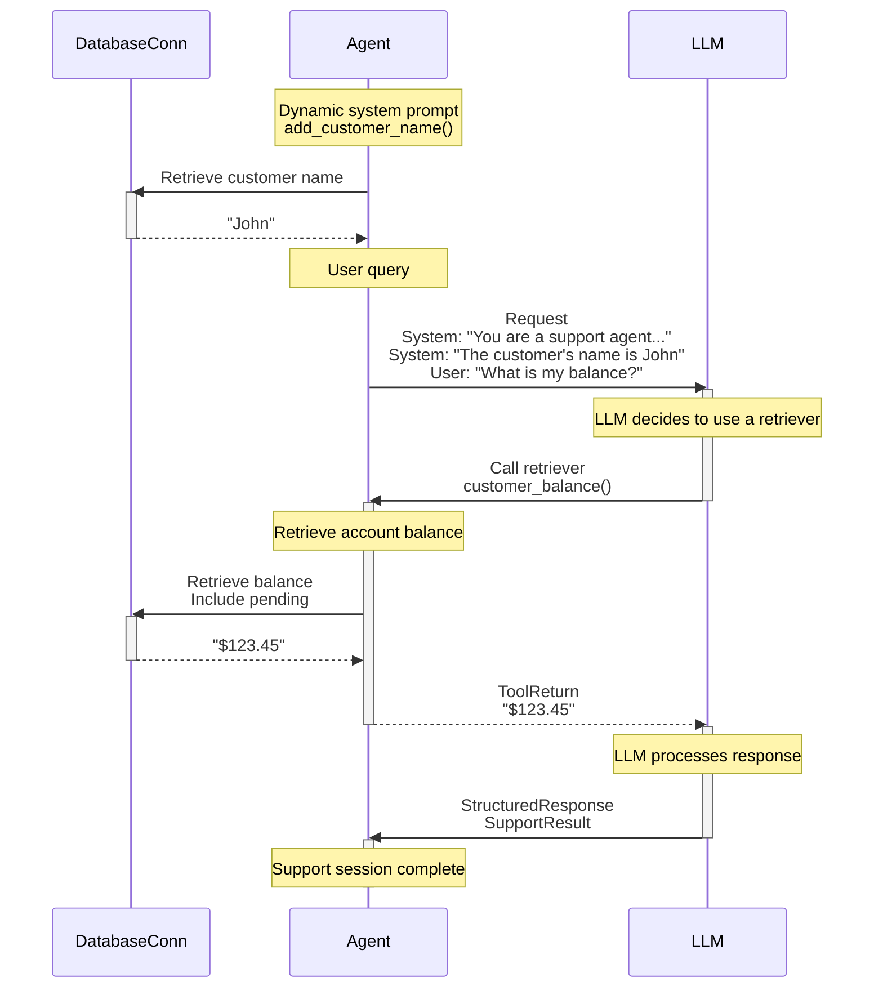

# Introduction {.hide}

--8<-- "docs/.partials/index-header.html"

When I first found FastAPI, I got it immediately. I was excited to find something so innovative and ergonomic built on Pydantic.

Virtually every Agent Framework and LLM library in Python uses Pydantic, but when we began to use LLMs in [Pydantic Logfire](https://pydantic.dev/logfire), I couldn't find anything that gave me the same feeling.

PydanticAI is a Python Agent Framework designed to make it less painful to build production grade applications with Generative AI.

## Why use PydanticAI

* Built by the team behind Pydantic (the validation layer of the OpenAI SDK, the Anthropic SDK, LangChain, LlamaIndex, AutoGPT, Transformers, Instructor and many more)
* Model-agnostic — currently both OpenAI and Gemini are supported, and Anthropic [is coming soon](https://github.com/pydantic/pydantic-ai/issues/63). And there is a simple interface to implement and customize support for other models.
* Type-safe
* Control flow and composing agents is done with vanilla python, allowing you to make use of the same Python development best practices you'd use in any other (non-AI) project
* [Structured response](results.md#structured-result-validation) validation with Pydantic
* [Streamed responses](results.md#streamed-results), including validation of streamed _structured_ responses with Pydantic
* Novel, type-safe [dependency injection system](dependencies.md), useful for testing and eval-driven iterative development
* [Logfire integration](logfire.md) for debugging and monitoring the performance and general behavior of your LLM-powered application

!!! example "In Beta"
    PydanticAI is in early beta, the API is still subject to change and there's a lot more to do.
    [Feedback](https://github.com/pydantic/pydantic-ai/issues) is very welcome!

## Hello World Example

Here's a minimal example of PydanticAI:

```py title="hello_world.py"
from pydantic_ai import Agent

agent = Agent(  # (1)!
    'gemini-1.5-flash',
    system_prompt='Be concise, reply with one sentence.',  # (2)!
)

result = agent.run_sync('Where does "hello world" come from?')  # (3)!
print(result.data)
"""
The first known use of "hello, world" was in a 1974 textbook about the C programming language.
"""
```

1. Define a very simple agent — here we configure the agent to use [Gemini 1.5's Flash](api/models/gemini.md) model, but you can also set the model when running the agent.
2. Register a static [system prompt](agents.md#system-prompts) using a keyword argument to the agent. For more complex dynamically-generated system prompts, see the example below.
3. [Run the agent](agents.md#running-agents) synchronously, conducting a conversation with the LLM. Here the exchange should be very short: PydanticAI will send the system prompt and the user query to the LLM, the model will return a text response.

_(This example is complete, it can be run "as is")_

Not very interesting yet, but we can easily add "retrievers", dynamic system prompts, and structured responses to build more powerful agents.

## Retrievers & Dependency Injection Example

Here is a concise example using PydanticAI to build a support agent for a bank:

```py title="bank_support.py"
from dataclasses import dataclass

from pydantic import BaseModel, Field
from pydantic_ai import Agent, CallContext

from bank_database import DatabaseConn


@dataclass
class SupportDependencies:  # (3)!
    customer_id: int
    db: DatabaseConn  # (12)!


class SupportResult(BaseModel):  # (13)!
    support_advice: str = Field(description='Advice returned to the customer')
    block_card: bool = Field(description="Whether to block the customer's card")
    risk: int = Field(description='Risk level of query', ge=0, le=10)


support_agent = Agent(  # (1)!
    'openai:gpt-4o',  # (2)!
    deps_type=SupportDependencies,
    result_type=SupportResult,  # (9)!
    system_prompt=(  # (4)!
        'You are a support agent in our bank, give the '
        'customer support and judge the risk level of their query.'
    ),
)


@support_agent.system_prompt  # (5)!
async def add_customer_name(ctx: CallContext[SupportDependencies]) -> str:
    customer_name = await ctx.deps.db.customer_name(id=ctx.deps.customer_id)
    return f"The customer's name is {customer_name!r}"


@support_agent.retriever  # (6)!
async def customer_balance(
    ctx: CallContext[SupportDependencies], include_pending: bool
) -> str:
    """Returns the customer's current account balance."""  # (7)!
    balance = await ctx.deps.db.customer_balance(
        id=ctx.deps.customer_id,
        include_pending=include_pending,
    )
    return f'${balance:.2f}'


...  # (11)!


async def main():
    deps = SupportDependencies(customer_id=123, db=DatabaseConn())
    result = await support_agent.run('What is my balance?', deps=deps)  # (8)!
    print(result.data)  # (10)!
    """
    support_advice='Hello John, your current account balance, including pending transactions, is $123.45.' block_card=False risk=1
    """

    result = await support_agent.run('I just lost my card!', deps=deps)
    print(result.data)
    """
    support_advice="I'm sorry to hear that, John. We are temporarily blocking your card to prevent unauthorized transactions." block_card=True risk=8
    """
```

1. This [agent](agents.md) will act as first-tier support in a bank. Agents are generic in the type of dependencies they accept and the type of result they return. In this case, the support agent has type `#!python Agent[SupportDependencies, SupportResult]`.
2. Here we configure the agent to use [OpenAI's GPT-4o model](api/models/openai.md), you can also set the model when running the agent.
3. The `SupportDependencies` dataclass is used to pass data, connections, and logic into the model that will be needed when running [system prompt](agents.md#system-prompts) and [retriever](agents.md#retrievers) functions. PydanticAI's system of dependency injection provides a type-safe way to customise the behavior of your agents, and can be especially useful when running unit tests and evals.
4. Static [system prompts](agents.md#system-prompts) can be registered with the [`system_prompt` keyword argument][pydantic_ai.Agent.__init__] to the agent.
5. Dynamic [system prompts](agents.md#system-prompts) can be registered with the [`@agent.system_prompt`][pydantic_ai.Agent.system_prompt] decorator, and can make use of dependency injection. Dependencies are carried via the [`CallContext`][pydantic_ai.dependencies.CallContext] argument, which is parameterized with the `deps_type` from above. If the type annotation here is wrong, static type checkers will catch it.
6. [Retrievers](agents.md#retrievers) let you register "tools" which the LLM may call while responding to a user. Again, dependencies are carried via [`CallContext`][pydantic_ai.dependencies.CallContext], and any other arguments become the tool schema passed to the LLM. Pydantic is used to validate these arguments, and errors are passed back to the LLM so it can retry.
7. The docstring of a retriever also passed to the LLM as a description of the tool. Parameter descriptions are [extracted](agents.md#retrievers-tools-and-schema) from the docstring and added to the tool schema sent to the LLM.
8. [Run the agent](agents.md#running-agents) asynchronously, conducting a conversation with the LLM until a final response is reached. Even in this fairly simple case, the agent will exchange multiple messages with the LLM as retrievers are called to retrieve a result.
9. The response from the agent will, be guaranteed to be a `SupportResult`, if validation fails [reflection](agents.md#reflection-and-self-correction) will mean the agent is prompted to try again.
10. The result will be validated with Pydantic to guarantee it is a `SupportResult`, since the agent is generic, it'll also be typed as a `SupportResult` to aid with static type checking.
11. In a real use case, you'd add many more retrievers and a longer system prompt to the agent to extend the context it's equipped with and support it can provide.
12. This is a simple sketch of a database connection, used to keep the example short and readable. In reality, you'd be connecting to an external database (e.g. PostgreSQL) to get information about customers.
13. This [Pydantic](https://docs.pydantic.dev) model is used to constrain the structured data returned by the agent. From this simple definition, Pydantic builds the JSON Schema that tells the LLM how to return the data, and performs validation to guarantee the data is correct at the end of the conversation.

To help make things more clear, here is a diagram of what is happening in the `#!python await support_agent.run('What is my balance?', deps=deps)` call within `main`:



!!! tip "Complete `bank_support.py` example"
    The code included here is incomplete for the sake of brevity (the definition of `DatabaseConn` is missing); you can find the complete `bank_support.py` example [here](examples/bank-support.md).

## Next Steps

To try PydanticAI yourself, follow the instructions [in the examples](examples/index.md).

Read the [conceptual documentation](agents.md) to learn more about building applications with PydanticAI.

Read the [API Reference](api/agent.md) to understand PydanticAI's interface.
