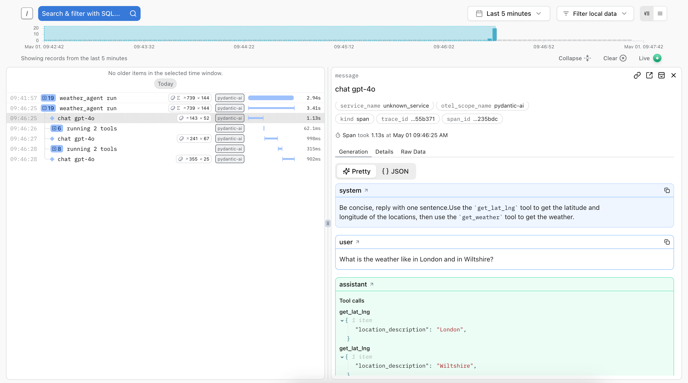
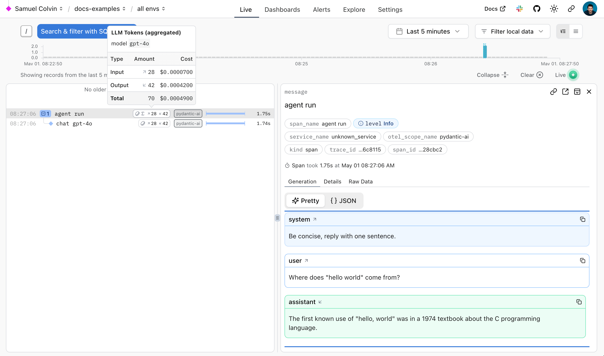
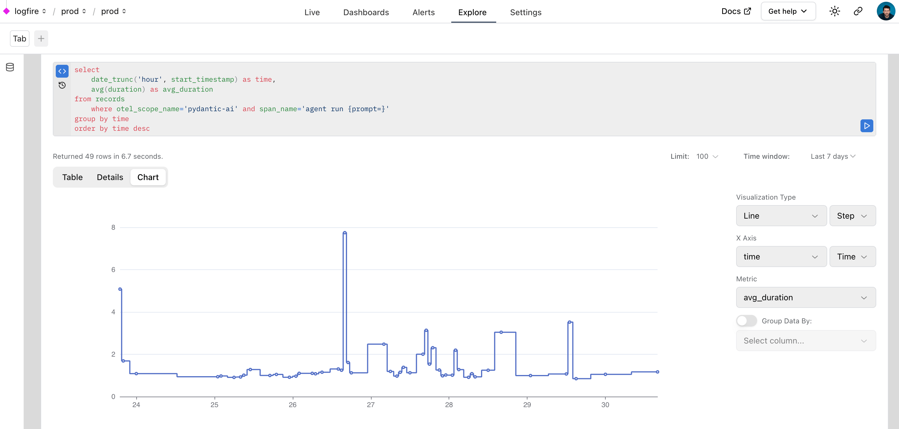
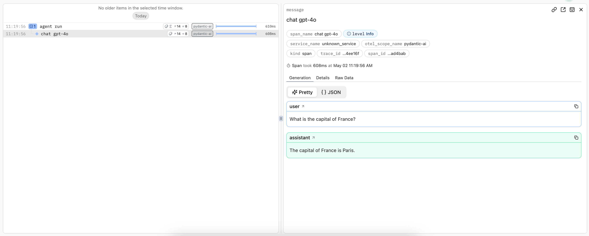
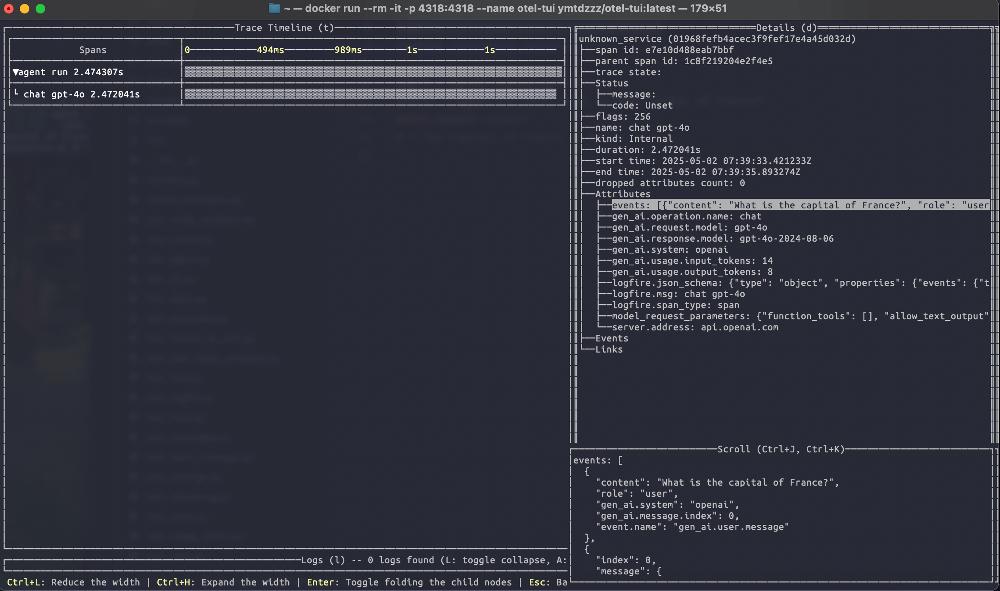
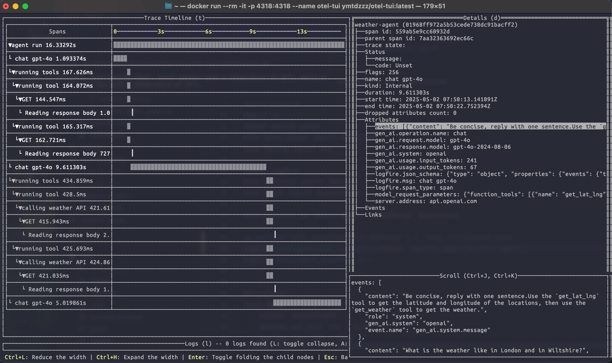

# Pydantic Logfire Debugging and Monitoring

Applications that use LLMs have some challenges that are well known and understood: LLMs are **slow**, **unreliable** and **expensive**.

These applications also have some challenges that most developers have encountered much less often: LLMs are **fickle** and **non-deterministic**. Subtle changes in a prompt can completely change a model's performance, and there's no `EXPLAIN` query you can run to understand why.

!!! danger "Warning"
    From a software engineers point of view, you can think of LLMs as the worst database you've ever heard of, but worse.

    If LLMs weren't so bloody useful, we'd never touch them.

To build successful applications with LLMs, we need new tools to understand both model performance, and the behavior of applications that rely on them.

LLM Observability tools that just let you understand how your model is performing are useless: making API calls to an LLM is easy, it's building that into an application that's hard.

## Pydantic Logfire

[Pydantic Logfire](https://pydantic.dev/logfire) is an observability platform developed by the team who created and maintain Pydantic Validation and Pydantic AI. Logfire aims to let you understand your entire application: Gen AI, classic predictive AI, HTTP traffic, database queries and everything else a modern application needs, all using OpenTelemetry.

!!! tip "Pydantic Logfire is a commercial product"
    Logfire is a commercially supported, hosted platform with an extremely generous and perpetual [free tier](https://pydantic.dev/pricing/).
    You can sign up and start using Logfire in a couple of minutes. Logfire can also be self-hosted on the enterprise tier.

Pydantic AI has built-in (but optional) support for Logfire. That means if the `logfire` package is installed and configured and agent instrumentation is enabled then detailed information about agent runs is sent to Logfire. Otherwise there's virtually no overhead and nothing is sent.

Here's an example showing details of running the [Weather Agent](examples/weather-agent.md) in Logfire:



A trace is generated for the agent run, and spans are emitted for each model request and tool call.

## Using Logfire

To use Logfire, you'll need a Logfire [account](https://logfire.pydantic.dev), and the Logfire Python SDK installed:

```bash
pip/uv-add "pydantic-ai[logfire]"
```

Then authenticate your local environment with Logfire:

```bash
py-cli logfire auth
```

And configure a project to send data to:

```bash
py-cli logfire projects new
```

(Or use an existing project with `logfire projects use`)

This will write to a `.logfire` directory in the current working directory, which the Logfire SDK will use for configuration at run time.

With that, you can start using Logfire to instrument Pydantic AI code:

```python {title="instrument_pydantic_ai.py" hl_lines="1 5 6"}
import logfire

from pydantic_ai import Agent

logfire.configure()  # (1)!
logfire.instrument_pydantic_ai()  # (2)!

agent = Agent('openai:gpt-4o', instructions='Be concise, reply with one sentence.')
result = agent.run_sync('Where does "hello world" come from?')  # (3)!
print(result.output)
"""
The first known use of "hello, world" was in a 1974 textbook about the C programming language.
"""
```

1. [`logfire.configure()`][logfire.configure] configures the SDK, by default it will find the write token from the `.logfire` directory, but you can also pass a token directly.
2. [`logfire.instrument_pydantic_ai()`][logfire.Logfire.instrument_pydantic_ai] enables instrumentation of Pydantic AI.
3. Since we've enabled instrumentation, a trace will be generated for each run, with spans emitted for models calls and tool function execution

_(This example is complete, it can be run "as is")_

Which will display in Logfire thus:



The [Logfire documentation](https://logfire.pydantic.dev/docs/) has more details on how to use Logfire,
including how to instrument other libraries like [HTTPX](https://logfire.pydantic.dev/docs/integrations/http-clients/httpx/) and [FastAPI](https://logfire.pydantic.dev/docs/integrations/web-frameworks/fastapi/).

Since Logfire is built on [OpenTelemetry](https://opentelemetry.io/), you can use the Logfire Python SDK to send data to any OpenTelemetry collector, see [below](#using-opentelemetry).

### Debugging

To demonstrate how Logfire can let you visualise the flow of a Pydantic AI run, here's the view you get from Logfire while running the [chat app examples](examples/chat-app.md):

{{ video('a764aff5840534dc77eba7d028707bfa', 25) }}

### Monitoring Performance

We can also query data with SQL in Logfire to monitor the performance of an application. Here's a real world example of using Logfire to monitor Pydantic AI runs inside Logfire itself:



### Monitoring HTTP Requests

!!! tip "\"F**k you, show me the prompt.\""
    As per Hamel Husain's influential 2024 blog post ["Fuck You, Show Me The Prompt."](https://hamel.dev/blog/posts/prompt/)
    (bear with the capitalization, the point is valid), it's often useful to be able to view the raw HTTP requests and responses made to model providers.

    To observe raw HTTP requests made to model providers, you can use Logfire's [HTTPX instrumentation](https://logfire.pydantic.dev/docs/integrations/http-clients/httpx/) since all provider SDKs use the [HTTPX](https://www.python-httpx.org/) library internally.

=== "With HTTP instrumentation"

    ```py {title="with_logfire_instrument_httpx.py" hl_lines="7"}
    import logfire

    from pydantic_ai import Agent

    logfire.configure()
    logfire.instrument_pydantic_ai()
    logfire.instrument_httpx(capture_all=True)  # (1)!
    agent = Agent('openai:gpt-4o')
    result = agent.run_sync('What is the capital of France?')
    print(result.output)
    #> Paris
    ```

    1. See the [`logfire.instrument_httpx` docs][logfire.Logfire.instrument_httpx] more details, `capture_all=True` means both headers and body are captured for both the request and response.

    

=== "Without HTTP instrumentation"

    ```py {title="without_logfire_instrument_httpx.py"}
    import logfire

    from pydantic_ai import Agent

    logfire.configure()
    logfire.instrument_pydantic_ai()

    agent = Agent('openai:gpt-4o')
    result = agent.run_sync('What is the capital of France?')
    print(result.output)
    #> Paris
    ```

    

## Using OpenTelemetry

Pydantic AI's instrumentation uses [OpenTelemetry](https://opentelemetry.io/) (OTel), which Logfire is based on.

This means you can debug and monitor Pydantic AI with any OpenTelemetry backend.

Pydantic AI follows the [OpenTelemetry Semantic Conventions for Generative AI systems](https://opentelemetry.io/docs/specs/semconv/gen-ai/), so while we think you'll have the best experience using the Logfire platform :wink:, you should be able to use any OTel service with GenAI support.

### Logfire with an alternative OTel backend

You can use the Logfire SDK completely freely and send the data to any OpenTelemetry backend.

Here's an example of configuring the Logfire library to send data to the excellent [otel-tui](https://github.com/ymtdzzz/otel-tui) — an open source terminal based OTel backend and viewer (no association with Pydantic Validation).

Run `otel-tui` with docker (see [the otel-tui readme](https://github.com/ymtdzzz/otel-tui) for more instructions):

```txt title="Terminal"
docker run --rm -it -p 4318:4318 --name otel-tui ymtdzzz/otel-tui:latest
```

then run,

```python {title="otel_tui.py" hl_lines="7 8" test="skip"}
import os

import logfire

from pydantic_ai import Agent

os.environ['OTEL_EXPORTER_OTLP_ENDPOINT'] = 'http://localhost:4318'  # (1)!
logfire.configure(send_to_logfire=False)  # (2)!
logfire.instrument_pydantic_ai()
logfire.instrument_httpx(capture_all=True)

agent = Agent('openai:gpt-4o')
result = agent.run_sync('What is the capital of France?')
print(result.output)
#> Paris
```

1. Set the `OTEL_EXPORTER_OTLP_ENDPOINT` environment variable to the URL of your OpenTelemetry backend. If you're using a backend that requires authentication, you may need to set [other environment variables](https://opentelemetry.io/docs/languages/sdk-configuration/otlp-exporter/). Of course, these can also be set outside the process, e.g. with `export OTEL_EXPORTER_OTLP_ENDPOINT=http://localhost:4318`.
2. We [configure][logfire.configure] Logfire to disable sending data to the Logfire OTel backend itself. If you removed `send_to_logfire=False`, data would be sent to both Logfire and your OpenTelemetry backend.

Running the above code will send tracing data to `otel-tui`, which will display like this:



Running the [weather agent](examples/weather-agent.md) example connected to `otel-tui` shows how it can be used to visualise a more complex trace:



For more information on using the Logfire SDK to send data to alternative backends, see
[the Logfire documentation](https://logfire.pydantic.dev/docs/how-to-guides/alternative-backends/).

### OTel without Logfire

You can also emit OpenTelemetry data from Pydantic AI without using Logfire at all.

To do this, you'll need to install and configure the OpenTelemetry packages you need. To run the following examples, use

```txt title="Terminal"
uv run \
  --with 'pydantic-ai-slim[openai]' \
  --with opentelemetry-sdk \
  --with opentelemetry-exporter-otlp \
  raw_otel.py
```

```python {title="raw_otel.py" test="skip"}
import os

from opentelemetry.exporter.otlp.proto.http.trace_exporter import OTLPSpanExporter
from opentelemetry.sdk.trace import TracerProvider
from opentelemetry.sdk.trace.export import BatchSpanProcessor
from opentelemetry.trace import set_tracer_provider

from pydantic_ai.agent import Agent

os.environ['OTEL_EXPORTER_OTLP_ENDPOINT'] = 'http://localhost:4318'
exporter = OTLPSpanExporter()
span_processor = BatchSpanProcessor(exporter)
tracer_provider = TracerProvider()
tracer_provider.add_span_processor(span_processor)

set_tracer_provider(tracer_provider)

Agent.instrument_all()
agent = Agent('openai:gpt-4o')
result = agent.run_sync('What is the capital of France?')
print(result.output)
#> Paris
```

### Alternative Observability backends

Because Pydantic AI uses OpenTelemetry for observability, you can easily configure it to send data to any OpenTelemetry-compatible backend, not just our observability platform [Pydantic Logfire](#pydantic-logfire).

The following providers have dedicated documentation on Pydantic AI:

<!--Feel free to add other platforms here. They MUST be added to the bottom of the list, and may only be a name with link.-->

- [Langfuse](https://langfuse.com/docs/integrations/pydantic-ai)
- [W&B Weave](https://weave-docs.wandb.ai/guides/integrations/pydantic_ai/)
- [Arize](https://arize.com/docs/ax/observe/tracing-integrations-auto/pydantic-ai)
- [Openlayer](https://www.openlayer.com/docs/integrations/pydantic-ai)
- [OpenLIT](https://docs.openlit.io/latest/integrations/pydantic)
- [LangWatch](https://docs.langwatch.ai/integration/python/integrations/pydantic-ai)
- [Patronus AI](https://docs.patronus.ai/docs/percival/pydantic)
- [Opik](https://www.comet.com/docs/opik/tracing/integrations/pydantic-ai)
- [mlflow](https://mlflow.org/docs/latest/genai/tracing/integrations/listing/pydantic_ai)
- [Agenta](https://docs.agenta.ai/observability/integrations/pydanticai)

## Advanced usage

### Configuring data format

Pydantic AI follows the [OpenTelemetry Semantic Conventions for Generative AI systems](https://opentelemetry.io/docs/specs/semconv/gen-ai/), with one caveat. The semantic conventions specify that messages should be captured as individual events (logs) that are children of the request span. By default, Pydantic AI instead collects these events into a JSON array which is set as a single large attribute called `events` on the request span. To change this, use `event_mode='logs'`:

```python {title="instrumentation_settings_event_mode.py"}
import logfire

from pydantic_ai import Agent

logfire.configure()
logfire.instrument_pydantic_ai(event_mode='logs')
agent = Agent('openai:gpt-4o')
result = agent.run_sync('What is the capital of France?')
print(result.output)
#> Paris
```

For now, this won't look as good in the Logfire UI, but we're working on it.

If you have very long conversations, the `events` span attribute may be truncated. Using `event_mode='logs'` will help avoid this issue.

Note that the OpenTelemetry Semantic Conventions are still experimental and are likely to change.

### Setting OpenTelemetry SDK providers

By default, the global `TracerProvider` and `EventLoggerProvider` are used. These are set automatically by `logfire.configure()`. They can also be set by the `set_tracer_provider` and `set_event_logger_provider` functions in the OpenTelemetry Python SDK. You can set custom providers with [`InstrumentationSettings`][pydantic_ai.models.instrumented.InstrumentationSettings].

```python {title="instrumentation_settings_providers.py"}
from opentelemetry.sdk._events import EventLoggerProvider
from opentelemetry.sdk.trace import TracerProvider

from pydantic_ai.agent import Agent, InstrumentationSettings

instrumentation_settings = InstrumentationSettings(
    tracer_provider=TracerProvider(),
    event_logger_provider=EventLoggerProvider(),
)

agent = Agent('gpt-4o', instrument=instrumentation_settings)
# or to instrument all agents:
Agent.instrument_all(instrumentation_settings)
```

### Instrumenting a specific `Model`

```python {title="instrumented_model_example.py"}
from pydantic_ai import Agent
from pydantic_ai.models.instrumented import InstrumentationSettings, InstrumentedModel

settings = InstrumentationSettings()
model = InstrumentedModel('gpt-4o', settings)
agent = Agent(model)
```

### Excluding binary content

```python {title="excluding_binary_content.py"}
from pydantic_ai.agent import Agent, InstrumentationSettings

instrumentation_settings = InstrumentationSettings(include_binary_content=False)

agent = Agent('gpt-4o', instrument=instrumentation_settings)
# or to instrument all agents:
Agent.instrument_all(instrumentation_settings)
```

### Excluding prompts and completions

For privacy and security reasons, you may want to monitor your agent's behavior and performance without exposing sensitive user data or proprietary prompts in your observability platform. Pydantic AI allows you to exclude the actual content from instrumentation events while preserving the structural information needed for debugging and monitoring.

When `include_content=False` is set, Pydantic AI will exclude sensitive content from OpenTelemetry events, including user prompts and model completions, tool call arguments and responses, and any other message content.

```python {title="excluding_sensitive_content.py"}
from pydantic_ai.agent import Agent
from pydantic_ai.models.instrumented import InstrumentationSettings

instrumentation_settings = InstrumentationSettings(include_content=False)

agent = Agent('gpt-4o', instrument=instrumentation_settings)
# or to instrument all agents:
Agent.instrument_all(instrumentation_settings)
```

This setting is particularly useful in production environments where compliance requirements or data sensitivity concerns make it necessary to limit what content is sent to your observability platform.
