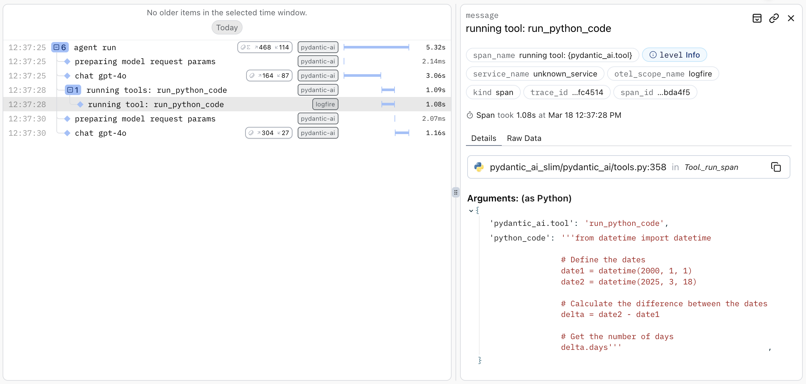

# Client

PydanticAI can act as an [MCP client](https://modelcontextprotocol.io/quickstart/client), connecting to MCP servers
to use their tools.

## Install

You need to either install [`pydantic-ai`](../install.md), or[`pydantic-ai-slim`](../install.md#slim-install) with the `mcp` optional group:

```bash
pip/uv-add "pydantic-ai-slim[mcp]"
```

!!! note
    MCP integration requires Python 3.10 or higher.

## Usage

PydanticAI comes with two ways to connect to MCP servers:

- [`MCPServerSSE`][pydantic_ai.mcp.MCPServerSSE] which connects to an MCP server using the [HTTP SSE](https://spec.modelcontextprotocol.io/specification/2024-11-05/basic/transports/#http-with-sse) transport
- [`MCPServerStreamableHTTP`][pydantic_ai.mcp.MCPServerStreamableHTTP] which connects to an MCP server using the [Streamable HTTP](https://modelcontextprotocol.io/introduction#streamable-http) transport
- [`MCPServerStdio`][pydantic_ai.mcp.MCPServerStdio] which runs the server as a subprocess and connects to it using the [stdio](https://spec.modelcontextprotocol.io/specification/2024-11-05/basic/transports/#stdio) transport

Examples of both are shown below; [mcp-run-python](run-python.md) is used as the MCP server in both examples.

### SSE Client

[`MCPServerSSE`][pydantic_ai.mcp.MCPServerSSE] connects over HTTP using the [HTTP + Server Sent Events transport](https://spec.modelcontextprotocol.io/specification/2024-11-05/basic/transports/#http-with-sse) to a server.

!!! note
    [`MCPServerSSE`][pydantic_ai.mcp.MCPServerSSE] requires an MCP server to be running and accepting HTTP connections before calling [`agent.run_mcp_servers()`][pydantic_ai.Agent.run_mcp_servers]. Running the server is not managed by PydanticAI.

The name "HTTP" is used since this implemented will be adapted in future to use the new
[Streamable HTTP](https://github.com/modelcontextprotocol/specification/pull/206) currently in development.

Before creating the SSE client, we need to run the server (docs [here](run-python.md)):

```bash {title="terminal (run sse server)"}
deno run \
  -N -R=node_modules -W=node_modules --node-modules-dir=auto \
  jsr:@pydantic/mcp-run-python sse
```

```python {title="mcp_sse_client.py" py="3.10"}
from pydantic_ai import Agent
from pydantic_ai.mcp import MCPServerSSE

server = MCPServerSSE(url='http://localhost:3001/sse')  # (1)!
agent = Agent('openai:gpt-4o', mcp_servers=[server])  # (2)!


async def main():
    async with agent.run_mcp_servers():  # (3)!
        result = await agent.run('How many days between 2000-01-01 and 2025-03-18?')
    print(result.output)
    #> There are 9,208 days between January 1, 2000, and March 18, 2025.
```

1. Define the MCP server with the URL used to connect.
2. Create an agent with the MCP server attached.
3. Create a client session to connect to the server.

_(This example is complete, it can be run "as is" with Python 3.10+ — you'll need to add `asyncio.run(main())` to run `main`)_

**What's happening here?**

- The model is receiving the prompt "how many days between 2000-01-01 and 2025-03-18?"
- The model decides "Oh, I've got this `run_python_code` tool, that will be a good way to answer this question", and writes some python code to calculate the answer.
- The model returns a tool call
- PydanticAI sends the tool call to the MCP server using the SSE transport
- The model is called again with the return value of running the code
- The model returns the final answer

You can visualise this clearly, and even see the code that's run by adding three lines of code to instrument the example with [logfire](https://logfire.pydantic.dev/docs):

```python {title="mcp_sse_client_logfire.py" test="skip"}
import logfire

logfire.configure()
logfire.instrument_pydantic_ai()
```

Will display as follows:



### Streamable HTTP Client

[`MCPServerStreamableHTTP`][pydantic_ai.mcp.MCPServerStreamableHTTP] connects over HTTP using the
[Streamable HTTP](https://modelcontextprotocol.io/introduction#streamable-http) transport to a server.

!!! note
    [`MCPServerStreamableHTTP`][pydantic_ai.mcp.MCPServerStreamableHTTP] requires an MCP server to be
    running and accepting HTTP connections before calling
    [`agent.run_mcp_servers()`][pydantic_ai.Agent.run_mcp_servers]. Running the server is not
    managed by PydanticAI.

Before creating the Streamable HTTP client, we need to run a server that supports the Streamable HTTP transport.

```python {title="streamable_http_server.py" py="3.10" test="skip"}
from mcp.server.fastmcp import FastMCP

app = FastMCP()

@app.tool()
def add(a: int, b: int) -> int:
    return a + b

app.run(transport='streamable-http')
```

Then we can create the client:

```python {title="mcp_streamable_http_client.py" py="3.10"}
from pydantic_ai import Agent
from pydantic_ai.mcp import MCPServerStreamableHTTP

server = MCPServerStreamableHTTP('http://localhost:8000/mcp')
agent = Agent('openai:gpt-4o', mcp_servers=[server])

async def main():
    async with agent.run_mcp_servers():  # (3)!
        result = await agent.run('How many days between 2000-01-01 and 2025-03-18?')
    print(result.output)
    #> There are 9,208 days between January 1, 2000, and March 18, 2025.
```

1. Create an agent with the MCP server attached.
2. Create a client session to connect to the server.

_(This example is complete, it can be run "as is" with Python 3.10+ — you'll need to add `asyncio.run(main())` to run `main`)_

### MCP "stdio" Server

The other transport offered by MCP is the [stdio transport](https://spec.modelcontextprotocol.io/specification/2024-11-05/basic/transports/#stdio) where the server is run as a subprocess and communicates with the client over `stdin` and `stdout`. In this case, you'd use the [`MCPServerStdio`][pydantic_ai.mcp.MCPServerStdio] class.

!!! note
    When using [`MCPServerStdio`][pydantic_ai.mcp.MCPServerStdio] servers, the [`agent.run_mcp_servers()`][pydantic_ai.Agent.run_mcp_servers] context manager is responsible for starting and stopping the server.

```python {title="mcp_stdio_client.py" py="3.10"}
from pydantic_ai import Agent
from pydantic_ai.mcp import MCPServerStdio

server = MCPServerStdio(  # (1)!
    'deno',
    args=[
        'run',
        '-N',
        '-R=node_modules',
        '-W=node_modules',
        '--node-modules-dir=auto',
        'jsr:@pydantic/mcp-run-python',
        'stdio',
    ]
)
agent = Agent('openai:gpt-4o', mcp_servers=[server])


async def main():
    async with agent.run_mcp_servers():
        result = await agent.run('How many days between 2000-01-01 and 2025-03-18?')
    print(result.output)
    #> There are 9,208 days between January 1, 2000, and March 18, 2025.
```

1. See [MCP Run Python](run-python.md) for more information.

## Tool call customisation

The MCP servers provide the ability to set a `process_tool_call` which allows
the customisation of tool call requests and their responses.

A common use case for this is to inject metadata to the requests which the server
call needs.

```python {title="mcp_process_tool_call.py" py="3.10"}
from typing import Any

from pydantic_ai import Agent
from pydantic_ai.mcp import CallToolFunc, MCPServerStdio, ToolResult
from pydantic_ai.models.test import TestModel
from pydantic_ai.tools import RunContext


async def process_tool_call(
    ctx: RunContext[int],
    call_tool: CallToolFunc,
    tool_name: str,
    args: dict[str, Any],
) -> ToolResult:
    """A tool call processor that passes along the deps."""
    return await call_tool(tool_name, args, metadata={'deps': ctx.deps})


server = MCPServerStdio('python', ['-m', 'tests.mcp_server'], process_tool_call=process_tool_call)
agent = Agent(
    model=TestModel(call_tools=['echo_deps']),
    deps_type=int,
    mcp_servers=[server]
)


async def main():
    async with agent.run_mcp_servers():
        result = await agent.run('Echo with deps set to 42', deps=42)
    print(result.output)
    #> {"echo_deps":{"echo":"This is an echo message","deps":42}}
```

## Using Tool Prefixes to Avoid Naming Conflicts

When connecting to multiple MCP servers that might provide tools with the same name, you can use the `tool_prefix` parameter to avoid naming conflicts. This parameter adds a prefix to all tool names from a specific server.

### How It Works

- If `tool_prefix` is set, all tools from that server will be prefixed with `{tool_prefix}_`
- When listing tools, the prefixed names are shown to the model
- When calling tools, the prefix is automatically removed before sending the request to the server

This allows you to use multiple servers that might have overlapping tool names without conflicts.

### Example with HTTP Server

```python {title="mcp_tool_prefix_http_client.py" py="3.10"}
from pydantic_ai import Agent
from pydantic_ai.mcp import MCPServerSSE

# Create two servers with different prefixes
weather_server = MCPServerSSE(
    url='http://localhost:3001/sse',
    tool_prefix='weather'  # Tools will be prefixed with 'weather_'
)

calculator_server = MCPServerSSE(
    url='http://localhost:3002/sse',
    tool_prefix='calc'  # Tools will be prefixed with 'calc_'
)

# Both servers might have a tool named 'get_data', but they'll be exposed as:
# - 'weather_get_data'
# - 'calc_get_data'
agent = Agent('openai:gpt-4o', mcp_servers=[weather_server, calculator_server])
```

### Example with Stdio Server

```python {title="mcp_tool_prefix_stdio_client.py" py="3.10"}
from pydantic_ai import Agent
from pydantic_ai.mcp import MCPServerStdio

python_server = MCPServerStdio(
    'deno',
    args=[
        'run',
        '-N',
        'jsr:@pydantic/mcp-run-python',
        'stdio',
    ],
    tool_prefix='py'  # Tools will be prefixed with 'py_'
)

js_server = MCPServerStdio(
    'node',
    args=[
        'run',
        'mcp-js-server.js',
        'stdio',
    ],
    tool_prefix='js'  # Tools will be prefixed with 'js_'
)

agent = Agent('openai:gpt-4o', mcp_servers=[python_server, js_server])
```

When the model interacts with these servers, it will see the prefixed tool names, but the prefixes will be automatically handled when making tool calls.
