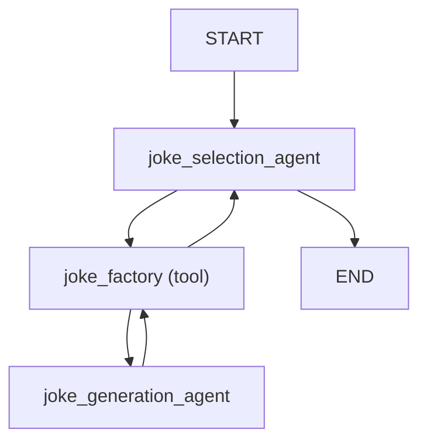
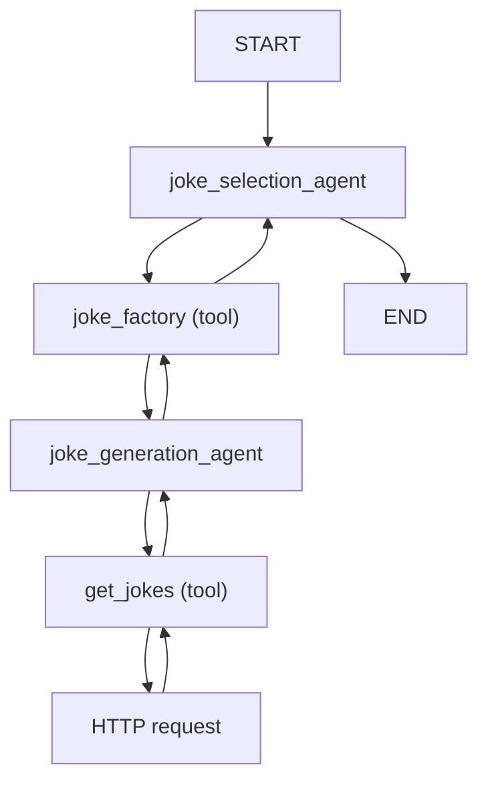
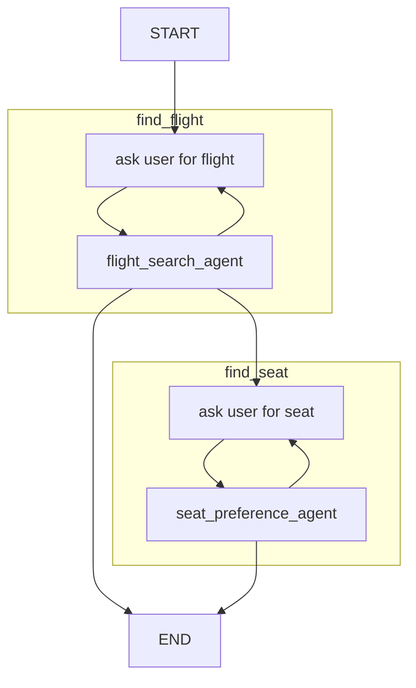

# Multi-agent Applications

There are roughly four levels of complexity when building applications with Pydantic AI:

1. Single agent workflows — what most of the `pydantic_ai` documentation covers
2. [Agent delegation](#agent-delegation) — agents using another agent via tools
3. [Programmatic agent hand-off](#programmatic-agent-hand-off) — one agent runs, then application code calls another agent
4. [Graph based control flow](graph.md) — for the most complex cases, a graph-based state machine can be used to control the execution of multiple agents

Of course, you can combine multiple strategies in a single application.

## Agent delegation

"Agent delegation" refers to the scenario where an agent delegates work to another agent, then takes back control when the delegate agent (the agent called from within a tool) finishes.
If you want to hand off control to another agent completely, without coming back to the first agent, you can use an [output function](output.md#output-functions).

Since agents are stateless and designed to be global, you do not need to include the agent itself in agent [dependencies](dependencies.md).

You'll generally want to pass [`ctx.usage`][pydantic_ai.RunContext.usage] to the [`usage`][pydantic_ai.Agent.run] keyword argument of the delegate agent run so usage within that run counts towards the total usage of the parent agent run.

!!! note "Multiple models"
    Agent delegation doesn't need to use the same model for each agent. If you choose to use different models within a run, calculating the monetary cost from the final [`result.usage()`][pydantic_ai.agent.AgentRunResult.usage] of the run will not be possible, but you can still use [`UsageLimits`][pydantic_ai.usage.UsageLimits] to avoid unexpected costs.

```python {title="agent_delegation_simple.py"}
from pydantic_ai import Agent, RunContext
from pydantic_ai.usage import UsageLimits

joke_selection_agent = Agent(  # (1)!
    'openai:gpt-4o',
    system_prompt=(
        'Use the `joke_factory` to generate some jokes, then choose the best. '
        'You must return just a single joke.'
    ),
)
joke_generation_agent = Agent(  # (2)!
    'google-gla:gemini-1.5-flash', output_type=list[str]
)


@joke_selection_agent.tool
async def joke_factory(ctx: RunContext[None], count: int) -> list[str]:
    r = await joke_generation_agent.run(  # (3)!
        f'Please generate {count} jokes.',
        usage=ctx.usage,  # (4)!
    )
    return r.output  # (5)!


result = joke_selection_agent.run_sync(
    'Tell me a joke.',
    usage_limits=UsageLimits(request_limit=5, total_tokens_limit=300),
)
print(result.output)
#> Did you hear about the toothpaste scandal? They called it Colgate.
print(result.usage())
#> Usage(requests=3, request_tokens=204, response_tokens=24, total_tokens=228)
```

1. The "parent" or controlling agent.
2. The "delegate" agent, which is called from within a tool of the parent agent.
3. Call the delegate agent from within a tool of the parent agent.
4. Pass the usage from the parent agent to the delegate agent so the final [`result.usage()`][pydantic_ai.agent.AgentRunResult.usage] includes the usage from both agents.
5. Since the function returns `#!python list[str]`, and the `output_type` of `joke_generation_agent` is also `#!python list[str]`, we can simply return `#!python r.output` from the tool.

_(This example is complete, it can be run "as is")_

The control flow for this example is pretty simple and can be summarised as follows:



### Agent delegation and dependencies

Generally the delegate agent needs to either have the same [dependencies](dependencies.md) as the calling agent, or dependencies which are a subset of the calling agent's dependencies.

!!! info "Initializing dependencies"
    We say "generally" above since there's nothing to stop you initializing dependencies within a tool call and therefore using interdependencies in a delegate agent that are not available on the parent, this should often be avoided since it can be significantly slower than reusing connections etc. from the parent agent.

```python {title="agent_delegation_deps.py"}
from dataclasses import dataclass

import httpx

from pydantic_ai import Agent, RunContext


@dataclass
class ClientAndKey:  # (1)!
    http_client: httpx.AsyncClient
    api_key: str


joke_selection_agent = Agent(
    'openai:gpt-4o',
    deps_type=ClientAndKey,  # (2)!
    system_prompt=(
        'Use the `joke_factory` tool to generate some jokes on the given subject, '
        'then choose the best. You must return just a single joke.'
    ),
)
joke_generation_agent = Agent(
    'gemini-1.5-flash',
    deps_type=ClientAndKey,  # (4)!
    output_type=list[str],
    system_prompt=(
        'Use the "get_jokes" tool to get some jokes on the given subject, '
        'then extract each joke into a list.'
    ),
)


@joke_selection_agent.tool
async def joke_factory(ctx: RunContext[ClientAndKey], count: int) -> list[str]:
    r = await joke_generation_agent.run(
        f'Please generate {count} jokes.',
        deps=ctx.deps,  # (3)!
        usage=ctx.usage,
    )
    return r.output


@joke_generation_agent.tool  # (5)!
async def get_jokes(ctx: RunContext[ClientAndKey], count: int) -> str:
    response = await ctx.deps.http_client.get(
        'https://example.com',
        params={'count': count},
        headers={'Authorization': f'Bearer {ctx.deps.api_key}'},
    )
    response.raise_for_status()
    return response.text


async def main():
    async with httpx.AsyncClient() as client:
        deps = ClientAndKey(client, 'foobar')
        result = await joke_selection_agent.run('Tell me a joke.', deps=deps)
        print(result.output)
        #> Did you hear about the toothpaste scandal? They called it Colgate.
        print(result.usage())  # (6)!
        #> Usage(requests=4, request_tokens=309, response_tokens=32, total_tokens=341)
```

1. Define a dataclass to hold the client and API key dependencies.
2. Set the `deps_type` of the calling agent — `joke_selection_agent` here.
3. Pass the dependencies to the delegate agent's run method within the tool call.
4. Also set the `deps_type` of the delegate agent — `joke_generation_agent` here.
5. Define a tool on the delegate agent that uses the dependencies to make an HTTP request.
6. Usage now includes 4 requests — 2 from the calling agent and 2 from the delegate agent.

_(This example is complete, it can be run "as is" — you'll need to add `asyncio.run(main())` to run `main`)_

This example shows how even a fairly simple agent delegation can lead to a complex control flow:



## Programmatic agent hand-off

"Programmatic agent hand-off" refers to the scenario where multiple agents are called in succession, with application code and/or a human in the loop responsible for deciding which agent to call next.

Here agents don't need to use the same deps.

Here we show two agents used in succession, the first to find a flight and the second to extract the user's seat preference.

```python {title="programmatic_handoff.py"}
from typing import Literal, Union

from pydantic import BaseModel, Field
from rich.prompt import Prompt

from pydantic_ai import Agent, RunContext
from pydantic_ai.messages import ModelMessage
from pydantic_ai.usage import Usage, UsageLimits


class FlightDetails(BaseModel):
    flight_number: str


class Failed(BaseModel):
    """Unable to find a satisfactory choice."""


flight_search_agent = Agent[None, Union[FlightDetails, Failed]](  # (1)!
    'openai:gpt-4o',
    output_type=Union[FlightDetails, Failed],  # type: ignore
    system_prompt=(
        'Use the "flight_search" tool to find a flight '
        'from the given origin to the given destination.'
    ),
)


@flight_search_agent.tool  # (2)!
async def flight_search(
    ctx: RunContext[None], origin: str, destination: str
) -> Union[FlightDetails, None]:
    # in reality, this would call a flight search API or
    # use a browser to scrape a flight search website
    return FlightDetails(flight_number='AK456')


usage_limits = UsageLimits(request_limit=15)  # (3)!


async def find_flight(usage: Usage) -> Union[FlightDetails, None]:  # (4)!
    message_history: Union[list[ModelMessage], None] = None
    for _ in range(3):
        prompt = Prompt.ask(
            'Where would you like to fly from and to?',
        )
        result = await flight_search_agent.run(
            prompt,
            message_history=message_history,
            usage=usage,
            usage_limits=usage_limits,
        )
        if isinstance(result.output, FlightDetails):
            return result.output
        else:
            message_history = result.all_messages(
                output_tool_return_content='Please try again.'
            )


class SeatPreference(BaseModel):
    row: int = Field(ge=1, le=30)
    seat: Literal['A', 'B', 'C', 'D', 'E', 'F']


# This agent is responsible for extracting the user's seat selection
seat_preference_agent = Agent[None, Union[SeatPreference, Failed]](  # (5)!
    'openai:gpt-4o',
    output_type=Union[SeatPreference, Failed],  # type: ignore
    system_prompt=(
        "Extract the user's seat preference. "
        'Seats A and F are window seats. '
        'Row 1 is the front row and has extra leg room. '
        'Rows 14, and 20 also have extra leg room. '
    ),
)


async def find_seat(usage: Usage) -> SeatPreference:  # (6)!
    message_history: Union[list[ModelMessage], None] = None
    while True:
        answer = Prompt.ask('What seat would you like?')

        result = await seat_preference_agent.run(
            answer,
            message_history=message_history,
            usage=usage,
            usage_limits=usage_limits,
        )
        if isinstance(result.output, SeatPreference):
            return result.output
        else:
            print('Could not understand seat preference. Please try again.')
            message_history = result.all_messages()


async def main():  # (7)!
    usage: Usage = Usage()

    opt_flight_details = await find_flight(usage)
    if opt_flight_details is not None:
        print(f'Flight found: {opt_flight_details.flight_number}')
        #> Flight found: AK456
        seat_preference = await find_seat(usage)
        print(f'Seat preference: {seat_preference}')
        #> Seat preference: row=1 seat='A'
```

1. Define the first agent, which finds a flight. We use an explicit type annotation until [PEP-747](https://peps.python.org/pep-0747/) lands, see [structured output](output.md#structured-output). We use a union as the output type so the model can communicate if it's unable to find a satisfactory choice; internally, each member of the union will be registered as a separate tool.
2. Define a tool on the agent to find a flight. In this simple case we could dispense with the tool and just define the agent to return structured data, then search for a flight, but in more complex scenarios the tool would be necessary.
3. Define usage limits for the entire app.
4. Define a function to find a flight, which asks the user for their preferences and then calls the agent to find a flight.
5. As with `flight_search_agent` above, we use an explicit type annotation to define the agent.
6. Define a function to find the user's seat preference, which asks the user for their seat preference and then calls the agent to extract the seat preference.
7. Now that we've put our logic for running each agent into separate functions, our main app becomes very simple.

_(This example is complete, it can be run "as is" — you'll need to add `asyncio.run(main())` to run `main`)_

The control flow for this example can be summarised as follows:



## Pydantic Graphs

See the [graph](graph.md) documentation on when and how to use graphs.

## Examples

The following examples demonstrate how to use dependencies in Pydantic AI:

- [Flight booking](examples/flight-booking.md)
