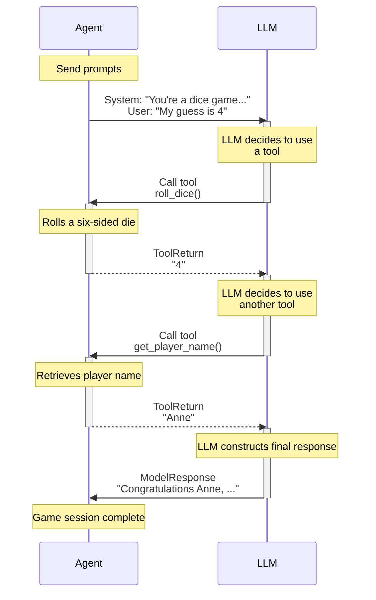

# Function Tools

Function tools provide a mechanism for models to perform actions and retrieve extra information to help them generate a response.

They're useful when you want to enable the model to take some action and use the result, when it is impractical or impossible to put all the context an agent might need into the instructions, or when you want to make agents' behavior more deterministic or reliable by deferring some of the logic required to generate a response to another (not necessarily AI-powered) tool.

If you want a model to be able to call a function as its final action, without the result being sent back to the model, you can use an [output function](output.md#output-functions) instead.

There are a number of ways to register tools with an agent:

- via the [`@agent.tool`][pydantic_ai.Agent.tool] decorator — for tools that need access to the agent [context][pydantic_ai.tools.RunContext]
- via the [`@agent.tool_plain`][pydantic_ai.Agent.tool_plain] decorator — for tools that do not need access to the agent [context][pydantic_ai.tools.RunContext]
- via the [`tools`][pydantic_ai.Agent.__init__] keyword argument to `Agent` which can take either plain functions, or instances of [`Tool`][pydantic_ai.tools.Tool]

For more advanced use cases, the [toolsets](toolsets.md) feature lets you manage collections of tools (built by you or provided by an [MCP server](mcp/client.md) or other [third party](third-party-tools.md#third-party-tools)) and register them with an agent in one go via the [`toolsets`][pydantic_ai.Agent.__init__] keyword argument to `Agent`. Internally, all `tools` and `toolsets` are gathered into a single [combined toolset](toolsets.md#combining-toolsets) that's made available to the model.

!!! info "Function tools vs. RAG"
    Function tools are basically the "R" of RAG (Retrieval-Augmented Generation) — they augment what the model can do by letting it request extra information.

    The main semantic difference between Pydantic AI Tools and RAG is RAG is synonymous with vector search, while Pydantic AI tools are more general-purpose. (Note: we may add support for vector search functionality in the future, particularly an API for generating embeddings. See [#58](https://github.com/pydantic/pydantic-ai/issues/58))

!!! info "Function Tools vs. Structured Outputs"
    As the name suggests, function tools use the model's "tools" or "functions" API to let the model know what is available to call. Tools or functions are also used to define the schema(s) for [structured output](output.md) when using the default [tool output mode](output.md#tool-output), thus a model might have access to many tools, some of which call function tools while others end the run and produce a final output.

## Registering via Decorator {#registering-function-tools-via-decorator}

`@agent.tool` is considered the default decorator since in the majority of cases tools will need access to the agent [context][pydantic_ai.tools.RunContext].

Here's an example using both:

```python {title="dice_game.py"}
import random

from pydantic_ai import Agent, RunContext

agent = Agent(
    'google-gla:gemini-1.5-flash',  # (1)!
    deps_type=str,  # (2)!
    system_prompt=(
        "You're a dice game, you should roll the die and see if the number "
        "you get back matches the user's guess. If so, tell them they're a winner. "
        "Use the player's name in the response."
    ),
)


@agent.tool_plain  # (3)!
def roll_dice() -> str:
    """Roll a six-sided die and return the result."""
    return str(random.randint(1, 6))


@agent.tool  # (4)!
def get_player_name(ctx: RunContext[str]) -> str:
    """Get the player's name."""
    return ctx.deps


dice_result = agent.run_sync('My guess is 4', deps='Anne')  # (5)!
print(dice_result.output)
#> Congratulations Anne, you guessed correctly! You're a winner!
```

1. This is a pretty simple task, so we can use the fast and cheap Gemini flash model.
2. We pass the user's name as the dependency, to keep things simple we use just the name as a string as the dependency.
3. This tool doesn't need any context, it just returns a random number. You could probably use dynamic instructions in this case.
4. This tool needs the player's name, so it uses `RunContext` to access dependencies which are just the player's name in this case.
5. Run the agent, passing the player's name as the dependency.

_(This example is complete, it can be run "as is")_

Let's print the messages from that game to see what happened:

```python {title="dice_game_messages.py" requires="dice_game.py"}
from dice_game import dice_result

print(dice_result.all_messages())
"""
[
    ModelRequest(
        parts=[
            SystemPromptPart(
                content="You're a dice game, you should roll the die and see if the number you get back matches the user's guess. If so, tell them they're a winner. Use the player's name in the response.",
                timestamp=datetime.datetime(...),
            ),
            UserPromptPart(
                content='My guess is 4',
                timestamp=datetime.datetime(...),
            ),
        ]
    ),
    ModelResponse(
        parts=[
            ToolCallPart(
                tool_name='roll_dice', args={}, tool_call_id='pyd_ai_tool_call_id'
            )
        ],
        usage=RequestUsage(input_tokens=90, output_tokens=2),
        model_name='gemini-1.5-flash',
        timestamp=datetime.datetime(...),
    ),
    ModelRequest(
        parts=[
            ToolReturnPart(
                tool_name='roll_dice',
                content='4',
                tool_call_id='pyd_ai_tool_call_id',
                timestamp=datetime.datetime(...),
            )
        ]
    ),
    ModelResponse(
        parts=[
            ToolCallPart(
                tool_name='get_player_name', args={}, tool_call_id='pyd_ai_tool_call_id'
            )
        ],
        usage=RequestUsage(input_tokens=91, output_tokens=4),
        model_name='gemini-1.5-flash',
        timestamp=datetime.datetime(...),
    ),
    ModelRequest(
        parts=[
            ToolReturnPart(
                tool_name='get_player_name',
                content='Anne',
                tool_call_id='pyd_ai_tool_call_id',
                timestamp=datetime.datetime(...),
            )
        ]
    ),
    ModelResponse(
        parts=[
            TextPart(
                content="Congratulations Anne, you guessed correctly! You're a winner!"
            )
        ],
        usage=RequestUsage(input_tokens=92, output_tokens=12),
        model_name='gemini-1.5-flash',
        timestamp=datetime.datetime(...),
    ),
]
"""
```

We can represent this with a diagram:



## Registering via Agent Argument {#registering-function-tools-via-agent-argument}

As well as using the decorators, we can register tools via the `tools` argument to the [`Agent` constructor][pydantic_ai.Agent.__init__]. This is useful when you want to reuse tools, and can also give more fine-grained control over the tools.

```python {title="dice_game_tool_kwarg.py"}
import random

from pydantic_ai import Agent, RunContext, Tool

system_prompt = """\
You're a dice game, you should roll the die and see if the number
you get back matches the user's guess. If so, tell them they're a winner.
Use the player's name in the response.
"""


def roll_dice() -> str:
    """Roll a six-sided die and return the result."""
    return str(random.randint(1, 6))


def get_player_name(ctx: RunContext[str]) -> str:
    """Get the player's name."""
    return ctx.deps


agent_a = Agent(
    'google-gla:gemini-1.5-flash',
    deps_type=str,
    tools=[roll_dice, get_player_name],  # (1)!
    system_prompt=system_prompt,
)
agent_b = Agent(
    'google-gla:gemini-1.5-flash',
    deps_type=str,
    tools=[  # (2)!
        Tool(roll_dice, takes_ctx=False),
        Tool(get_player_name, takes_ctx=True),
    ],
    system_prompt=system_prompt,
)

dice_result = {}
dice_result['a'] = agent_a.run_sync('My guess is 6', deps='Yashar')
dice_result['b'] = agent_b.run_sync('My guess is 4', deps='Anne')
print(dice_result['a'].output)
#> Tough luck, Yashar, you rolled a 4. Better luck next time.
print(dice_result['b'].output)
#> Congratulations Anne, you guessed correctly! You're a winner!
```

1. The simplest way to register tools via the `Agent` constructor is to pass a list of functions, the function signature is inspected to determine if the tool takes [`RunContext`][pydantic_ai.tools.RunContext].
2. `agent_a` and `agent_b` are identical — but we can use [`Tool`][pydantic_ai.tools.Tool] to reuse tool definitions and give more fine-grained control over how tools are defined, e.g. setting their name or description, or using a custom [`prepare`](tools-advanced.md#tool-prepare) method.

_(This example is complete, it can be run "as is")_

## Tool Output {#function-tool-output}

Tools can return anything that Pydantic can serialize to JSON. For advanced output options including multi-modal content and metadata, see [Advanced Tool Features](tools-advanced.md#function-tool-output).

## Tool Schema {#function-tools-and-schema}

Function parameters are extracted from the function signature, and all parameters except `RunContext` are used to build the schema for that tool call.

Even better, Pydantic AI extracts the docstring from functions and (thanks to [griffe](https://mkdocstrings.github.io/griffe/)) extracts parameter descriptions from the docstring and adds them to the schema.

[Griffe supports](https://mkdocstrings.github.io/griffe/reference/docstrings/#docstrings) extracting parameter descriptions from `google`, `numpy`, and `sphinx` style docstrings. Pydantic AI will infer the format to use based on the docstring, but you can explicitly set it using [`docstring_format`][pydantic_ai.tools.DocstringFormat]. You can also enforce parameter requirements by setting `require_parameter_descriptions=True`. This will raise a [`UserError`][pydantic_ai.exceptions.UserError] if a parameter description is missing.

To demonstrate a tool's schema, here we use [`FunctionModel`][pydantic_ai.models.function.FunctionModel] to print the schema a model would receive:

```python {title="tool_schema.py"}
from pydantic_ai import Agent
from pydantic_ai.messages import ModelMessage, ModelResponse, TextPart
from pydantic_ai.models.function import AgentInfo, FunctionModel

agent = Agent()


@agent.tool_plain(docstring_format='google', require_parameter_descriptions=True)
def foobar(a: int, b: str, c: dict[str, list[float]]) -> str:
    """Get me foobar.

    Args:
        a: apple pie
        b: banana cake
        c: carrot smoothie
    """
    return f'{a} {b} {c}'


def print_schema(messages: list[ModelMessage], info: AgentInfo) -> ModelResponse:
    tool = info.function_tools[0]
    print(tool.description)
    #> Get me foobar.
    print(tool.parameters_json_schema)
    """
    {
        'additionalProperties': False,
        'properties': {
            'a': {'description': 'apple pie', 'type': 'integer'},
            'b': {'description': 'banana cake', 'type': 'string'},
            'c': {
                'additionalProperties': {'items': {'type': 'number'}, 'type': 'array'},
                'description': 'carrot smoothie',
                'type': 'object',
            },
        },
        'required': ['a', 'b', 'c'],
        'type': 'object',
    }
    """
    return ModelResponse(parts=[TextPart('foobar')])


agent.run_sync('hello', model=FunctionModel(print_schema))
```

_(This example is complete, it can be run "as is")_

If a tool has a single parameter that can be represented as an object in JSON schema (e.g. dataclass, TypedDict, pydantic model), the schema for the tool is simplified to be just that object.

Here's an example where we use [`TestModel.last_model_request_parameters`][pydantic_ai.models.test.TestModel.last_model_request_parameters] to inspect the tool schema that would be passed to the model.

```python {title="single_parameter_tool.py"}
from pydantic import BaseModel

from pydantic_ai import Agent
from pydantic_ai.models.test import TestModel

agent = Agent()


class Foobar(BaseModel):
    """This is a Foobar"""

    x: int
    y: str
    z: float = 3.14


@agent.tool_plain
def foobar(f: Foobar) -> str:
    return str(f)


test_model = TestModel()
result = agent.run_sync('hello', model=test_model)
print(result.output)
#> {"foobar":"x=0 y='a' z=3.14"}
print(test_model.last_model_request_parameters.function_tools)
"""
[
    ToolDefinition(
        name='foobar',
        parameters_json_schema={
            'properties': {
                'x': {'type': 'integer'},
                'y': {'type': 'string'},
                'z': {'default': 3.14, 'type': 'number'},
            },
            'required': ['x', 'y'],
            'title': 'Foobar',
            'type': 'object',
        },
        description='This is a Foobar',
    )
]
"""
```

_(This example is complete, it can be run "as is")_


## See Also

For more tool features and integrations, see:

- [Advanced Tool Features](tools-advanced.md) - Custom schemas, dynamic tools, tool execution and retries
- [Toolsets](toolsets.md) - Managing collections of tools
- [Builtin Tools](builtin-tools.md) - Native tools provided by LLM providers
- [Common Tools](common-tools.md) - Ready-to-use tool implementations
- [Third-Party Tools](third-party-tools.md) - Integrations with MCP, LangChain, ACI.dev and other tool libraries
- [Deferred Tools](deferred-tools.md) - Tools requiring approval or external execution
