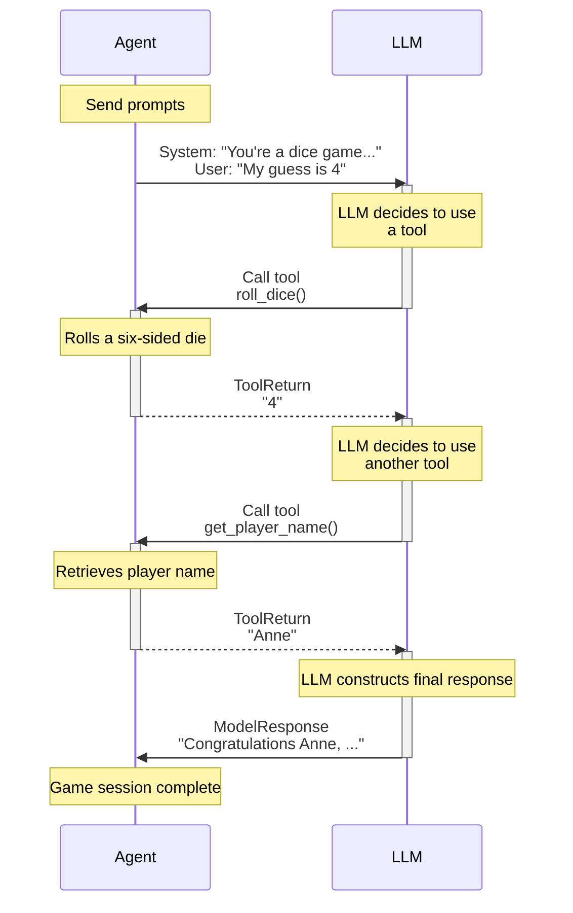

# Function Tools

Function tools provide a mechanism for models to perform actions and retrieve extra information to help them generate a response.

They're useful when you want to enable the model to take some action and use the result, when it is impractical or impossible to put all the context an agent might need into the instructions, or when you want to make agents' behavior more deterministic or reliable by deferring some of the logic required to generate a response to another (not necessarily AI-powered) tool.

If you want a model to be able to call a function as its final action, without the result being sent back to the model, you can use an [output function](output.md#output-functions) instead.

There are a number of ways to register tools with an agent:

- via the [`@agent.tool`][pydantic_ai.Agent.tool] decorator — for tools that need access to the agent [context][pydantic_ai.tools.RunContext]
- via the [`@agent.tool_plain`][pydantic_ai.Agent.tool_plain] decorator — for tools that do not need access to the agent [context][pydantic_ai.tools.RunContext]
- via the [`tools`][pydantic_ai.Agent.__init__] keyword argument to `Agent` which can take either plain functions, or instances of [`Tool`][pydantic_ai.tools.Tool]

For more advanced use cases, the [toolsets](toolsets.md) feature lets you manage collections of tools (built by you or providd by an [MCP server](mcp/client.md) or other [third party](#third-party-tools)) and register them with an agent in one go via the [`toolsets`][pydantic_ai.Agent.__init__] keyword argument to `Agent`.

!!! info "Function tools vs. RAG"
    Function tools are basically the "R" of RAG (Retrieval-Augmented Generation) — they augment what the model can do by letting it request extra information.

    The main semantic difference between Pydantic AI Tools and RAG is RAG is synonymous with vector search, while Pydantic AI tools are more general-purpose. (Note: we may add support for vector search functionality in the future, particularly an API for generating embeddings. See [#58](https://github.com/pydantic/pydantic-ai/issues/58))

!!! info "Function Tools vs. Structured Outputs"
    As the name suggests, function tools use the model's "tools" or "functions" API to let the model know what is available to call. Tools or functions are also used to define the schema(s) for [structured output](output.md) when using the default [tool output mode](output.md#tool-output), thus a model might have access to many tools, some of which call function tools while others end the run and produce a final output.

## Registering via Decorator {#registering-function-tools-via-decorator}

`@agent.tool` is considered the default decorator since in the majority of cases tools will need access to the agent [context][pydantic_ai.tools.RunContext].

Here's an example using both:

```python {title="dice_game.py"}
import random

from pydantic_ai import Agent, RunContext

agent = Agent(
    'google-gla:gemini-1.5-flash',  # (1)!
    deps_type=str,  # (2)!
    system_prompt=(
        "You're a dice game, you should roll the die and see if the number "
        "you get back matches the user's guess. If so, tell them they're a winner. "
        "Use the player's name in the response."
    ),
)


@agent.tool_plain  # (3)!
def roll_dice() -> str:
    """Roll a six-sided die and return the result."""
    return str(random.randint(1, 6))


@agent.tool  # (4)!
def get_player_name(ctx: RunContext[str]) -> str:
    """Get the player's name."""
    return ctx.deps


dice_result = agent.run_sync('My guess is 4', deps='Anne')  # (5)!
print(dice_result.output)
#> Congratulations Anne, you guessed correctly! You're a winner!
```

1. This is a pretty simple task, so we can use the fast and cheap Gemini flash model.
2. We pass the user's name as the dependency, to keep things simple we use just the name as a string as the dependency.
3. This tool doesn't need any context, it just returns a random number. You could probably use dynamic instructions in this case.
4. This tool needs the player's name, so it uses `RunContext` to access dependencies which are just the player's name in this case.
5. Run the agent, passing the player's name as the dependency.

_(This example is complete, it can be run "as is")_

Let's print the messages from that game to see what happened:

```python {title="dice_game_messages.py" requires="dice_game.py"}
from dice_game import dice_result

print(dice_result.all_messages())
"""
[
    ModelRequest(
        parts=[
            SystemPromptPart(
                content="You're a dice game, you should roll the die and see if the number you get back matches the user's guess. If so, tell them they're a winner. Use the player's name in the response.",
                timestamp=datetime.datetime(...),
            ),
            UserPromptPart(
                content='My guess is 4',
                timestamp=datetime.datetime(...),
            ),
        ]
    ),
    ModelResponse(
        parts=[
            ToolCallPart(
                tool_name='roll_dice', args={}, tool_call_id='pyd_ai_tool_call_id'
            )
        ],
        usage=Usage(requests=1, request_tokens=90, response_tokens=2, total_tokens=92),
        model_name='gemini-1.5-flash',
        timestamp=datetime.datetime(...),
    ),
    ModelRequest(
        parts=[
            ToolReturnPart(
                tool_name='roll_dice',
                content='4',
                tool_call_id='pyd_ai_tool_call_id',
                timestamp=datetime.datetime(...),
            )
        ]
    ),
    ModelResponse(
        parts=[
            ToolCallPart(
                tool_name='get_player_name', args={}, tool_call_id='pyd_ai_tool_call_id'
            )
        ],
        usage=Usage(requests=1, request_tokens=91, response_tokens=4, total_tokens=95),
        model_name='gemini-1.5-flash',
        timestamp=datetime.datetime(...),
    ),
    ModelRequest(
        parts=[
            ToolReturnPart(
                tool_name='get_player_name',
                content='Anne',
                tool_call_id='pyd_ai_tool_call_id',
                timestamp=datetime.datetime(...),
            )
        ]
    ),
    ModelResponse(
        parts=[
            TextPart(
                content="Congratulations Anne, you guessed correctly! You're a winner!"
            )
        ],
        usage=Usage(
            requests=1, request_tokens=92, response_tokens=12, total_tokens=104
        ),
        model_name='gemini-1.5-flash',
        timestamp=datetime.datetime(...),
    ),
]
"""
```

We can represent this with a diagram:



## Registering via Agent Argument {#registering-function-tools-via-agent-argument}

As well as using the decorators, we can register tools via the `tools` argument to the [`Agent` constructor][pydantic_ai.Agent.__init__]. This is useful when you want to reuse tools, and can also give more fine-grained control over the tools.

```python {title="dice_game_tool_kwarg.py"}
import random

from pydantic_ai import Agent, RunContext, Tool

system_prompt = """\
You're a dice game, you should roll the die and see if the number
you get back matches the user's guess. If so, tell them they're a winner.
Use the player's name in the response.
"""


def roll_dice() -> str:
    """Roll a six-sided die and return the result."""
    return str(random.randint(1, 6))


def get_player_name(ctx: RunContext[str]) -> str:
    """Get the player's name."""
    return ctx.deps


agent_a = Agent(
    'google-gla:gemini-1.5-flash',
    deps_type=str,
    tools=[roll_dice, get_player_name],  # (1)!
    system_prompt=system_prompt,
)
agent_b = Agent(
    'google-gla:gemini-1.5-flash',
    deps_type=str,
    tools=[  # (2)!
        Tool(roll_dice, takes_ctx=False),
        Tool(get_player_name, takes_ctx=True),
    ],
    system_prompt=system_prompt,
)

dice_result = {}
dice_result['a'] = agent_a.run_sync('My guess is 6', deps='Yashar')
dice_result['b'] = agent_b.run_sync('My guess is 4', deps='Anne')
print(dice_result['a'].output)
#> Tough luck, Yashar, you rolled a 4. Better luck next time.
print(dice_result['b'].output)
#> Congratulations Anne, you guessed correctly! You're a winner!
```

1. The simplest way to register tools via the `Agent` constructor is to pass a list of functions, the function signature is inspected to determine if the tool takes [`RunContext`][pydantic_ai.tools.RunContext].
2. `agent_a` and `agent_b` are identical — but we can use [`Tool`][pydantic_ai.tools.Tool] to reuse tool definitions and give more fine-grained control over how tools are defined, e.g. setting their name or description, or using a custom [`prepare`](#tool-prepare) method.

_(This example is complete, it can be run "as is")_

## Tool Output {#function-tool-output}

Tools can return anything that Pydantic can serialize to JSON, as well as audio, video, image or document content depending on the types of [multi-modal input](input.md) the model supports:

```python {title="function_tool_output.py"}
from datetime import datetime

from pydantic import BaseModel

from pydantic_ai import Agent, DocumentUrl, ImageUrl
from pydantic_ai.models.openai import OpenAIResponsesModel


class User(BaseModel):
    name: str
    age: int


agent = Agent(model=OpenAIResponsesModel('gpt-4o'))


@agent.tool_plain
def get_current_time() -> datetime:
    return datetime.now()


@agent.tool_plain
def get_user() -> User:
    return User(name='John', age=30)


@agent.tool_plain
def get_company_logo() -> ImageUrl:
    return ImageUrl(url='https://iili.io/3Hs4FMg.png')


@agent.tool_plain
def get_document() -> DocumentUrl:
    return DocumentUrl(url='https://www.w3.org/WAI/ER/tests/xhtml/testfiles/resources/pdf/dummy.pdf')


result = agent.run_sync('What time is it?')
print(result.output)
#> The current time is 10:45 PM on April 17, 2025.

result = agent.run_sync('What is the user name?')
print(result.output)
#> The user's name is John.

result = agent.run_sync('What is the company name in the logo?')
print(result.output)
#> The company name in the logo is "Pydantic."

result = agent.run_sync('What is the main content of the document?')
print(result.output)
#> The document contains just the text "Dummy PDF file."
```

_(This example is complete, it can be run "as is")_

Some models (e.g. Gemini) natively support semi-structured return values, while some expect text (OpenAI) but seem to be just as good at extracting meaning from the data. If a Python object is returned and the model expects a string, the value will be serialized to JSON.

### Advanced Tool Returns

For scenarios where you need more control over both the tool's return value and the content sent to the model, you can use [`ToolReturn`][pydantic_ai.messages.ToolReturn]. This is particularly useful when you want to:

- Provide rich multi-modal content (images, documents, etc.) to the model as context
- Separate the programmatic return value from the model's context
- Include additional metadata that shouldn't be sent to the LLM

Here's an example of a computer automation tool that captures screenshots and provides visual feedback:

```python {title="advanced_tool_return.py" test="skip" lint="skip"}
import time
from pydantic_ai import Agent
from pydantic_ai.messages import ToolReturn, BinaryContent

agent = Agent('openai:gpt-4o')

@agent.tool_plain
def click_and_capture(x: int, y: int) -> ToolReturn:
    """Click at coordinates and show before/after screenshots."""
    # Take screenshot before action
    before_screenshot = capture_screen()

    # Perform click operation
    perform_click(x, y)
    time.sleep(0.5)  # Wait for UI to update

    # Take screenshot after action
    after_screenshot = capture_screen()

    return ToolReturn(
        return_value=f"Successfully clicked at ({x}, {y})",
        content=[
            f"Clicked at coordinates ({x}, {y}). Here's the comparison:",
            "Before:",
            BinaryContent(data=before_screenshot, media_type="image/png"),
            "After:",
            BinaryContent(data=after_screenshot, media_type="image/png"),
            "Please analyze the changes and suggest next steps."
        ],
        metadata={
            "coordinates": {"x": x, "y": y},
            "action_type": "click_and_capture",
            "timestamp": time.time()
        }
    )

# The model receives the rich visual content for analysis
# while your application can access the structured return_value and metadata
result = agent.run_sync("Click on the submit button and tell me what happened")
print(result.output)
# The model can analyze the screenshots and provide detailed feedback
```

- **`return_value`**: The actual return value used in the tool response. This is what gets serialized and sent back to the model as the tool's result.
- **`content`**: A sequence of content (text, images, documents, etc.) that provides additional context to the model. This appears as a separate user message.
- **`metadata`**: Optional metadata that your application can access but is not sent to the LLM. Useful for logging, debugging, or additional processing. Some other AI frameworks call this feature "artifacts".

This separation allows you to provide rich context to the model while maintaining clean, structured return values for your application logic.

## Tool Schema {#function-tools-and-schema}

Function parameters are extracted from the function signature, and all parameters except `RunContext` are used to build the schema for that tool call.

Even better, Pydantic AI extracts the docstring from functions and (thanks to [griffe](https://mkdocstrings.github.io/griffe/)) extracts parameter descriptions from the docstring and adds them to the schema.

[Griffe supports](https://mkdocstrings.github.io/griffe/reference/docstrings/#docstrings) extracting parameter descriptions from `google`, `numpy`, and `sphinx` style docstrings. Pydantic AI will infer the format to use based on the docstring, but you can explicitly set it using [`docstring_format`][pydantic_ai.tools.DocstringFormat]. You can also enforce parameter requirements by setting `require_parameter_descriptions=True`. This will raise a [`UserError`][pydantic_ai.exceptions.UserError] if a parameter description is missing.

To demonstrate a tool's schema, here we use [`FunctionModel`][pydantic_ai.models.function.FunctionModel] to print the schema a model would receive:

```python {title="tool_schema.py"}
from pydantic_ai import Agent
from pydantic_ai.messages import ModelMessage, ModelResponse, TextPart
from pydantic_ai.models.function import AgentInfo, FunctionModel

agent = Agent()


@agent.tool_plain(docstring_format='google', require_parameter_descriptions=True)
def foobar(a: int, b: str, c: dict[str, list[float]]) -> str:
    """Get me foobar.

    Args:
        a: apple pie
        b: banana cake
        c: carrot smoothie
    """
    return f'{a} {b} {c}'


def print_schema(messages: list[ModelMessage], info: AgentInfo) -> ModelResponse:
    tool = info.function_tools[0]
    print(tool.description)
    #> Get me foobar.
    print(tool.parameters_json_schema)
    """
    {
        'additionalProperties': False,
        'properties': {
            'a': {'description': 'apple pie', 'type': 'integer'},
            'b': {'description': 'banana cake', 'type': 'string'},
            'c': {
                'additionalProperties': {'items': {'type': 'number'}, 'type': 'array'},
                'description': 'carrot smoothie',
                'type': 'object',
            },
        },
        'required': ['a', 'b', 'c'],
        'type': 'object',
    }
    """
    return ModelResponse(parts=[TextPart('foobar')])


agent.run_sync('hello', model=FunctionModel(print_schema))
```

_(This example is complete, it can be run "as is")_

If a tool has a single parameter that can be represented as an object in JSON schema (e.g. dataclass, TypedDict, pydantic model), the schema for the tool is simplified to be just that object.

Here's an example where we use [`TestModel.last_model_request_parameters`][pydantic_ai.models.test.TestModel.last_model_request_parameters] to inspect the tool schema that would be passed to the model.

```python {title="single_parameter_tool.py"}
from pydantic import BaseModel

from pydantic_ai import Agent
from pydantic_ai.models.test import TestModel

agent = Agent()


class Foobar(BaseModel):
    """This is a Foobar"""

    x: int
    y: str
    z: float = 3.14


@agent.tool_plain
def foobar(f: Foobar) -> str:
    return str(f)


test_model = TestModel()
result = agent.run_sync('hello', model=test_model)
print(result.output)
#> {"foobar":"x=0 y='a' z=3.14"}
print(test_model.last_model_request_parameters.function_tools)
"""
[
    ToolDefinition(
        name='foobar',
        parameters_json_schema={
            'properties': {
                'x': {'type': 'integer'},
                'y': {'type': 'string'},
                'z': {'default': 3.14, 'type': 'number'},
            },
            'required': ['x', 'y'],
            'title': 'Foobar',
            'type': 'object',
        },
        description='This is a Foobar',
    )
]
"""
```

_(This example is complete, it can be run "as is")_

### Custom Tool Schema

If you have a function that lacks appropriate documentation (i.e. poorly named, no type information, poor docstring, use of \*args or \*\*kwargs and suchlike) then you can still turn it into a tool that can be effectively used by the agent with the [`Tool.from_schema`][pydantic_ai.Tool.from_schema] function. With this you provide the name, description and JSON schema for the function directly:

```python
from pydantic_ai import Agent, Tool
from pydantic_ai.models.test import TestModel


def foobar(**kwargs) -> str:
    return kwargs['a'] + kwargs['b']

tool = Tool.from_schema(
    function=foobar,
    name='sum',
    description='Sum two numbers.',
    json_schema={
        'additionalProperties': False,
        'properties': {
            'a': {'description': 'the first number', 'type': 'integer'},
            'b': {'description': 'the second number', 'type': 'integer'},
        },
        'required': ['a', 'b'],
        'type': 'object',
    }
)

test_model = TestModel()
agent = Agent(test_model, tools=[tool])

result = agent.run_sync('testing...')
print(result.output)
#> {"sum":0}
```

Please note that validation of the tool arguments will not be performed, and this will pass all arguments as keyword arguments.

## Dynamic Tools {#tool-prepare}

Tools can optionally be defined with another function: `prepare`, which is called at each step of a run to
customize the definition of the tool passed to the model, or omit the tool completely from that step.

A `prepare` method can be registered via the `prepare` kwarg to any of the tool registration mechanisms:

- [`@agent.tool`][pydantic_ai.Agent.tool] decorator
- [`@agent.tool_plain`][pydantic_ai.Agent.tool_plain] decorator
- [`Tool`][pydantic_ai.tools.Tool] dataclass

The `prepare` method, should be of type [`ToolPrepareFunc`][pydantic_ai.tools.ToolPrepareFunc], a function which takes [`RunContext`][pydantic_ai.tools.RunContext] and a pre-built [`ToolDefinition`][pydantic_ai.tools.ToolDefinition], and should either return that `ToolDefinition` with or without modifying it, return a new `ToolDefinition`, or return `None` to indicate this tools should not be registered for that step.

Here's a simple `prepare` method that only includes the tool if the value of the dependency is `42`.

As with the previous example, we use [`TestModel`][pydantic_ai.models.test.TestModel] to demonstrate the behavior without calling a real model.

```python {title="tool_only_if_42.py"}
from typing import Union

from pydantic_ai import Agent, RunContext
from pydantic_ai.tools import ToolDefinition

agent = Agent('test')


async def only_if_42(
    ctx: RunContext[int], tool_def: ToolDefinition
) -> Union[ToolDefinition, None]:
    if ctx.deps == 42:
        return tool_def


@agent.tool(prepare=only_if_42)
def hitchhiker(ctx: RunContext[int], answer: str) -> str:
    return f'{ctx.deps} {answer}'


result = agent.run_sync('testing...', deps=41)
print(result.output)
#> success (no tool calls)
result = agent.run_sync('testing...', deps=42)
print(result.output)
#> {"hitchhiker":"42 a"}
```

_(This example is complete, it can be run "as is")_

Here's a more complex example where we change the description of the `name` parameter to based on the value of `deps`

For the sake of variation, we create this tool using the [`Tool`][pydantic_ai.tools.Tool] dataclass.

```python {title="customize_name.py"}
from __future__ import annotations

from typing import Literal

from pydantic_ai import Agent, RunContext
from pydantic_ai.models.test import TestModel
from pydantic_ai.tools import Tool, ToolDefinition


def greet(name: str) -> str:
    return f'hello {name}'


async def prepare_greet(
    ctx: RunContext[Literal['human', 'machine']], tool_def: ToolDefinition
) -> ToolDefinition | None:
    d = f'Name of the {ctx.deps} to greet.'
    tool_def.parameters_json_schema['properties']['name']['description'] = d
    return tool_def


greet_tool = Tool(greet, prepare=prepare_greet)
test_model = TestModel()
agent = Agent(test_model, tools=[greet_tool], deps_type=Literal['human', 'machine'])

result = agent.run_sync('testing...', deps='human')
print(result.output)
#> {"greet":"hello a"}
print(test_model.last_model_request_parameters.function_tools)
"""
[
    ToolDefinition(
        name='greet',
        parameters_json_schema={
            'additionalProperties': False,
            'properties': {
                'name': {'type': 'string', 'description': 'Name of the human to greet.'}
            },
            'required': ['name'],
            'type': 'object',
        },
    )
]
"""
```

_(This example is complete, it can be run "as is")_

### Agent-wide Dynamic Tools {#prepare-tools}

In addition to per-tool `prepare` methods, you can also define an agent-wide `prepare_tools` function. This function is called at each step of a run and allows you to filter or modify the list of all tool definitions available to the agent for that step. This is especially useful if you want to enable or disable multiple tools at once, or apply global logic based on the current context.

The `prepare_tools` function should be of type [`ToolsPrepareFunc`][pydantic_ai.tools.ToolsPrepareFunc], which takes the [`RunContext`][pydantic_ai.tools.RunContext] and a list of [`ToolDefinition`][pydantic_ai.tools.ToolDefinition], and returns a new list of tool definitions (or `None` to disable all tools for that step).

!!! note
    The list of tool definitions passed to `prepare_tools` includes both regular function tools and tools from any [toolsets](toolsets.md) registered to the agent, but not [output tools](output.md#tool-output).
To modify output tools, you can set a `prepare_output_tools` function instead.

Here's an example that makes all tools strict if the model is an OpenAI model:

```python {title="agent_prepare_tools_customize.py" noqa="I001"}
from dataclasses import replace
from typing import Union

from pydantic_ai import Agent, RunContext
from pydantic_ai.tools import ToolDefinition
from pydantic_ai.models.test import TestModel


async def turn_on_strict_if_openai(
    ctx: RunContext[None], tool_defs: list[ToolDefinition]
) -> Union[list[ToolDefinition], None]:
    if ctx.model.system == 'openai':
        return [replace(tool_def, strict=True) for tool_def in tool_defs]
    return tool_defs


test_model = TestModel()
agent = Agent(test_model, prepare_tools=turn_on_strict_if_openai)


@agent.tool_plain
def echo(message: str) -> str:
    return message


agent.run_sync('testing...')
assert test_model.last_model_request_parameters.function_tools[0].strict is None

# Set the system attribute of the test_model to 'openai'
test_model._system = 'openai'

agent.run_sync('testing with openai...')
assert test_model.last_model_request_parameters.function_tools[0].strict
```

_(This example is complete, it can be run "as is")_

Here's another example that conditionally filters out the tools by name if the dependency (`ctx.deps`) is `True`:

```python {title="agent_prepare_tools_filter_out.py" noqa="I001"}
from typing import Union

from pydantic_ai import Agent, RunContext
from pydantic_ai.tools import Tool, ToolDefinition


def launch_potato(target: str) -> str:
    return f'Potato launched at {target}!'


async def filter_out_tools_by_name(
    ctx: RunContext[bool], tool_defs: list[ToolDefinition]
) -> Union[list[ToolDefinition], None]:
    if ctx.deps:
        return [tool_def for tool_def in tool_defs if tool_def.name != 'launch_potato']
    return tool_defs


agent = Agent(
    'test',
    tools=[Tool(launch_potato)],
    prepare_tools=filter_out_tools_by_name,
    deps_type=bool,
)

result = agent.run_sync('testing...', deps=False)
print(result.output)
#> {"launch_potato":"Potato launched at a!"}
result = agent.run_sync('testing...', deps=True)
print(result.output)
#> success (no tool calls)
```

_(This example is complete, it can be run "as is")_

You can use `prepare_tools` to:

- Dynamically enable or disable tools based on the current model, dependencies, or other context
- Modify tool definitions globally (e.g., set all tools to strict mode, change descriptions, etc.)

If both per-tool `prepare` and agent-wide `prepare_tools` are used, the per-tool `prepare` is applied first to each tool, and then `prepare_tools` is called with the resulting list of tool definitions.

## Tool Execution and Retries {#tool-retries}

When a tool is executed, its arguments (provided by the LLM) are first validated against the function's signature using Pydantic. If validation fails (e.g., due to incorrect types or missing required arguments), a `ValidationError` is raised, and the framework automatically generates a [`RetryPromptPart`][pydantic_ai.messages.RetryPromptPart] containing the validation details. This prompt is sent back to the LLM, informing it of the error and allowing it to correct the parameters and retry the tool call.

Beyond automatic validation errors, the tool's own internal logic can also explicitly request a retry by raising the [`ModelRetry`][pydantic_ai.exceptions.ModelRetry] exception. This is useful for situations where the parameters were technically valid, but an issue occurred during execution (like a transient network error, or the tool determining the initial attempt needs modification).

```python
from pydantic_ai import ModelRetry


def my_flaky_tool(query: str) -> str:
    if query == 'bad':
        # Tell the LLM the query was bad and it should try again
        raise ModelRetry("The query 'bad' is not allowed. Please provide a different query.")
    # ... process query ...
    return 'Success!'
```

Raising `ModelRetry` also generates a `RetryPromptPart` containing the exception message, which is sent back to the LLM to guide its next attempt. Both `ValidationError` and `ModelRetry` respect the `retries` setting configured on the `Tool` or `Agent`.

## Third-Party Tools

### MCP Tools {#mcp-tools}

See the [MCP Client](./mcp/client.md) documentation for how to use MCP servers with Pydantic AI as [toolsets](toolsets.md).

### LangChain Tools {#langchain-tools}

If you'd like to use a tool from LangChain's [community tool library](https://python.langchain.com/docs/integrations/tools/) with Pydantic AI, you can use the [`tool_from_langchain`][pydantic_ai.ext.langchain.tool_from_langchain] convenience method. Note that Pydantic AI will not validate the arguments in this case -- it's up to the model to provide arguments matching the schema specified by the LangChain tool, and up to the LangChain tool to raise an error if the arguments are invalid.

You will need to install the `langchain-community` package and any others required by the tool in question.

Here is how you can use the LangChain `DuckDuckGoSearchRun` tool, which requires the `ddgs` package:

```python {test="skip"}
from langchain_community.tools import DuckDuckGoSearchRun

from pydantic_ai import Agent
from pydantic_ai.ext.langchain import tool_from_langchain


search = DuckDuckGoSearchRun()
search_tool = tool_from_langchain(search)

agent = Agent(
    'google-gla:gemini-2.0-flash',
    tools=[search_tool],
)

result = agent.run_sync('What is the release date of Elden Ring Nightreign?')  # (1)!
print(result.output)
#> Elden Ring Nightreign is planned to be released on May 30, 2025.
```

1. The release date of this game is the 30th of May 2025, which is after the knowledge cutoff for Gemini 2.0 (August 2024).

If you'd like to use multiple LangChain tools or a LangChain [toolkit](https://python.langchain.com/docs/concepts/tools/#toolkits), you can use the [`LangChainToolset`][pydantic_ai.ext.langchain.LangChainToolset] [toolset](toolsets.md) which takes a list of LangChain tools:

```python {test="skip"}
from langchain_community.agent_toolkits import SlackToolkit

from pydantic_ai import Agent
from pydantic_ai.ext.langchain import LangChainToolset


toolkit = SlackToolkit()
toolset = LangChainToolset(toolkit.get_tools())

agent = Agent('openai:gpt-4o', toolsets=[toolset])
# ...
```

### ACI.dev Tools {#aci-tools}

If you'd like to use a tool from the [ACI.dev tool library](https://www.aci.dev/tools) with Pydantic AI, you can use the [`tool_from_aci`][pydantic_ai.ext.aci.tool_from_aci] convenience method. Note that Pydantic AI will not validate the arguments in this case -- it's up to the model to provide arguments matching the schema specified by the ACI tool, and up to the ACI tool to raise an error if the arguments are invalid.

You will need to install the `aci-sdk` package, set your ACI API key in the `ACI_API_KEY` environment variable, and pass your ACI "linked account owner ID" to the function.

Here is how you can use the ACI.dev `TAVILY__SEARCH` tool:

```python {test="skip"}
import os

from pydantic_ai import Agent
from pydantic_ai.ext.aci import tool_from_aci


tavily_search = tool_from_aci(
    'TAVILY__SEARCH',
    linked_account_owner_id=os.getenv('LINKED_ACCOUNT_OWNER_ID'),
)

agent = Agent(
    'google-gla:gemini-2.0-flash',
    tools=[tavily_search],
)

result = agent.run_sync('What is the release date of Elden Ring Nightreign?')  # (1)!
print(result.output)
#> Elden Ring Nightreign is planned to be released on May 30, 2025.
```

1. The release date of this game is the 30th of May 2025, which is after the knowledge cutoff for Gemini 2.0 (August 2024).

If you'd like to use multiple ACI.dev tools, you can use the [`ACIToolset`][pydantic_ai.ext.aci.ACIToolset] [toolset](toolsets.md) which takes a list of ACI tool names as well as the `linked_account_owner_id`:

```python {test="skip"}
import os

from pydantic_ai import Agent
from pydantic_ai.ext.aci import ACIToolset


toolset = ACIToolset(
    [
        'OPEN_WEATHER_MAP__CURRENT_WEATHER',
        'OPEN_WEATHER_MAP__FORECAST',
    ],
    linked_account_owner_id=os.getenv('LINKED_ACCOUNT_OWNER_ID'),
)

agent = Agent('openai:gpt-4o', toolsets=[toolset])
```
